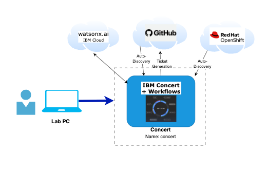

import RequestingLabEnvironment from "@site/src/components/requestingLabEnvironment/RequestingLabEnvironment"

# Lab Environment

This section describes the infrastructure available to you during the lab.

## What You Have Access To

Your lab environment consists of one pre-built RHEL virtual machine and a set of pre-loaded credentials:

| Component | Description |
|-----------|-------------|
| **Concert Host** | A RHEL VM with IBM Concert, Workflows, and DataApps pre-installed. This is your primary workstation for all lab exercises. |
| **OCP Credentials** | Pre-loaded credentials for a Red Hat OpenShift cluster running a sample vulnerable application, used during the OCP Auto-Discovery section. |
| **E-commerce application** | A GitHub repository containing a Java application with intentional security vulnerabilities, used for the GitHub Auto-Discovery section. |

## Software Versions

| Software | Version |
|----------|---------|
| IBM Concert | v3.0.0 |

## Lab Deployment Architecture

The diagram below shows the overall infrastructure layout for the lab.

