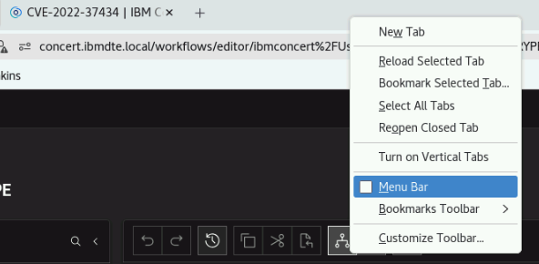

## 3.1: Overview

Before proceeding with the main lab activities, ensure that you have completed **all Lab Preparation steps** in this section. These steps get your environment ready so that the exercises in later sections run smoothly—skipping them is the most common cause of problems later in the lab.

:::warning
You may receive prompts for software updates during the lab.
Please **ignore these prompts** and **do not install any updates** to avoid disrupting the lab environment.
:::

If you encounter a security warning such as **"Warning: Potential Security Risk Ahead"** when
using the browser, please disregard it. Select **Advanced** → **Accept the Risk and Continue**. This warning is expected because the lab uses internal, self-signed certificates rather than public ones, and it is safe to continue.

---

## 3.2: Using the Bastion Host Terminal and UI

This section provides background information about the Bastion environment. You will execute actual
commands in later sections. This lab environment includes both **Concert** and **Workflows** installations.

:::info What is the Bastion Host?
The **Bastion Host** is the single machine you use to reach everything else in the lab. Think of it as your entry point: from here you open the browser to access the Concert and Workflows user interfaces, and from here you connect to the other lab servers over SSH. You will do all of your work in this lab from the Bastion Host.
:::

### Accessing the UIs

This lab uses two related interfaces, and it helps to know the difference before you start:

- **Concert** is where you view your environment, inventory, vulnerabilities, and remediation actions.
- **Workflows** is where you build and run the automation.

To open them:

From the **Bastion Host Terminal**, click on **Activities** and open **Firefox**.
Then click on the bookmark **Concert** to launch the Concert UI.

- To open the **Concert UI**, click the **burger menu (☰)** at the top-left corner and select **Concert → Home**.
- To open the **Workflows UI**, click the **burger menu (☰)** and select **Workflows → Home**.



### Using SSH from the Bastion Host

**SSH** (Secure Shell) is a way to open a command-line session on another machine over the network. From the Bastion Host you can connect to the other lab VMs using the commands below. You will use these connections in later sections.

```bash title="Host: bastion-gym-lan"
# Access the Concert VM
ssh jammer@concert
```

## 3.3: Capturing the Lab Credentials

In this section, you will collect **all** credentials and configuration details required to complete the lab exercises. This includes your **Concert API key**, your **IBM Bob API key**, and your **GitHub Personal Access Token (PAT)**.
All credentials will be consolidated into a single text file, which simplifies the steps later in the lab.

:::note Why do this?
Throughout the lab you will need to paste in values like the Concert API key, the IBM Bob API key, and a GitHub PAT. Rather than generating each one at the moment you need it, you will gather them all into a single `credentials.txt` file now. Later sections will simply refer to "the credentials file," so keeping it open saves you time and prevents mistakes.
:::

### Prepare the Credentials File

1. From the **Bastion Remote Desktop**, on the left panel click **Show Applications** → **Text Editor**.
2. Create a new file named `credentials.txt`.
3. Paste the following template into the file and **save** it.
4. Keep this window open for easy access during the lab.

As you work through the lab, you will fill in the blank fields (such as the API keys and token) with the values you collect in the steps below.

```yaml
Bookmarks:
  Lab guide:  https://ibm.github.io/waiops-tech-jam/labs/concert/introduction/
  Concert:    https://concert.ibmdte.local/

Concert Workflows: https://ibm.box.com/s/lrhd8y9d8bvkyv60v6kq989vdlf4du1v

Concert URL: https://concert.ibmdte.local
Concert Port: 12443

Concert API Key:
Concert Request header:

concert_username: ibmconcert
concert_password: Passw0rd

IBM Bob API Key:

GitHub Personal Access Token (PAT):

```

### Capture the Concert API Key

<!-- Keep your existing Concert API key steps here if they lived elsewhere; paste them and I'll slot them in. -->

Paste the generated key into the `Concert API Key:` field of your credentials file.

### Capture the IBM Bob API Key

The **IBM Bob API key** is used later in the lab to connect IBM Concert Secure Coder to Bob for building, scanning, and auto-remediation.

1. In Firefox, go to [https://bob.ibm.com/admin/apikeys](https://bob.ibm.com/admin/apikeys).
2. Create a new API key with the **General** scope.
3. Copy the key and paste it into the `IBM Bob API Key:` field of your credentials file.

:::warning
Copy the key immediately—like most secrets, it is shown only once. If you lose it, generate a new one.
:::

### Capture the GitHub Personal Access Token (PAT)

The **GitHub PAT** is used later for cloning the e-commerce repository, auto-discovery, and applying auto-remediation pull requests.

1. In Firefox, sign in to GitHub and go to **Settings → Developer settings → Personal access tokens → Tokens (classic)**.
2. Generate a new **classic** token.
3. Under scopes, select the full **`repo`** scope.

:::warning
The token must have **write** access, not just read. Auto-remediation creates a branch and opens a pull request on your fork, which fails with a read-only token. Selecting the full **`repo`** scope grants the write access it needs.
:::

4. Copy the token and paste it into the `GitHub Personal Access Token (PAT):` field of your credentials file.

## 3.4 Remove Data from Previous Labs

If you have previously run other labs using the same Concert environment, there may be existing data such as applications or automation rules
that could interfere with the exercises in this lab.

:::tip
If this is the first time you are running a lab in this environment, there may be nothing to delete—that is perfectly fine. Simply check each area below and move on if it is already empty.
:::

From the Bastion Remote Desktop, on the Firefox browser click on **Concert** > **Home**.

* Select **Administration** > **Integrations**
    * Click the **Automation rules** tab
    * Remove each listed rule by selecting **Delete** from the 3-dot menu on the right side of each entry.

    * Click the **Ingestion Jobs** tab
    * Remove each listed job by selecting **Delete** from the 3-dot menu on the right side of each entry.

* Select **Inventory** > **Application inventory**
    * Remove each listed application by selecting **Delete** from the 3-dot menu on the right side of each entry.
When prompted, make sure to check the box to also *delete all related exposures and CVE findings*, then confirm.

       

* Select **Inventory** > **Environment inventory**
   * Remove each listed environment by selecting **Delete** from the 3-dot menu on the right side of each entry.