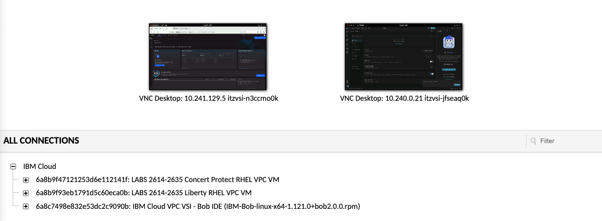
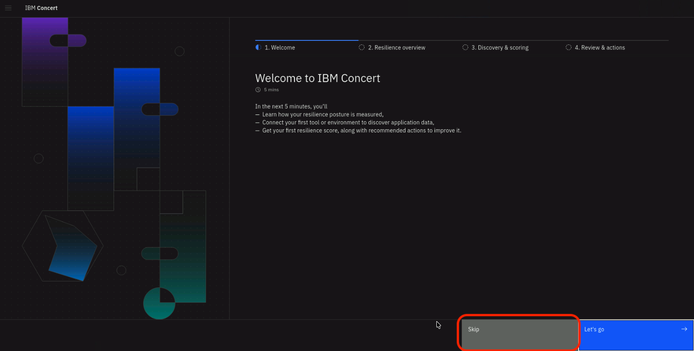
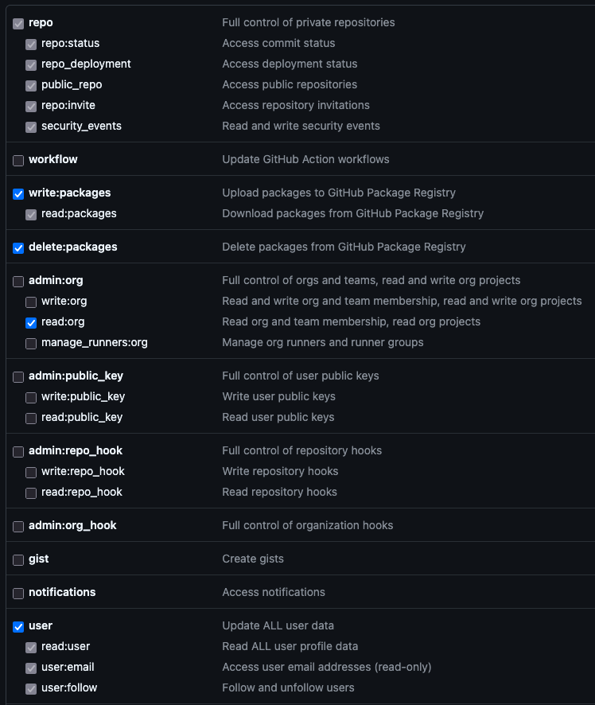
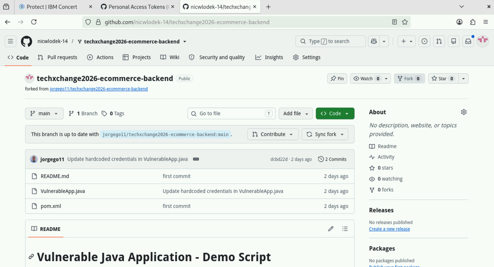
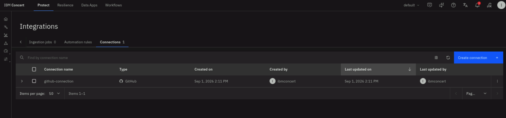

## 3.1 Overview

Before moving on to the main lab activities, complete **all steps in this section**. These steps get your environment ready so that the exercises later on run smoothly — skipping them is the most common cause of problems later in the lab.

:::warning Do not install updates
You may see prompts for software updates during the lab. **Ignore these prompts** and **do not install any updates** — doing so can disrupt the lab environment.
:::

:::note Browser security warnings
If your browser shows a warning such as `Warning: Potential Security Risk Ahead`, select **Advanced → Accept the Risk and Continue**. This is expected because the lab uses internal self-signed certificates rather than public ones.
:::

---

## 3.2 Access the Concert VDI

You'll have access to one **IBM Concert Protect** VDI, available from the **ALL CONNECTIONS** tab of your lab environment.



Click the **Concert Protect RHEL VPC VM** entry and open its **VNC Desktop** to connect.

---

## 3.3 Disabling the Terminal Window Timeout

This command removes the default timeout settings of the Terminal window and then closes the window. We will do this to keep the
Terminal window open during the Lab. 
From the **Concert VNC Desktop**, click on the top-left **Activities** button and then on the bottom panel, click **Terminal**.


Run the command below on the Terminal window:

```bash
sudo sed -i 's/^typeset -xr TMOUT=900/export TMOUT=0/' /etc/profile.d/tmout.sh;exit
```


---

## 3.4 Prepare Your Credentials File

In this section you'll collect all the credentials and configuration details required for the lab, then consolidate them into a single text file. Having everything in one place prevents mistakes and saves time when you need to paste values later.

:::note Why a credentials file?
Throughout the lab you'll need to paste in values like your GitHub PAT, Concert URL, and OCP token. Rather than generating each one at the moment you need it, gather them all into a `credentials.txt` file now. Later sections simply tell you *"paste the value from your credentials file"* — keeping it open saves you from hunting across multiple tabs.
:::

### 3.4.1 Create the Credentials File

1. From the Concert VDI desktop, click **Show Applications → Text Editor**.
2. Create a new file and name it `credentials.txt`.
3. Paste the template below into the file and save it.
4. Keep this window open throughout the lab — you'll fill in the blank fields as you complete the steps below.

```yaml
Shared Box Note:   https://ibm.box.com/v/discovery-lab-note

Concert URL:       https://localhost/concert:12443
concert_username:  ibmconcert
concert_password:  Passw0rd

ecommerce-backend: https://github.com/jorgego11/techxchange2026-ecommerce-backend

Forked Repo:       

GitHub PAT:        

```

---

## 3.5 Login into IBM Concert for the First Time

From the **Concert VNC Desktop**, click on the top-left **Activities** button and then on the bottom panel, click on the **Firefox** icon.
Copy/Paste the Concert URL from the **credentials.sh** file to the browser.

:::warning
If you encounter a security warning such as **“Warning: Potential Security Risk Ahead”** when 
using the browser, please disregard it. Select **Advanced** → **Accept the Risk and Continue**.
::: 

Login to the Concert UI using the credentials from your credentials file:

- **concert_username**
- **concert_password**


On the Concert welcome page, select the **Resilience** option on the right and select **Skip** in the next page:


:::danger
Make sure to choose **Skip** in the next page to bypass the setup wizard.


:::


---

## 3.6 Configuring GitHub

You will need a personal GitHub account to complete the lab. Make sure the account is personal
as you will not be able to use an Enterprise GitHub account. If you do not have a personal account,
 please create one at [GitHub](https://github.com/).

### 3.6.1 Create a GitHub Personal Access Token (PAT)

The GitHub PAT is used later when Concert clones the e-commerce repository during an Auto-Discovery session.

1. In GitHub, click your **profile picture** (top-right) and select **Settings**.
2. In the left sidebar, scroll to the bottom and click **Developer settings**.
3. Click **Personal access tokens → Tokens (classic)**.
4. Click **Generate new token → Generate new token (classic)**.
5. Under **Note**, enter a descriptive name such as `concert-lab`.
6. Under **Expiration**, select **90 days**.
7. Select the following scopes:

   | Scope | Why it is needed |
   |-------|-----------------|
   | `repo` | Full control of private repositories — required for cloning and pushing |
   | `write:packages` | Push and pull container images |
   | `delete:packages` | Delete container images |
   | `admin:org` → `read:org` | Auto-discover repositories within an organization |
   | `user` | Update all user data |

   

8. Click **Generate token** at the bottom.
9. **Copy the token immediately** — GitHub shows it only once.
10. Paste it into the `GitHub PAT:` field of your credentials file and save.

:::warning Save the credentials file now
Once you leave the GitHub page, the token cannot be retrieved again. If you lose it, you must regenerate a new one.
:::

---

### 3.6.2 Fork the Vulnerable Repository

Concert needs a repository to scan. For this lab, you'll use a sample Java application that contains intentional security vulnerabilities.

1. Open a new browser tab and paste the `ecommerce-backend` URL from your credentials file.
2. Click **Fork** in the top-right corner.
3. Complete the fork. Once finished, confirm you're viewing *your* copy — the repository name should show your username, with `forked from techxchange2026-ecommerce-backend` beneath it.

   

4. Copy your forked repository URL and paste it into the `Forked Repo:` field of your credentials file.

---

### 3.6.3 Enable GitHub Issues on Your Fork

Concert creates GitHub Issues for detected vulnerabilities, so Issues must be enabled on your fork before you connect it.

1. In your forked repository, click the **Settings** tab.
2. Under **General → Features**, check the **Issues** checkbox.

   

---

### 3.6.4 Create the GitHub Integration in Concert

You'll now connect Concert to your GitHub account using the PAT you just created. Concert uses this connection to open GitHub Issues for vulnerabilities it discovers.

1. From the Concert Protect UI, navigate to **Administration → Integrations**.
2. Select the **Connections** tab and click **Create connection**.
3. Search for **GitHub** and click the GitHub tile.
4. Fill in the connection details:

   | Field | Value |
   |-------|-------|
   | **Name** | `github-connection` (or any unique name you prefer) |
   | **Description** | *(optional)* |
   | **Host** | `https://api.github.com/` |
   | **Personal Access Token** | The **GitHub PAT** from your credentials file |

5. Click **Validate connection** to confirm it is working, then click **Create**.

   

---


Once all steps in this section are complete, you are ready to proceed to **Section 4: Auto-Discovery**.
