## 4.1 Overview

Concert can discover vulnerabilities from many different sources. In this section, you will explore two primary discovery mechanisms:
1. **GitHub Repository** — Concert scans your application's source code and dependency manifests.
2. **Red Hat OpenShift Cluster (OCP)** — Concert scans container images running in live workloads.

Both flows follow the same pattern once the integration is established:

1. Connect to the source and run a scan
2. Set environmental factors so Concert knows how critical the application is for the business
3. Review findings ranked by real contextualized risk, not just raw severity
4. Drill into a CVE end to end — overview, blast radius, findings, remediation guidance
5. Open a tracked ticket from the finding

The scoring model, the blast radius, and the ticketing workflow are identical across both sources. The only differences 
are in *how you connect* and *what Concert scans*: source code and dependency manifests for GitHub, 
container images for OCP. Those differences are covered in the next two sections.

:::info Why does source matter?
A vulnerability can exist in two very different places:

- In the **application** — a flaw in your code or a vulnerable library your project depends on. This is what a GitHub scan finds.
- In the **runtime environment** — a vulnerable package baked into a container image. This is what an OCP cluster scan finds.

Both matter. A GitHub scan tells you what is wrong in what you **wrote**; a cluster scan tells you what is wrong in what you 
are currently running in **production**.
:::

---

## 4.2 Connect a GitHub Repository

From the **Concert VDI**, open the Concert UI. On the top navigation bar, click **Protect**.

:::note What is the Protect view?
**Protect** is Concert's developer-focused view, built around the question: 
*what is wrong with my code, and what should I fix first?*
:::

Once in the Protect view, click **Discover your data** in the top-right corner.

1. The watsonx assistant prompts: *"Share a GitHub link to a repository or organization you want to analyze and I'll take a look."*
2. From your credentials file, copy and paste the `Forked Repo` URL and press **Enter**.

   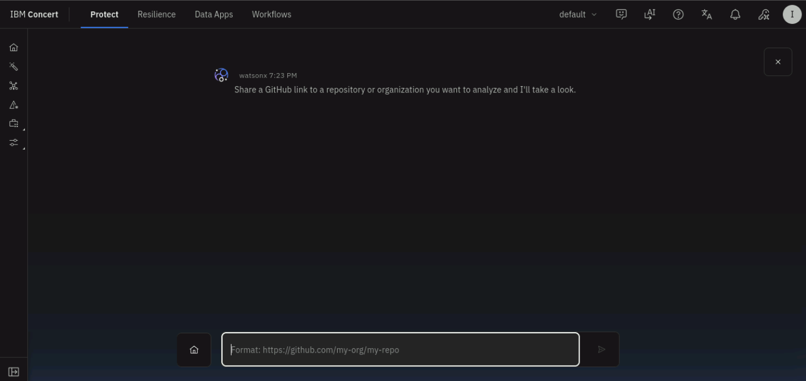

3. Concert needs permission to read the repository. Select the **github-connection** you created previously.

   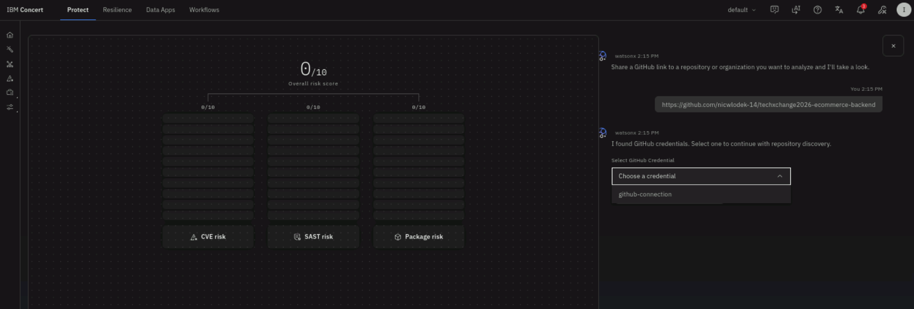

   :::note Your token is stored securely
   Concert encrypts your token using AES-256 encryption and base-64 encodes it before storing. It is never held in plain text.
   :::

4. Click **Advanced settings**. Change the application name to `ecommerce-app` and leave the **Application version** as `1.0.0`.

   :::tip Advanced settings
   Before clicking **Save and scan now**, two settings are worth knowing:
   - **Application name:** By default, Concert uses the GitHub repository or organization name. Change it in **Advanced settings** if you want a different name or need to map to an existing application.
   - **Branch:** Concert scans the default branch (`main`) unless you change it. For this lab, `main` is correct.
   :::

5. Click **Save and scan now**.

   Concert pulls down the code, runs a Trivy scan, resolves every dependency the project relies on, and cross-references all of it against known vulnerability databases. Three categories of findings come out: **CVEs** in the codebase, **SAST exposures** (code composition flaws), and **package risks** (vulnerable third-party dependencies).

6. To confirm the scan ran successfully, navigate to **Administration → Integrations → Ingestion jobs**. The job should appear with a **Success** status.

   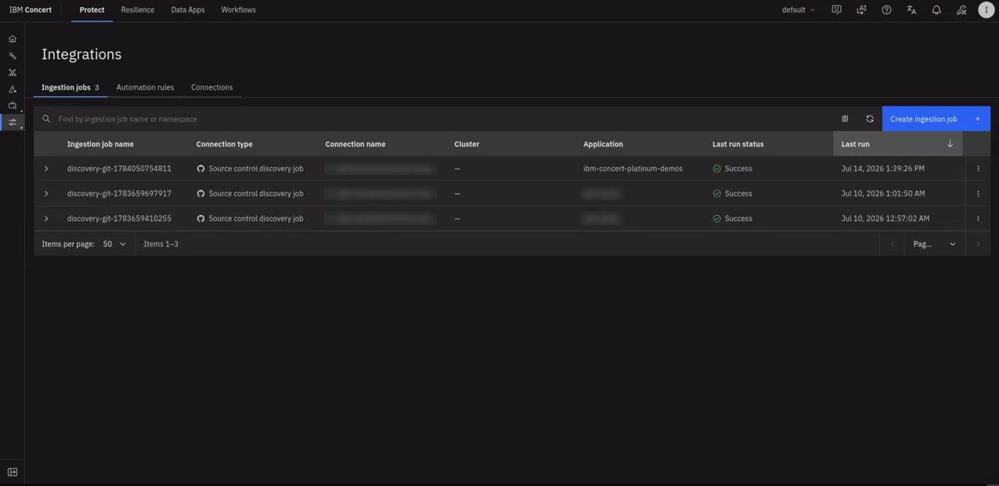

   :::tip This scan takes roughly 5 minutes
   It is a real analysis. Move on to the next section while it runs.
   :::

---

## 4.3 Connect a Red Hat OpenShift Cluster

In the Concert UI, click **Resilience** in the top navigation bar.

:::note What is the Resilience view?
**Resilience** is Concert's operations-focused view. It covers infrastructure and environments — including container workloads running on Kubernetes and OpenShift.
:::

1. On the home page, click **Discover your data** in the top-right corner.

   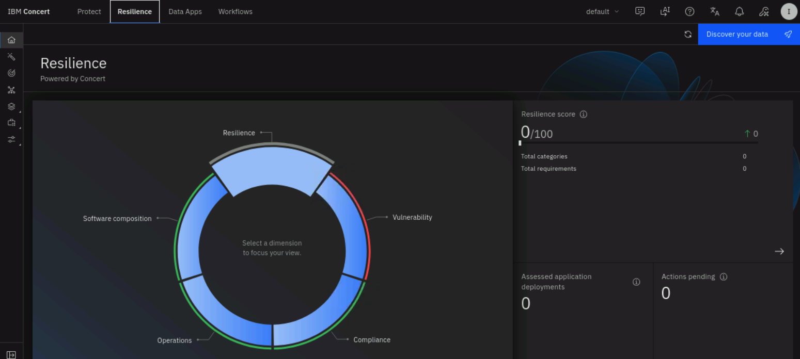

2. A menu of integration types appears — AWS, IBM Cloud, Kubernetes, Google Cloud, and more.

   

3. Choose **Kubernetes**, then in the **Select an integration** dropdown select **Red Hat OpenShift Container Platform (OCP)**.

   

4. Leave **Create new connection** selected
      * From the credentials file, open the **Shared Box Note** URL on a new tab in the Firefox browser
      * Copy the three values from the **Shared Box Note** page as shown below:
      * 


   | Field | Value |
   |-------|-------|
   | **Endpoint** | `OCP_Endpoint` |
   | **Token** | `OCP_Token` |
   | **Cluster name** | `OCP_Cluster_Name` |

   

   :::info What are these three values?
   - **Endpoint** — the cluster's API address: the front door Concert knocks on to communicate with OpenShift.
   - **Token** — a service-account credential that proves Concert is authorized and grants it read access.
   - **Cluster name** — a label so you can recognize this cluster inside Concert later.
   :::

5. Click on **Validate Connection**. When the credentials are correct, **Validation status** shows a green **Successful**. Click **Next**.

   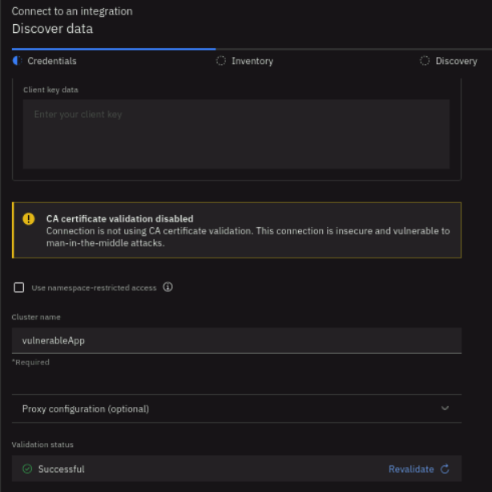

   :::tip If validation fails
   A failed validation almost always means the token is wrong, expired, or truncated. Re-copy it carefully and use **Revalidate** rather than starting over.
   :::

6. On the **Inventory** step, enter a name for **Target Environment** (such as `Test`), set the **Aggregation period count** to `1` and set the **Assessment period** to `Hour`.

   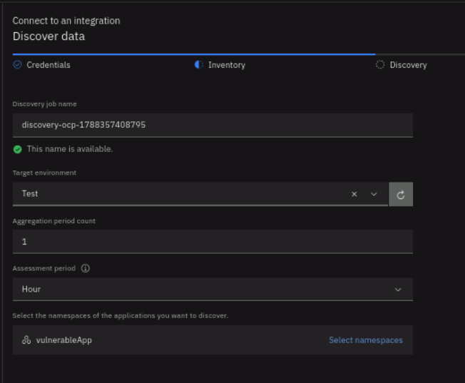

7. Click **Select namespaces**, then open **Advanced filters**. In the **Include namespaces (comma separated)** field, enter `vulnerableapp-demo` and **Apply** the filter. Select **vulnerableapp-demo** from the results and click **Select**.

   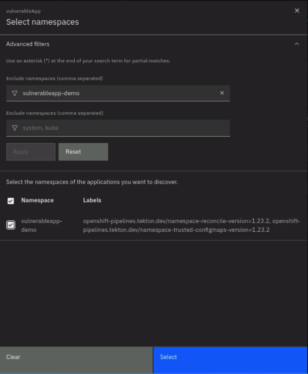

8. Back on the Inventory step, confirm the **vulnerableApp Namespace** is listed and click **Next**.

9. Concert begins discovery: it accesses the cluster, pulls the image inventory, and starts the Trivy scan. The screen shows *"Accessing and scanning the cloud…"* with an estimated time.

   

10. Let it load and when it's available, click **Go to the home page** and continue to the next step while the scan runs in the background.

---

## 4.4 Set Environmental Factors

Concert has discovered your applications but does not yet know how important they are to your business. 
The same vulnerability can represent completely different levels of risk in different applications — Concert 
cannot distinguish between them until you provide that context information.

Repeat these steps for **both** the GitHub-discovered application and the OCP-discovered application.

1. In the left navigation rail, click the **Inventory** icon, then select **Application inventory**.

   You will see the applications that were auto-discovered from GitHub and OpenShift.

   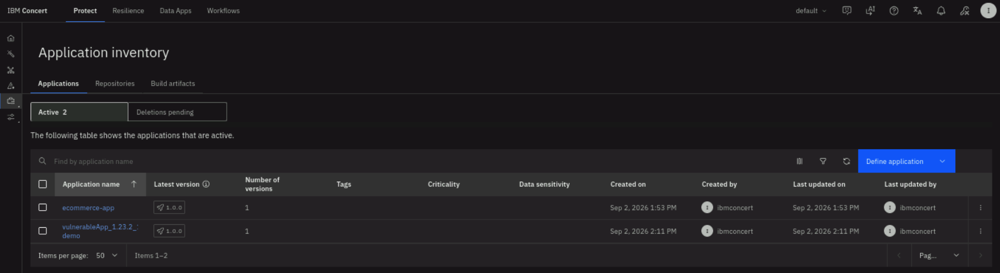

2. Click on the application name to view its version details.
3. Click the **3-dot menu** (overflow menu) on the right side of the application row or version row and select **Edit details**. Configure the following values and click **Save**:

   | Field | Value |
   |-------|-------|
   | **Application criticality** | `Very High` |
   | **Data sensitivity** | `Very High` |

   

4. Repeat steps 2 through 3 for the second discovered application.

5. Pick one of the two applications to show the application versions list, select the checkbox next to the target version, and click **Recompute priorities**.
Because the priorities across **all** applications in this Concert instance are recomputed, this action only needs to be done once.

   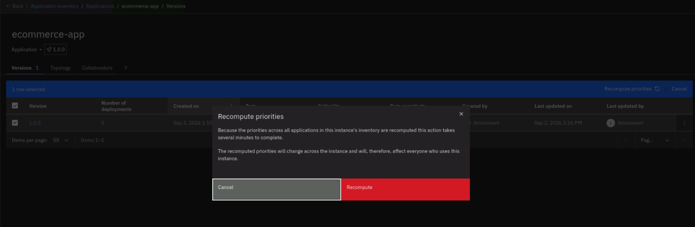


:::warning Recompute is required
Changing criticality and data sensitivity does **not** automatically re-rank findings. You must click **Recompute priorities** — otherwise Concert continues to show priorities from before your changes.
:::

:::note What just happened?
The values you set feed into the **environmental factor**, one of the three inputs to the Concert risk score. Marking an application as highly critical tells Concert that a vulnerability here matters more than the same vulnerability somewhere less important. After recomputing, a number of findings will promote to Priority 1.
:::

---

## 4.5 Review the Scan Findings and Prioritized Risks

When the Auto-discovery scans finish, return to the **Protect** home page and refresh the page.

:::warning Scan completion time
The initial scan performs a comprehensive vulnerability analysis across your code and images. The process continues running in the background even if you navigate away.
:::

Review the **Overall risk composition** panel. Concert breaks findings into three categories:

   | Category | What it contains |
   |----------|-----------------|
   | **Prioritized CVEs** | Known external threats from the CVE databases |
   | **Prioritized exposures** | SAST findings — flaws in the code's own composition |
   | **Packages with high vulnerability** | Risk from vulnerable third-party dependencies |

   Each category is broken down by priority, so you can see not just *how many* problems exist but *how many actually matter*.

   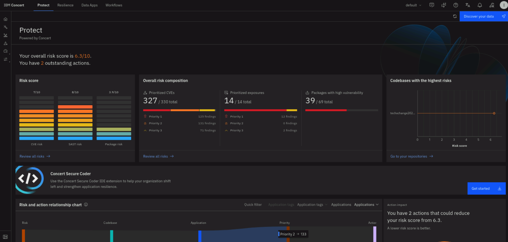

### 4.5.1 The Risk View


Click **Review all risks** to open the full **Risk** view. 

#### CVEs Tab View

Note that for each CVE the following information is available:

   | Column | Meaning |
   |--------|---------|
   | **CVSS score** | Industry-standard severity (0–10). How dangerous the flaw is *in the abstract*. |
   | **Total findings** | How many times this vulnerability appears in your code. |
   | **Highest priority in findings** | How urgently Concert recommends acting. Priority 1 is most urgent. |
   | **Highest risk score in findings** | Concert's own score (0–10), reflecting *your* environment. |
   | **Impacted applications** | Which of your applications this vulnerability affects. |

   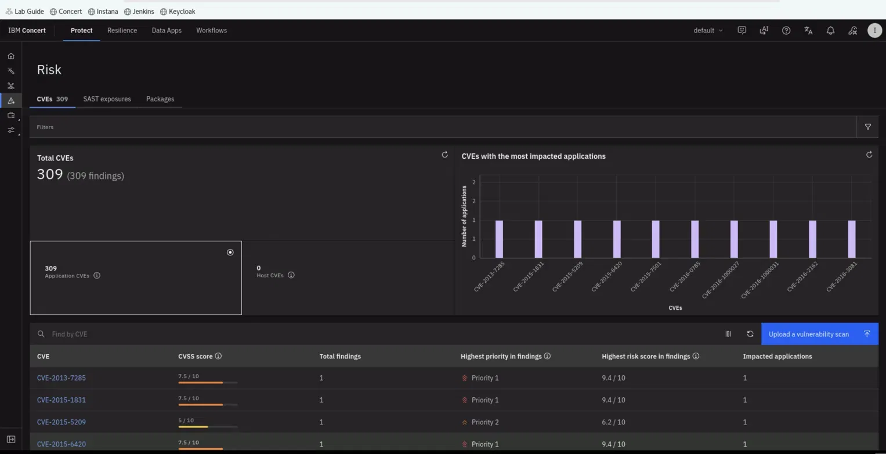

   :::note CVSS score vs. Concert risk score
   A **CVSS score** tells you how severe a vulnerability is *in general*. A **Concert risk score** tells you how much it matters *in your environment* — whether the code is reachable, whether it is being exploited, and whether the application is critical. Section 4.6 explains exactly how Concert calculates it.
   :::


#### SAST Tab View

Click on the **SAST exposures** tab. Concert performs Static Application Security Testing (SAST) analysis 
by scanning repositories directly as you have done previously. Select one of the listed open exposures to see
the source of the code, file name, line number, etc.

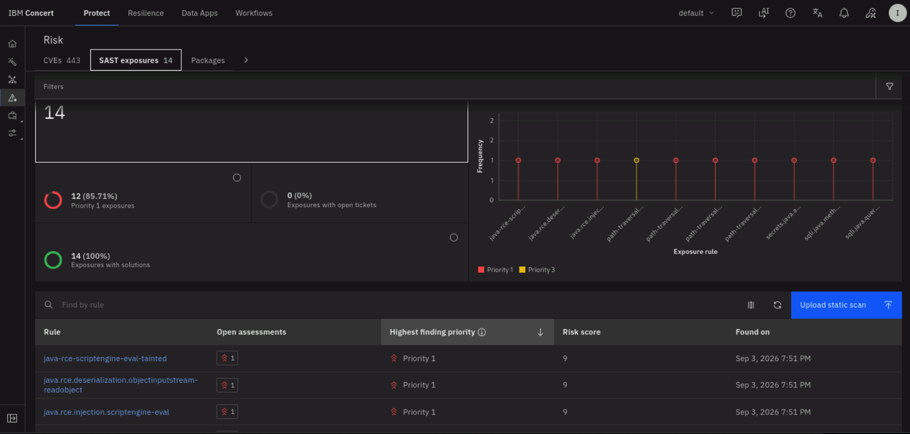


#### Packages Tab View

Click on the **Packages** tab. Concert performs Software Composition Analysis (SCA) by inspecting third-party 
and open-source libraries declared in codebases to identify public dependencies tied to known Common Vulnerabilities 
and Exposures. Select one package to see additional details including package reliability checks, applications impacted, 
where the package is used, dependencies and blast radius.

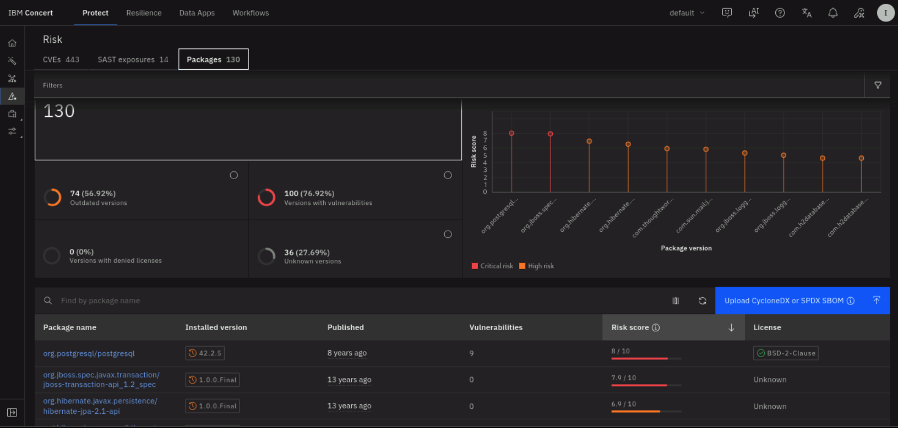

---

## 4.6 Understanding the Concert Risk Score

With findings now prioritized, it is worth understanding the number Concert uses to rank them. The scoring model is identical whether data came from a GitHub scan or an OCP cluster scan.

Return to the **Risk** tab (in the Protect view) or the **Vulnerability** dimension (in the Resilience view) and filter by **Highest priority in findings** to bring Priority 1 items to the top.

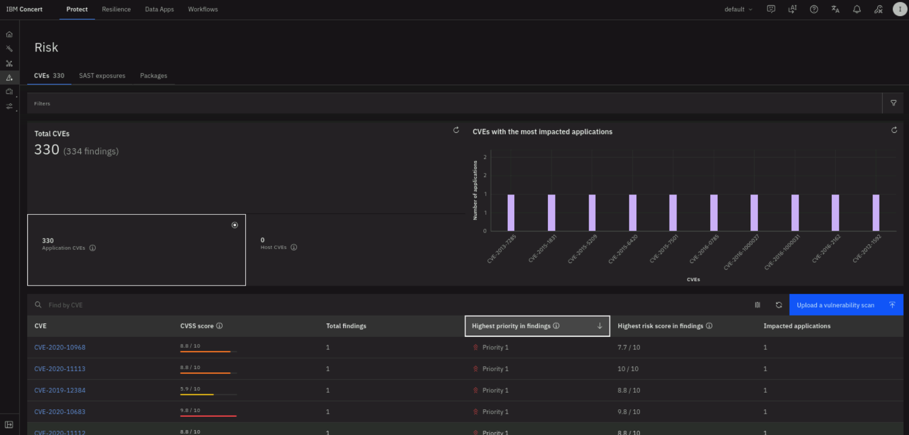

### 4.6.1 The Problem With CVSS Alone

Most organizations prioritize vulnerabilities using the **CVSS score**, and CVSS is a useful number. But it only measures *severity* — how dangerous the flaw is in the abstract. It says nothing about:

- Whether the vulnerable code is actually reachable in your environment
- Whether anyone is actively exploiting it
- Whether the application it lives in matters to your business

Consider the scale: a very large share of all published CVEs score **7 or higher** on CVSS — that is the pile most teams work through. But the set of CVEs **actually being exploited** in real environments is dramatically smaller, and **part of that set scores below 7** and never gets prioritized under a CVSS-only approach.

### 4.6.2 How Concert Calculates Risk

Concert produces its own score on a scale of 1 to 10:

```
Risk Score = Severity × Exploitability × Environmental Factor
```

| Input | Source | What it measures |
|-------|--------|-----------------|
| **Severity** | NVD / CVSS v3 | How dangerous the flaw is in general |
| **Exploitability** | EPSS | Probability the CVE will be exploited within 30 days |
| **Environmental factor** | Your inputs in Concert | How much this flaw matters *in your environment* |

**EPSS** (Exploit Prediction Scoring System) is an AI model that predicts whether a CVE will be exploited in the near term. Concert uses an equilibrium point of **0.1**: an EPSS score above 0.1 raises the risk score; below 0.1 lowers it.

**Environmental factor** is derived from what you set in Section 4.4:
- **Application criticality** — below medium lowers the score; above medium raises it.
- **Data sensitivity** — mapped identically to criticality.
- **Access points** — public exposure is the strongest signal and always raises the score. Private access points only begin to raise the score at four or more. If no access points are recorded, Concert averages criticality and data sensitivity.

The result is capped at **10**.

:::note Where each factor lives
The **environmental factor** is calculated at the *finding* level — the same CVE in different applications produces different scores. **CVSS severity** and **exploitability** are held at the *CVE* level — identical across every finding for that CVE.
:::

### 4.6.3 Configuring the Scoring Method

An administrator can change the prioritization method under **Settings**:

| Option | Description |
|--------|-------------|
| **Concert risk score** | Default — combines severity, exploitability, and environmental context |
| **CVSS score** | Uses the raw CVSS score for prioritization |
| **External score** | Accepts a JSON file via the API, for organizations with their own scoring formula |

The priority bands are also adjustable. By default, Priority 1 covers scores from 7.5 to 10, but an administrator can move that threshold using a slider.

---

## 4.7 Review a CVE End to End and Open a Ticket

The CVE review flow is the same regardless of which source the finding came from — GitHub or OCP. The only difference is where you find the list: **Risk** in the Protect view for GitHub findings, **Dimensions → Vulnerability** in the Resilience view for OCP findings.

This walkthrough uses **CVE-2021-44228** (Log4Shell), but the same steps apply to any CVE.

### 4.7.1 Open the CVE

In the **Protect** view, open the **Risk** tab. Click into a Priority 1 CVE.


### 4.7.2 Overview Tab

On the **Overview** tab, Concert provides:

- A description of the vulnerability
- The **attack vector** — how this would be exploited
- The **impact** if exploitation were successful
- Whether there is an **active exploit** in the wild
- Whether **remediation is available**

The overview also shows watsonx-generated contextual guidance. If these fields are not populated, click **Regenerate with watsonx**.

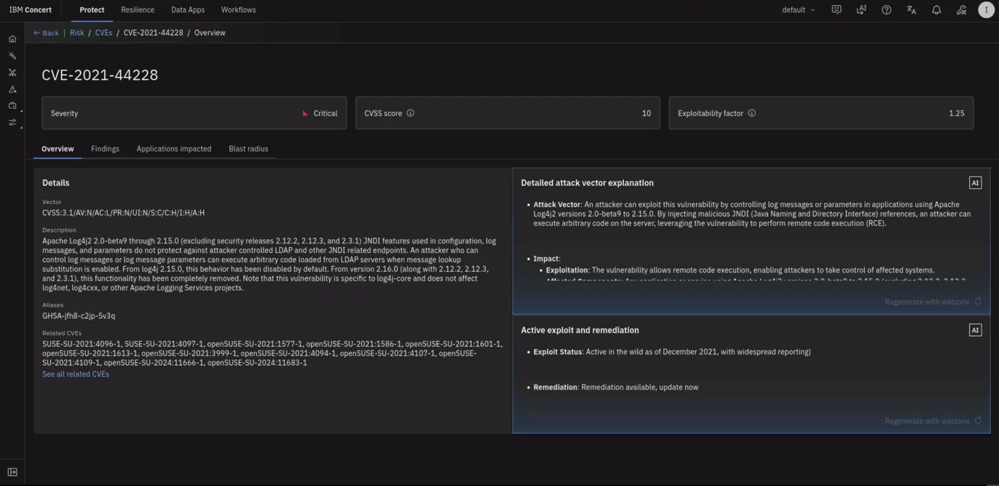

### 4.7.3 Blast Radius Tab

Click the **Blast radius** tab. This is Concert's dependency-impact graph — it maps every link in the chain from the CVE to your environment.

**For a GitHub scan,** the chain is: CVE → package → repository → application.


**For an OCP cluster scan,** the chain extends further: CVE → package → container image → application → environment (with access points).

The blast radius tells you:

- Which of your assets inherit the vulnerability and by what path
- Whether fixing one package resolves a single finding or clears it across multiple applications at once

### 4.7.4 Findings Tab

Click the **Findings** tab and expand a finding using the arrow on the left. The risk score is fully transparent here: you can see the CVSS score, the exploitability factor, and the environmental factor that combined to produce the final number.


Below the finding details, Concert presents a **recommended mitigation strategy** generated by watsonx.ai. For the GitHub/Maven repository, it returns the exact `pom.xml` dependency block to change. For OCP findings, it returns guidance specific to the image and package.

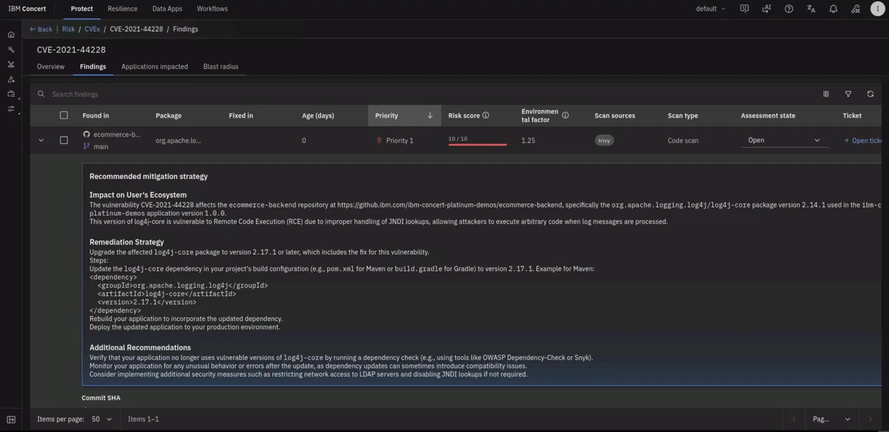

### 4.7.5 Open a Ticket

1. On the finding row, click on **Open ticket** on the last column:

   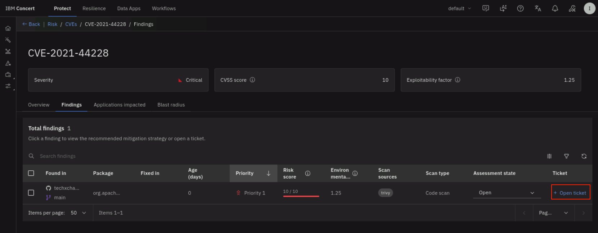

2. In the **Open a ticket** dialog, fill in the details:

   | Field | Value |
   |-------|-------|
   | **Type** | GitHub |
   | **Connection** | Select the **github-connection** from Section 3 |
   | **Organization** | Your personal GitHub username |
   | **Repository** | `techxchange2026-ecommerce-backend` |

   Click **Open**.

   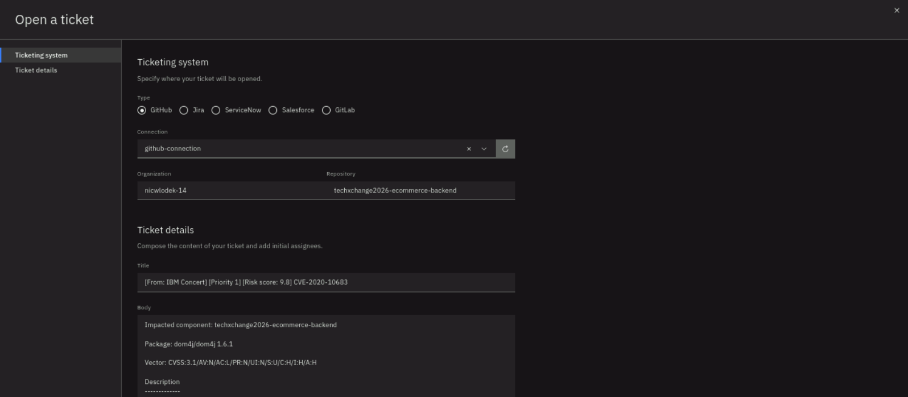

3. Open your forked GitHub repository and click the **Issues** tab to confirm the issue was created.

   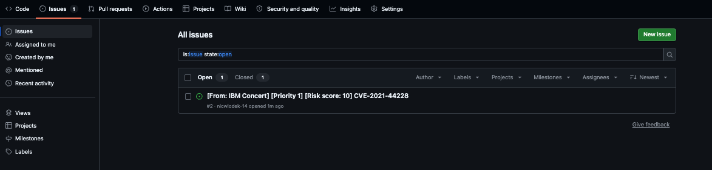
---


## 4.8 Section Summary

In this section Concert discovered vulnerabilities from two distinct sources — a GitHub repository and a live OpenShift cluster — using the same underlying scan and scoring engine for both. You connected each source, set environmental factors so Concert could prioritize findings for your environment, reviewed a CVE through its full blast radius, and turned a finding into a tracked GitHub Issue.

The scoring model — Severity × Exploitability × Environmental Factor — applies identically regardless of where data came from. The blast radius grows deeper for cluster-based data, extending the chain from source code all the way through container images and running environments.

