## 4.1: Overview

**Important:** This section of the lab is **optional** — you may skip it if needed, but review it only if time permits.

In this section you will create an application from scratch using **IBM Bob**, IBM's AI development assistant, publish it to GitHub, and then run it through the Concert auto-discovery flow. The next section repeats this discovery flow against an existing repository.
This section is written to be followed step by step, and assumes no prior experience with IBM Bob, Java, or Maven.
This lab section guides you through:
- Downloading and setting up IBM Bob inside the lab environment
- Using Bob to generate a Java Maven application from a plain-English prompt
- Modifying the project so it contains known-vulnerable dependencies
- Pushing the application to GitHub
- Connecting the repository to Concert and running auto-discovery
- Reviewing the discovered CVEs, blast radius, and remediation guidance
:::info What is IBM Bob?
**IBM Bob** is an AI development assistant built into a code editor (similar to VS Code). You describe what you want in plain English, and Bob writes the application for you: the project files, the source code, and the configuration. In this lab it plays the role of the developer who produces the code that Concert will later scan.
:::
:::info Why build a deliberately vulnerable application?
The point of this section is to watch Concert find security vulnerabilities. A brand-new application built with the latest libraries would scan almost clean and produce a boring result. So we intentionally configure the application to use older library versions that contain well-known CVEs, such as Log4Shell. This gives Concert real, critical vulnerabilities to detect, which is exactly what a security-scanning demo needs.
:::
---
## 4.2 Prepare the Lab Environment
IBM Bob runs inside the **Guacamole remote desktop** (the browser-based Linux desktop) that is part of your Concert lab environment. You will install Bob there, not on your own laptop.
1. Open your **TechZone reservation** for the Concert environment.
2. Confirm the status shows **Ready** and that the reservation has not expired. If you need more time, use the extend option.
3. In the reservation details, locate the **Bastion Remote Desktop** link (a Guacamole URL) and click it to open the remote Linux desktop.
4. Also note the password field labeled *"The password for all provisioned virtual machines."* You will need this when installing software.
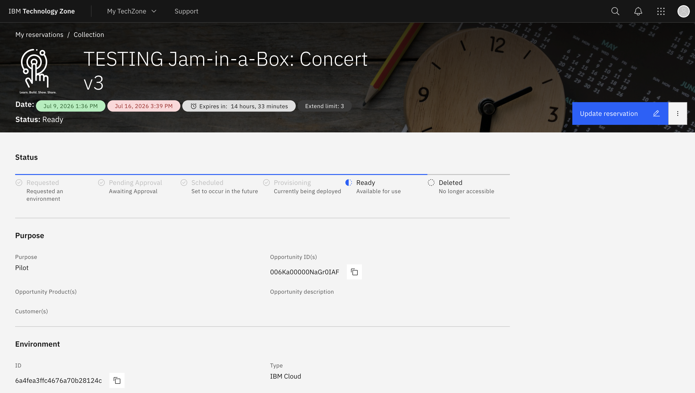
:::info Where does Bob get installed?
IBM Bob must be installed **inside the Guacamole remote desktop**, not on your personal machine. Concert's auto-discovery reads your code from GitHub, so the application only needs to be pushed there from the remote desktop.
:::
---
## 4.3 Download IBM Bob
1. Inside the remote desktop, open **Firefox** and go to the IBM Bob download page (`bob.ibm.com/download`).
2. Make sure the **Bob IDE** option is selected, not Bob Shell. Bob IDE is the code-editor version you need.
3. Under the **Linux** column, choose **Linux RPM x64**. The lab desktop runs Red Hat Enterprise Linux, which uses RPM packages rather than the `.deb` option.
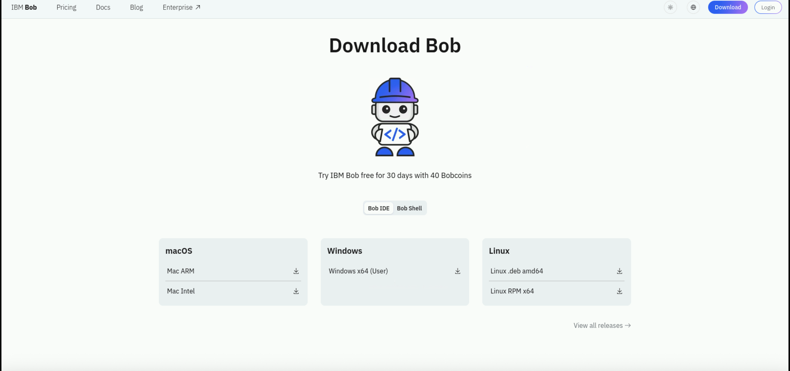
:::warning
Choose the **RPM** package, not the `.deb`. The lab desktop is Red Hat Enterprise Linux (RHEL); a Debian/Ubuntu `.deb` package will not install cleanly.
:::
---
## 4.4 Install and Launch Bob
1. When the RPM finishes downloading, open it. The desktop's **Software** installer (GNOME Software) opens and shows the `bobide` package.
2. Click **Install**.
3. When prompted with **Authentication Required**, enter the environment password, the one labeled *"The password for all provisioned virtual machines"* on your TechZone reservation page, and click **Authenticate**.
:::note
This authentication prompt asks for the remote desktop machine's admin password (provided by TechZone), **not** your IBM account password. If it says the password is wrong, double-check you copied the exact value from the reservation details.
:::
4. Once installed, launch **IBM Bob**. It may open automatically, or you can find it in the **Activities** menu.
5. If Bob offers to migrate old chats or import settings from another editor, choose **Skip migration** and **Skip for now**. You are starting fresh.
6. Log in to Bob with your IBM credentials if prompted.
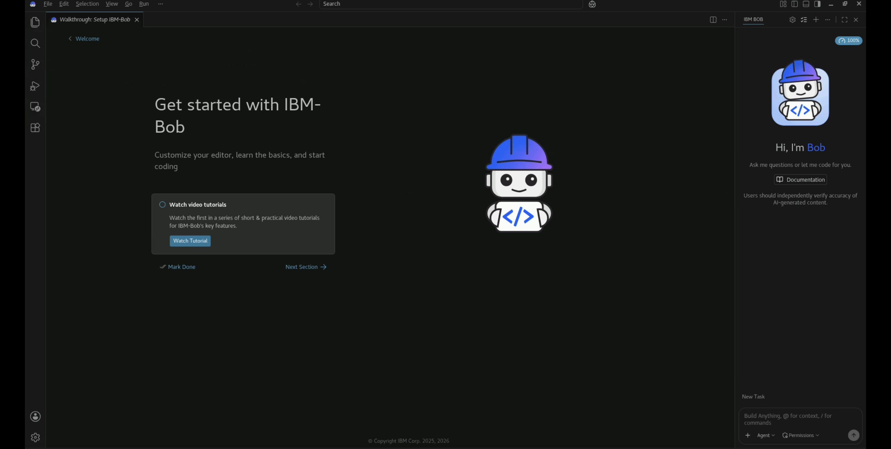
:::note
A message about the OS keyring not being available for encryption is only a warning, not a blocker. Close it and continue.
:::
---
## 4.5 Build the Application with Bob
Now you use Bob to generate a small REST API called **Mission Control**, a space-themed application that tracks space missions, planets, and stars.
1. In Bob, go to **File** → **Open Folder** and create/open a new empty folder for the project. Bob needs a workspace to write files into.
2. In the Bob chat panel on the right (the **New Task** box), paste the following prompt:
```text
Create a new Java Spring Boot REST API called mission-control using Maven.
Requirements:
- A SpaceObject entity with fields: id, name, category (MISSION, PLANET, STAR),
  agency (nullable), launchYear (nullable), status (ACTIVE, COMPLETED, PLANNED, N/A),
  monitoringStatus (NOMINAL, ALERT, MONITORED)
- Full CRUD REST endpoints at /api/space-objects (GET all, GET by id, POST, PUT, DELETE)
- Also add a filter endpoint: GET /api/space-objects/category/{category}
- In-memory storage (a simple List, no database)
- A SpaceObjectController, SpaceObjectService, and SpaceObject model class
- Seed with: missions (Perseverance, Voyager 1, James Webb, Artemis),
  planets (Mars, Jupiter, Saturn), stars (Sun, Betelgeuse, Sirius)
- Group id: com.demo, artifact id: mission-control
- Use Java 11
- Keep the pom.xml as-is, I will edit dependencies myself
Generate all Java source files and application.properties.
```
3. Bob analyzes the prompt and produces a to-do list (create the Maven structure, the `pom.xml`, the model, service, and controller classes, and so on).
4. When Bob asks for permission to proceed, click **Approve todo tools for task** so it can complete every step without stopping for each one.
5. Let Bob work through the entire list. When it finishes, it reports **All tasks completed** and the new files appear in the Explorer.
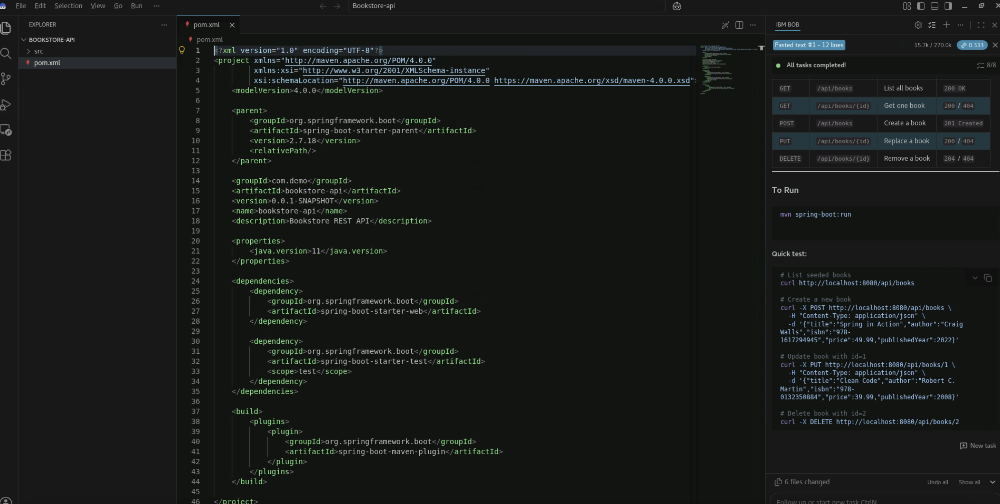
:::tip
If the file tree still shows old files after Bob finishes, right-click the `src` folder and choose **Refresh** (or press **F5**). Confirm you see the `missioncontrol` package containing `SpaceObject.java`, `SpaceObjectController.java`, `SpaceObjectService.java`, and `MissionControlApplication.java`.
:::
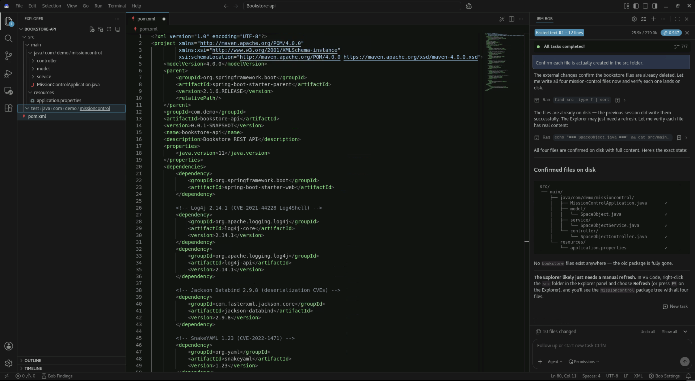
:::info Get creative
Mission Control is only one option. The application can track anything you like, since the CRUD pattern is the same regardless of theme. What the application *does* has no effect on the scan; the vulnerabilities you add in the next step are what Concert actually reports on.
:::
---
## 4.6 Add Vulnerable Dependencies
The application Bob generated is clean and uses modern, patched libraries. To give Concert something meaningful to find, you now replace the project's dependency file (`pom.xml`) with one that intentionally references older library versions containing well-known CVEs.
:::info What is the pom.xml?
In a Maven project, the **`pom.xml`** is the file that lists every external library the application depends on, and which version of each. When Concert scans your repository, it reads this file, checks each library and version against known-vulnerability databases, and reports the CVEs it finds. This is why the `pom.xml` is the single most important file for this section.
:::
1. In the Explorer, click **`pom.xml`** to open it.
2. Select all of its contents (`Ctrl+A`), delete them, and paste in the vulnerable version below.
3. Save the file (`Ctrl+S`). If a *"Failed to save: the content is newer"* dialog appears, click **Overwrite**, since your version is the correct one.
```xml
<?xml version="1.0" encoding="UTF-8"?>
<project xmlns="http://maven.apache.org/POM/4.0.0"
         xmlns:xsi="http://www.w3.org/2001/XMLSchema-instance"
         xsi:schemaLocation="http://maven.apache.org/POM/4.0.0 https://maven.apache.org/xsd/maven-4.0.0.xsd">
    <modelVersion>4.0.0</modelVersion>
    <parent>
        <groupId>org.springframework.boot</groupId>
        <artifactId>spring-boot-starter-parent</artifactId>
        <version>2.1.6.RELEASE</version>
        <relativePath/>
    </parent>
    <groupId>com.demo</groupId>
    <artifactId>mission-control</artifactId>
    <version>0.0.1-SNAPSHOT</version>
    <name>mission-control</name>
    <description>Mission Control REST API</description>
    <properties>
        <java.version>11</java.version>
    </properties>
    <dependencies>
        <dependency>
            <groupId>org.springframework.boot</groupId>
            <artifactId>spring-boot-starter-web</artifactId>
        </dependency>
        <!-- Log4j 2.14.1 (CVE-2021-44228 Log4Shell) -->
        <dependency>
            <groupId>org.apache.logging.log4j</groupId>
            <artifactId>log4j-core</artifactId>
            <version>2.14.1</version>
        </dependency>
        <dependency>
            <groupId>org.apache.logging.log4j</groupId>
            <artifactId>log4j-api</artifactId>
            <version>2.14.1</version>
        </dependency>
        <!-- Jackson Databind 2.9.8 (deserialization CVEs) -->
        <dependency>
            <groupId>com.fasterxml.jackson.core</groupId>
            <artifactId>jackson-databind</artifactId>
            <version>2.9.8</version>
        </dependency>
        <!-- SnakeYAML 1.23 (CVE-2022-1471) -->
        <dependency>
            <groupId>org.yaml</groupId>
            <artifactId>snakeyaml</artifactId>
            <version>1.23</version>
        </dependency>
        <!-- commons-collections 3.2.1 (deserialization RCE) -->
        <dependency>
            <groupId>commons-collections</groupId>
            <artifactId>commons-collections</artifactId>
            <version>3.2.1</version>
        </dependency>
        <!-- Apache Commons Text 1.9 (CVE-2022-42889 Text4Shell) -->
        <dependency>
            <groupId>org.apache.commons</groupId>
            <artifactId>commons-text</artifactId>
            <version>1.9</version>
        </dependency>
        <dependency>
            <groupId>org.springframework.boot</groupId>
            <artifactId>spring-boot-starter-test</artifactId>
            <scope>test</scope>
        </dependency>
    </dependencies>
    <build>
        <plugins>
            <plugin>
                <groupId>org.springframework.boot</groupId>
                <artifactId>spring-boot-maven-plugin</artifactId>
            </plugin>
        </plugins>
    </build>
</project>
```
Each library above was chosen because it carries a well-known, high-severity CVE:
- **Spring Boot 2.1.6.RELEASE** — an older parent version that pulls in many outdated transitive dependencies, and introduces Spring4Shell (CVE-2022-22965).
- **Log4j 2.14.1** — Log4Shell (CVE-2021-44228), a critical remote-code-execution flaw.
- **Jackson Databind 2.9.8** — multiple deserialization vulnerabilities.
- **SnakeYAML 1.23** — CVE-2022-1471, a remote-code-execution flaw.
- **commons-collections 3.2.1** — a classic Java deserialization RCE.
- **Apache Commons Text 1.9** — Text4Shell (CVE-2022-42889).
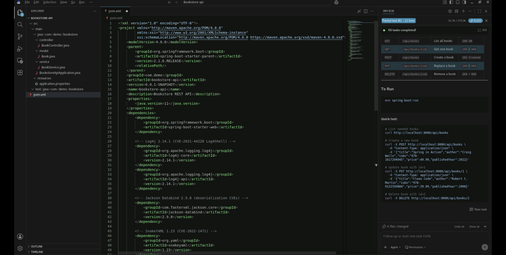
:::note
The `.java` files Bob generated are left exactly as they are. Only the `pom.xml` is changed, because that is the file that determines which dependencies, and therefore which vulnerabilities, Concert will find.
:::
---
## 4.7 Publish the Application to GitHub
Concert discovers your application by reading it from GitHub, so the next step is to create a repository and push your code to it.
### 4.7.1 Create an empty repository
1. In the remote desktop's Firefox, go to `github.ibm.com`.
2. Click **New repository** (the **+** menu, top-right).
3. Name it `mission-control`, set it to **Private**, and do **not** add a README (leave it completely empty).
4. Add a short description, for example: *"Sample Java Spring Boot REST API built with IBM Bob, containing intentionally vulnerable dependencies for IBM Concert CVE scanning."*
5. Click **Create repository** and copy the repository URL, for example `https://github.ibm.com/YOUR-USERNAME/mission-control.git`.
### 4.7.2 Get the Git PAT from the credentials file
GitHub no longer accepts account passwords for git operations; you authenticate with a **Personal Access Token (PAT)** instead. You already created this token during **Lab Preparation** and saved it in your credentials file, so you do not need to create a new one here.
1. Open your `credentials.txt` file.
2. Copy the value of the **GitHub Personal Access Token (PAT)** field.
3. Keep it handy — you will use it in the next step to authenticate the `git push`, and again in section 4.8 when you connect the repository to Concert.
:::note
If the **GitHub Personal Access Token (PAT)** field in your credentials file is empty, go back to section 3, Lab Preparation, and complete the step that creates it. The token needs the **`repo`** scope (write access), and Concert also needs the org read permission included with **`admin:org`**.
:::
:::warning
Never commit a live token or credential into your code. IBM's secret scanner will block any push that contains one. Always use placeholders in write-ups.
:::
### 4.7.3 Push the code
1. In Bob, open a terminal: **Terminal** → **New Terminal**.
2. Run the following commands one at a time. Use your own email, repository URL, and folder name.
```bash
cd ~/YOUR-PROJECT-FOLDER
git config --global user.email "your.name@ibm.com"
git config --global user.name "Your Name"
git init
git add .
git commit -m "Mission Control API with vulnerable dependencies"
git branch -M main
git remote add origin https://github.ibm.com/YOUR-USERNAME/mission-control.git
git push -u origin main
```
3. When `git push` prompts for credentials, enter your GitHub **username**, and for the password paste the **Git PAT from your credentials file** (not your account password).
:::tip
When you paste the token as the password, the terminal may show nothing as you type or paste. That is normal. Just paste and press **Enter**.
:::
4. A successful push ends with a line like `[new branch] main -> main`. Your code is now on GitHub.
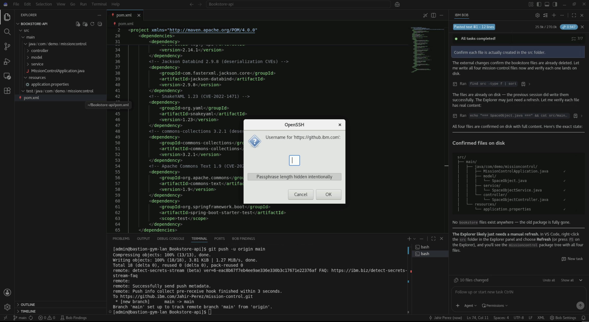
---
## 4.8 Scan the Application in Concert
With the application on GitHub, you now connect it to Concert and run auto-discovery. This is the same flow used in the next section.
1. Open IBM Concert and switch to the **Protect** view (the Developer focus).
2. Click **Discover your data** to start a new discovery. The watsonx assistant opens on the right and asks for a GitHub link.
3. In the assistant's input box, paste your repository URL, for example `https://github.ibm.com/YOUR-USERNAME/mission-control`, and send it.
4. When prompted to select a GitHub credential, choose **Use new classic GitHub PAT**.
5. Paste the **Git PAT from your credentials file** (it needs the **`repo`** and **`read:org`** scopes) and click **Connect**.
6. The assistant confirms it connected to GitHub and identifies the active repository and branch (`mission-control`, `main`).
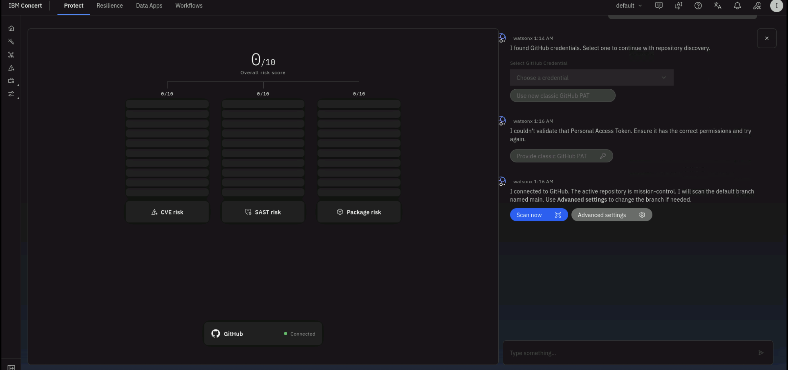
7. Click **Scan now**. Concert runs its scan pipeline against the repository: discovery, SBOM generation, dependency scan, and static code scan.
8. The scan takes a few minutes. You can watch progress in the **Event log**, where each job shows **Processing completed** as it finishes.
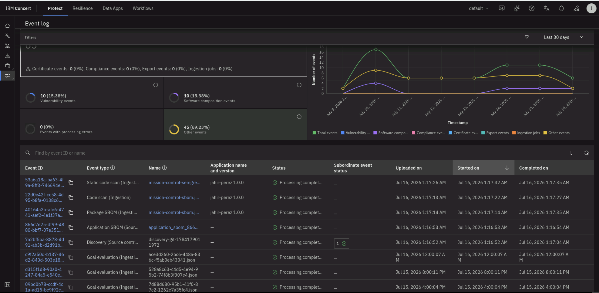
:::note
Unlike a cluster-based scan that depends on reaching a container registry, a GitHub scan reads everything it needs directly from the repository. As long as the token is valid and the `pom.xml` is present, the scan will produce results.
:::
---
## 4.9 Review the Results
Once the scan completes, Concert populates the risk data for your application.
### 4.9.1 The CVE list
1. From the **Protect** view, open the **Risk** area and select the **CVEs** tab.
2. You will see the full list of discovered CVEs, sorted by severity. The vulnerable dependencies you added produce many findings, including several critical (CVSS 10) issues.
The most important one to note is **CVE-2021-44228 (Log4Shell)**, which appears as a **Priority 1** finding with a maximum CVSS score of **10**, exactly the critical vulnerability the vulnerable Log4j version was chosen to introduce.
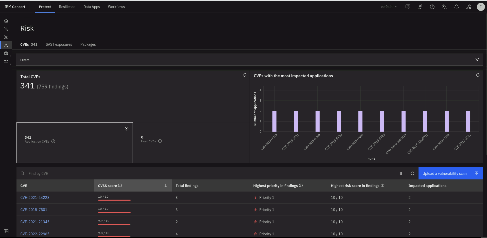
### 4.9.2 CVE detail: Overview
1. Click **CVE-2021-44228** to open its detail page.
2. The **Overview** tab shows the severity (Critical), CVSS score (10), exploitability factor, a plain-English description, and watsonx-generated attack-vector and remediation guidance.
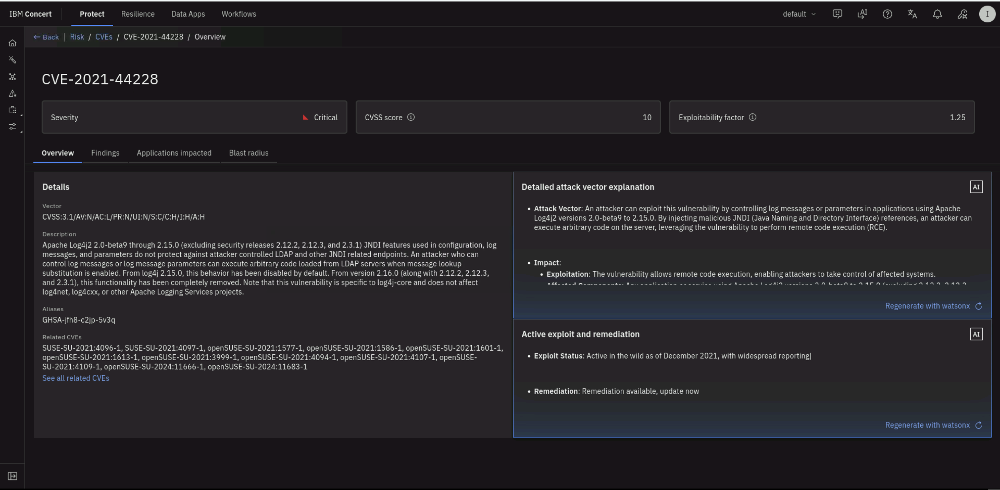
### 4.9.3 Blast radius
The **blast radius** is Concert's dependency-impact graph for a single vulnerability. Rather than showing the CVE in isolation, it maps every link in the chain that connects the flaw to your environment: the CVE is carried by a specific package (the Log4j library), that package is a dependency of your `mission-control` repository, and that repository is registered as your application. Reading the graph tells you exactly which of your assets inherit the vulnerability and by what path, information a CVE record alone never gives you.
1. On the CVE detail page, open the **Blast radius** tab.
2. Trace the chain from the CVE, through the Log4j package, to the `mission-control` repository, to your application.
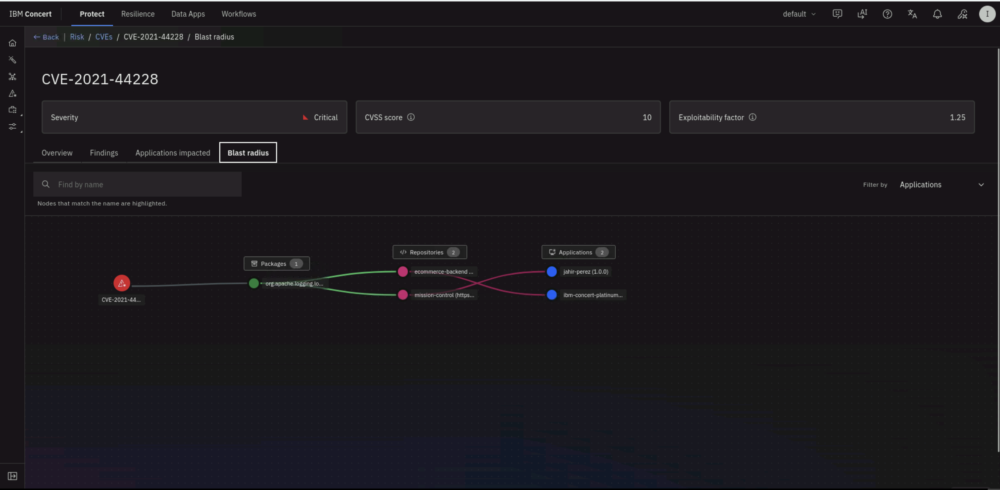
### 4.9.4 Findings and impacted applications
1. The **Findings** tab lists each place the vulnerability was found (your `mission-control` repository, on the `main` branch), its priority, risk score, and scan source (Trivy). From here you can also open a remediation ticket.
2. The **Applications impacted** tab shows which applications are affected, along with their criticality and data-sensitivity ratings.
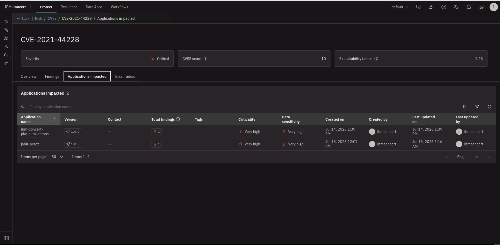
### 4.9.5 File a remediation ticket in GitHub
Reviewing a vulnerability is only useful if someone acts on it. This last step takes the Log4Shell finding all the way to a tracked GitHub issue, so the application Bob built for you ends the lab with a real remediation ticket attached to it.

A **ticket** is Concert's way of handing a vulnerability off to whoever will actually fix it — instead of the finding living only inside Concert, it becomes an issue in the tool your developers already work in, with the watsonx remediation guidance already written into it.

1. On the **Findings** tab of **CVE-2021-44228**, expand the finding using the arrow on the left. Concert shows the **recommended mitigation strategy** generated by watsonx.ai — specific to your project, naming the vulnerable `org.apache.logging.log4j/log4j-core` package, the fixed version to upgrade to, and the exact Maven dependency block to change in the `pom.xml` you edited in section 4.6.

2. Below the guidance, click **Open ticket**. The **Open a ticket** dialog opens with two sections: **Ticketing system** (where the ticket goes) and **Ticket details** (what it says). Work through them top to bottom.

   **a. Choose the ticketing system.** Under **Type**, pick where the ticket should be created. Concert can file into **GitHub**, **Jira**, **ServiceNow**, **Salesforce**, or **GitLab**. For this lab, leave **GitHub** selected.

   **b. Select a connection.** A *connection* is a saved, authenticated link between Concert and your ticketing tool — it is what actually gives Concert permission to create an issue on your behalf, using the Git PAT from your credentials file. Open the **Connection** dropdown and choose the GitHub connection for the repository you scanned.

   :::note No connection in the dropdown?
   If the **Connection** dropdown is empty, no link to GitHub has been set up yet, and you cannot file a ticket until one exists. A connection is created once in the Concert Administration area by an Admin or Editor, using a GitHub token with read and write access to the repository. Note also that only users with an **Admin** or **Editor** role in Concert are allowed to create tickets.
   :::

   **c. Point at the repository.** Two fields tell Concert exactly where the GitHub issue should land:
   - **Organization** — the GitHub account or organization that **owns the repository the issue will be filed in**. For the `mission-control` repository you created in section 4.7, this is your own `github.ibm.com` username.
   - **Repository** — the specific repo inside that organization: `mission-control`.

   *(Optional)* Click the **Refresh** button next to **Select labels** to pull the repository's existing GitHub labels, then apply any you want on the issue.

   At this point the top half of the dialog should look like this — GitHub selected, a connection chosen, and the organization and repository filled in:

   

   :::warning Organization is not always your username
   The **Connection** name may show a different label than the account that owns the target repository — that name is just how Concert labelled the connection. The **Organization** field must name the account that actually owns the repo the issue belongs in. Entering the wrong account here is the most common reason a ticket fails to publish. If the ticket does not file, check this field first, then confirm your Git PAT still has the `repo` scope.
   :::

3. Review the **Ticket details**. Concert has **already written the ticket for you** from the finding, so you normally do not touch anything here.

   - The **Title** carries the source, the priority, the risk score, and the CVE, for example: `[From: IBM Concert] [Priority 1] [Risk score: 10] CVE-2021-44228`.
   - The **Body** carries the impacted component, the affected package (`org.apache.logging.log4j/log4j-core 2.14.1` — the exact version you pinned in section 4.6), the CVSS vector, and the description.
   - *(Optional)* Add a GitHub username in the **Assignees** field to assign the issue on creation. Do not include the `@`.

4. Click **Open** to file the ticket. Concert sends the issue to GitHub through the connection, and the dialog closes.

5. Confirm it worked inside Concert. Back on the **Findings** tab, expand the finding again — the **Ticket** field now shows a linked issue number instead of the **Open ticket +** option. This link is your proof the ticket was created and your shortcut to open it.

   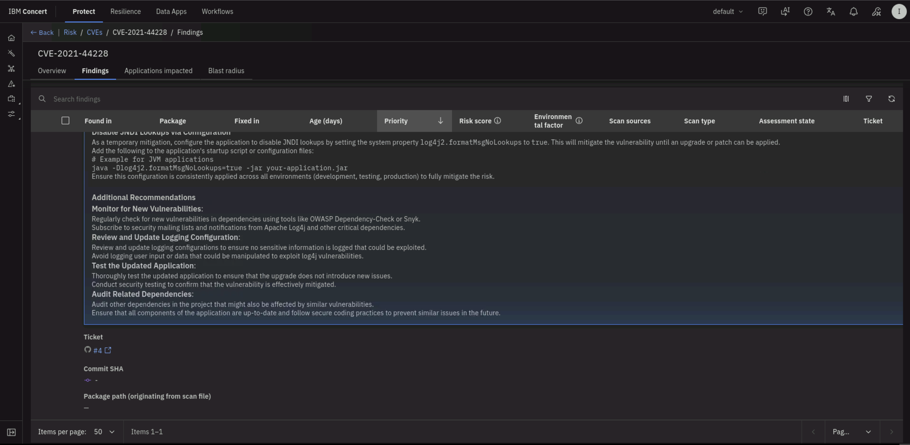

6. Confirm it worked inside GitHub. Click the **external-link arrow** next to the issue number to open the issue in a new tab. You will see it in the **Open** state, titled exactly as Concert set it, with the impacted component, package, CVSS vector, and full description carried across — a ready-to-work ticket a developer can pick up immediately.

   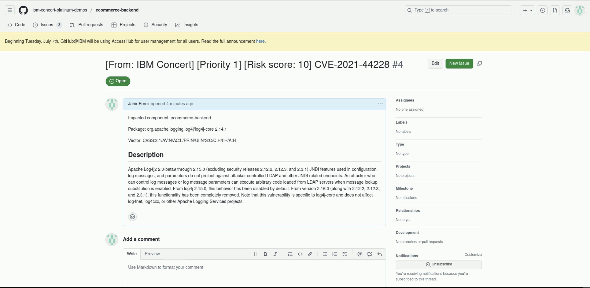

:::tip Automating this at scale
Opening tickets one at a time is fine for a demo, but a customer would automate it. Under **Administration** → **Integrations** → **Automation rules**, you can create a rule such as:

> *When a CVE is detected, and it is Priority 1, and it affects the mission-control app, open a GitHub ticket in the mission-control repository using the existing GitHub connection.*

Concert then files the ticket — watsonx remediation guidance included — the moment a qualifying vulnerability is found.
:::
---
:::tip Success Indicators
- IBM Bob is installed and running in the remote desktop
- Bob has generated the Java Maven application and the files appear in the Explorer
- The `pom.xml` contains the intentionally vulnerable dependencies
- The application is pushed to GitHub without the secret scanner blocking it
- The GitHub indicator in Concert shows **Connected** and the scan completes
- The Risk view lists discovered CVEs, with Log4Shell (CVE-2021-44228) appearing as a Priority 1 finding
- The blast radius links the CVE through the Log4j package to your `mission-control` repository and application
- Clicking **Open** files the ticket, and the finding's **Ticket** field links the created GitHub issue
:::

## 4.10 Summary

In this section you built a complete application from nothing, using IBM Bob to write the code, GitHub to host it, and IBM Concert to scan it. You watched the workflow move from *no application* to a *fully scanned application with prioritized, remediable vulnerabilities*, anchored by a critical, real-world flaw like Log4Shell — and closed the loop by filing that vulnerability as a tracked remediation ticket back into the same repository.

---