## 5.1: Overview

In this section you will connect a GitHub repository to IBM Concert and let Concert scan it for vulnerabilities. Concert uses a watsonx-powered assistant to do this: you give it a link to your repository and a token that grants read access, and it analyzes the code, its dependencies, and its known security issues, then ranks what it finds by risk.

This lab section guides you through:

- Forking a sample vulnerable repository to your own GitHub account
- Connecting the repository to Concert through the watsonx assistant, using the Git PAT from your credentials file
- Running the scan and reviewing the vulnerabilities Concert discovers
- Setting environmental factors so Concert can prioritize findings for your environment
- Reviewing a vulnerability end to end and opening a remediation ticket

:::info Why scan code?
A vulnerability can live in two very different places. It can be in the **operating system** of the machine your application runs on, such as an out-of-date system package. Or it can be in the **application itself**, either a flaw in the code you wrote or in a third-party library your project depends on. This lab focuses on the application: Concert reads your code and everything it depends on, and tells you what is at risk.
:::

Concert measures code risk across three dimensions:

- **CVE risk** — known, publicly catalogued vulnerabilities. A *CVE* (Common Vulnerabilities and Exposures) is the industry's standard way of naming a specific known flaw.
- **SAST risk** — flaws in your code's own composition, found by Static Application Security Testing, which analyzes source code without running it.
- **Package risk** — risk inherited from the third-party dependencies your project pulls in. This is also known as software composition analysis.

---

## 5.2 Fork the Vulnerable Repository

Concert needs a repository to scan. For this lab you will use a sample Java application that contains intentional security vulnerabilities.

1. In your browser, navigate to the sample repository: `ibm-concert-platinum-demos/ecommerce-backend`
2. Click **Fork** in the top-right corner to create a copy under your own GitHub account.
3. Once the fork completes, confirm you are looking at **your** copy. The repository name should show your username, and beneath it you should see *forked from ibm-concert-platinum-demos/ecommerce-backend*.

Your forked repository should look like this:

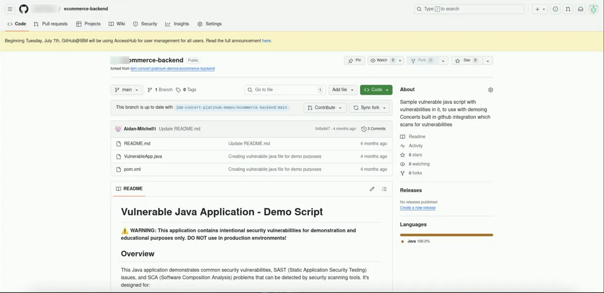

:::note Why fork it instead of scanning the original?
A **fork** is your own personal copy of someone else's repository. You need one here because the Git PAT in your credentials file grants access to *your* repositories. You cannot hand Concert a token for a repo you do not own.
:::

:::warning
This application intentionally contains security vulnerabilities for demonstration purposes. That is exactly what makes it useful here, since it gives Concert something real to find. Do not deploy it anywhere.
:::

---

## 5.3 Access the Concert UI

With your repository forked, you can now open Concert.

1. From your TechZone reservation, open the **Guacamole** remote desktop link. Guacamole is what gives you a browser-based desktop inside the lab environment. You will see the list of available connections.

   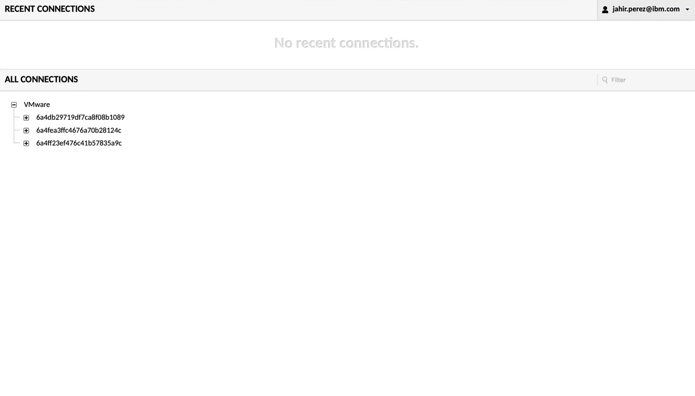

2. Select the bastion connection to open the remote desktop.
3. In the browser on the remote desktop, click the **Concert** bookmark to open the Concert login page.
4. Log in with the credentials from your credentials file:
   - **Username**: `ibmconcert`
   - **Password**: `Passw0rd`

   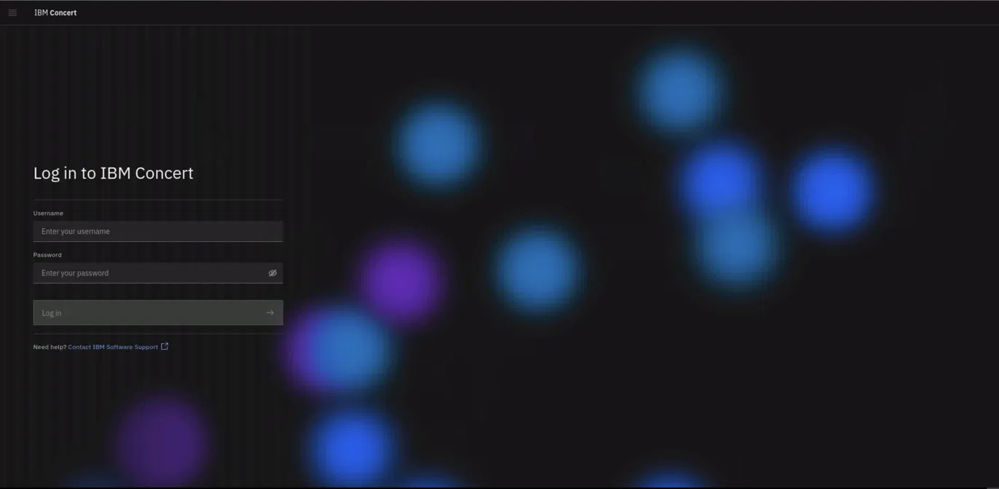

---

## 5.4 Select the Developer Focus

The first time you open Concert, it asks how you want to use it.

1. On the **Welcome to IBM Concert** screen you will see two options:
   - **Protect** — *"You focus on code and the risks that come with it. Connect your GitHub account and we'll handle the rest."* This is the **Developer focus**.
   - **Resilience** — *"You manage the big picture, risk, resilience, and compliance. Connect your environments to gain full visibility."* This is the Enterprise view.
2. Click the arrow on the **Protect** card to continue.

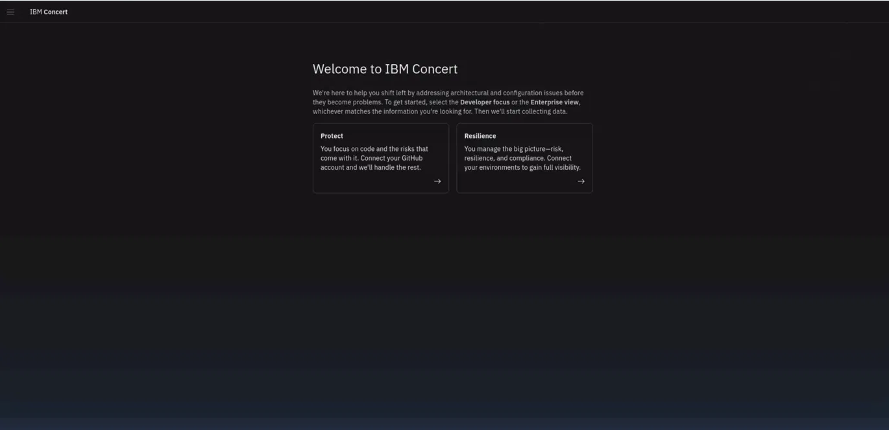

:::note
**Protect** is the Developer focus view, and it is where the rest of this section takes place. It is built around one question: *what is wrong with my code, and what should I fix first?*
:::

---

## 5.5 Share Your Repository with the watsonx Assistant

You are now in the Protect view. The watsonx assistant is waiting on the right-hand side of the screen.

1. The assistant will prompt you: *"Share a GitHub link to a repository or organization you want to analyze and I'll take a look."*
2. In the message box at the bottom, paste the full URL of **your forked repository**, for example:
https://github.com/YOUR-USERNAME/ecommerce-backend

3. Press **Enter** to send it.

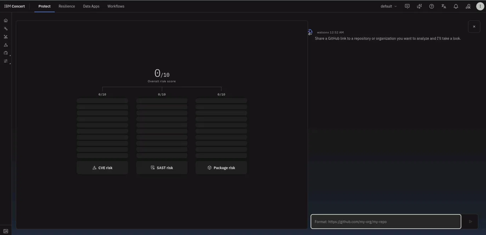

Notice that the three risk scores on the left are all currently **0/10**, and the panels beneath them are empty. Concert has no data yet. That is about to change.

---

## 5.6 Provide Your Personal Access Token

Concert now needs permission to actually read the repository you just pointed it at.

1. The assistant responds asking for a classic GitHub Personal Access Token.
2. Click **Provide classic GitHub PAT**.
3. In the dialog that appears, paste the **Git PAT from your credentials file** (created in section 3, Lab Preparation).
4. Click **Connect**.

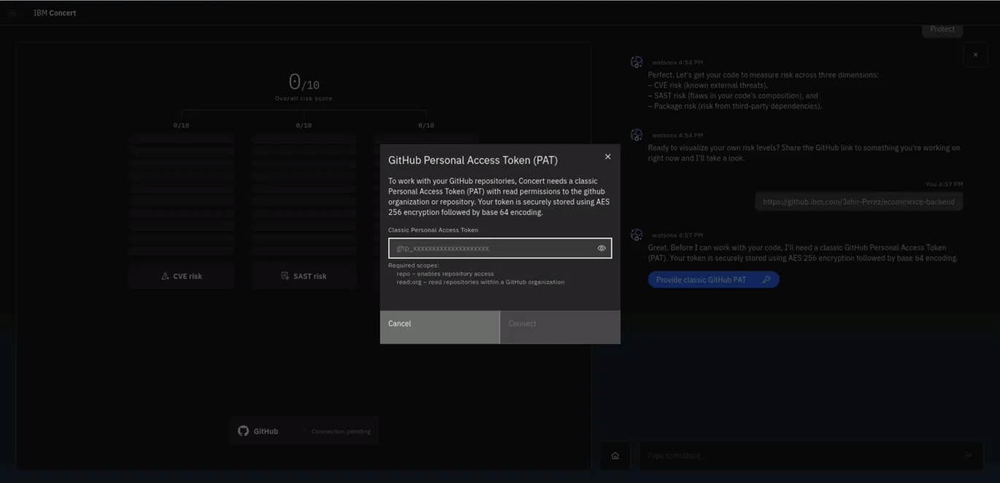

:::note
Your token is stored securely. Concert encrypts it using AES-256 encryption, then base-64 encodes it, before storing it. It is never held in plain text.
:::

---

## 5.7 Run the Scan

Once the token is accepted, Concert connects to GitHub and is ready to scan.

1. The assistant confirms the connection: *"I connected to GitHub. The active repository is ecommerce-backend. I will scan the default branch named main."*
2. Notice the **GitHub** indicator at the bottom of the panel has changed from *Connection pending* to **Connected**.
3. Click **Scan now**.

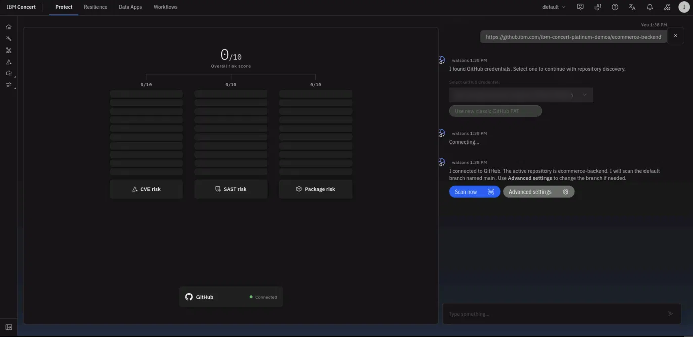

:::tip Advanced settings
Two things are worth knowing before you click Scan now.

First, Concert takes the **GitHub organization name** and uses it as the application name by default, on the assumption that an organization maps to an application. That is often not what you want. In **Advanced settings** you can rename the application, or map the scan to an application that already exists in Concert.

Second, Concert scans the **default branch** unless you tell it otherwise. If you need to scan `staging-changes` rather than `main`, change it in Advanced settings before scanning. For this lab, the default `main` branch is what you want.
:::

The scan takes a few minutes to complete. Concert pulls down the code, runs a Trivy scan against it, resolves every dependency the project relies on, and cross-references all of it against known vulnerability databases. Three things come out of it: **CVEs** in the codebase, **SAST exposures**, and **package risks**.

You can confirm the scan ran successfully under **Administration** → **Integrations** → **Ingestion jobs**, where the job appears with a **Success** status.

:::tip Demo tip
The scan is a real analysis and takes roughly five minutes to finish. If you are running this in front of a customer, have a second instance with the scan already completed so you can switch to it rather than waiting in silence.
:::

---

## 5.8 Review the Scan Findings

When the scan finishes, Concert presents what it found.

1. On the **Protect** home page, review the **Overall risk composition** panel. Concert breaks the findings into the three categories introduced earlier:
   - **Prioritized CVEs** — known external threats
   - **Prioritized exposures** — SAST findings, meaning flaws in the code's own composition
   - **Packages with high vulnerability** — risk from third-party dependencies

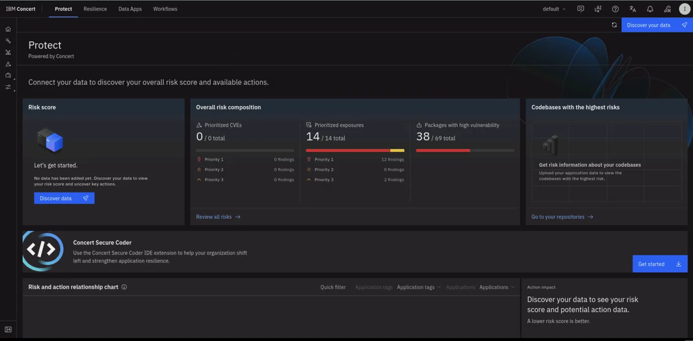

Each category is broken down by priority, so you can see at a glance not just *how many* problems exist but *how many actually matter*.

2. Click **Review all risks** to open the full **Risk** view.
3. Here you can see every CVE Concert discovered. For each one:
   - **CVSS score** — the industry-standard severity rating, out of 10. This is a general measure of how dangerous the flaw is *in the abstract*.
   - **Total findings** — how many times this vulnerability appears in your code.
   - **Highest priority in findings** — how urgently Concert thinks you should act. Priority 1 is most urgent.
   - **Highest risk score in findings** — Concert's own assessment, out of 10. This is the one that reflects *your* situation.
   - **Impacted applications** — what this vulnerability actually affects.

:::note CVSS score vs. risk score
These two numbers are not the same thing, and the difference is the point of Concert.

A **CVSS score** tells you how severe a vulnerability is in general. A **risk score** tells you how much it matters *in your environment*, taking into account whether the vulnerable code is actually reachable, what it is connected to, and how critical that is. A flaw with a high CVSS score might pose little real risk to you, while a moderate one might be your most urgent problem. Concert's job is to tell you which is which.

Section 5.10 explains exactly how Concert arrives at that number.
:::

---

## 5.9 Set Environmental Factors on the Application

Concert has now discovered your application, but it does not yet know anything about how important that application is to you. Two applications can carry the exact same vulnerability and still represent completely different levels of risk, and Concert cannot tell the difference until you tell it.

1. In the left navigation rail, select the **Inventory** icon, then **Application inventory**. You will see the application Concert created from your scan.

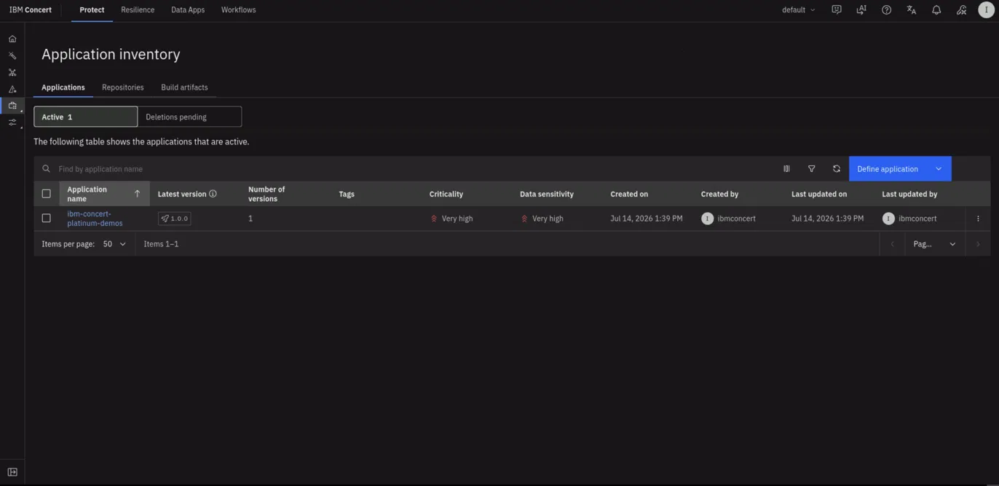

2. Click the **3-dot menu** on the right of the row and select **Edit details**.
3. Set the following:
   - **Application criticality**: `Very high`
   - **Data sensitivity**: `Very high`
4. Optionally, add business details such as business name, business unit, and email contact.
5. Click **Save**.
6. Select the checkbox next to the application name, then click **Recompute priorities**.

:::warning
Changing criticality and data sensitivity does not re-rank your findings on its own. You must explicitly **recompute priorities** afterwards, or Concert will continue to show the priorities it calculated before you made the change.
:::

:::note What just happened?
The values you set feed directly into the **environmental factor**, one of the three inputs to the Concert risk score. Marking the application as highly critical tells Concert that a vulnerability living here matters more than the same vulnerability living somewhere less important. After recomputing, findings re-rank accordingly and a number of them promote to Priority 1.

This is where the prioritization story pays off. Your scan may have surfaced hundreds of CVEs. What you actually want to know is where to start looking first, and the environmental factors are what make that answer meaningful.
:::

---

## 5.10 Understanding the Concert Risk Score

You now have a long list of CVEs, and every one of them is competing for your attention. The question is where to start.

### 5.10.1 The problem with CVSS alone

Most organizations today prioritize vulnerabilities using the **CVSS score**, and CVSS is a useful number. But it only measures *severity*, meaning how dangerous the flaw is in the abstract. It says nothing about whether the vulnerable code is reachable in your environment, whether anyone is actually exploiting it, or whether the application it lives in matters to your business.

Consider the scale of the problem:

- Of every CVE ever published, a very large subset scores **7 or higher** on CVSS. This is the pile most organizations are trying to work through.
- The set of CVEs **actually being exploited** in real environments is dramatically smaller. It is a small subset of the high-CVSS pile, **and part of it falls outside that pile entirely**, meaning some genuinely exploited vulnerabilities score below 7 and never get prioritized at all.

Prioritizing by CVSS alone means chasing the large pile while some of the real threats sit outside it.

### 5.10.2 How Concert calculates risk

Concert produces its own score on a scale of 1 to 10:
Risk Score = Severity × Exploitability × Environmental Factor

**Severity** is taken directly from the **NVD** (National Vulnerability Database) using **CVSS v3**, the version in standard use today. CVSS v4 exists, but it does not yet score every CVE, so adoption remains limited.

**Exploitability** uses **EPSS** (Exploit Prediction Scoring System), an AI model that predicts whether a CVE will be exploited within the next 30 days, or whether it is already being exploited. Concert uses an equilibrium point of **0.1**: an EPSS score above 0.1 raises the risk score, and a score below 0.1 lowers it.

**Environmental factor** is derived from what *you* told Concert about the application in section 5.9:

- **Application criticality** — five levels from very low to very high. Anything below medium lowers the score; anything above raises it.
- **Data sensitivity** — mapped the same way as criticality.
- **Access points** — Concert checks for public exposure first, since a publicly accessible endpoint is the single strongest signal and always raises the score. Private access points only begin to raise the score at **four or more**, on the reasoning that a single internal endpoint may be nothing more than an internal tool. If the application has no access points recorded at all, Concert averages criticality and data sensitivity and moves on.

The result is capped at **10**, since Concert treats 10 as the maximum possible criticality.

:::note Where each factor lives
The **environmental factor** is calculated at the *finding* level, because the same CVE can appear in several applications and each application sits in a different environment.

**CVSS severity** and **exploitability** are held at the *CVE* level, because those values are identical across every finding for that CVE.
:::

### 5.10.3 If a customer wants to keep using CVSS

Concert does not force its own scoring model. An administrator can change the prioritization method in **Settings**:

- Use the **Concert risk score** (the default)
- Use the **CVSS score** directly
- Use an **external score** uploaded through the API as JSON, for organizations already managing CVEs with a tool that has its own formula

The priority bands are also adjustable. By default, Priority 1 is anything scoring 7.5 to 10, but an administrator can move that threshold with a slider.

---

## 5.11 Review, Remediate, and Open a Ticket

Now that the findings are prioritized, work through a single CVE end to end. This walkthrough uses **CVE-2021-44228** (Log4Shell), a Priority 1 finding, but the same steps apply to any CVE in the list.

1. From the **Risk** view, click into a Priority 1 CVE.

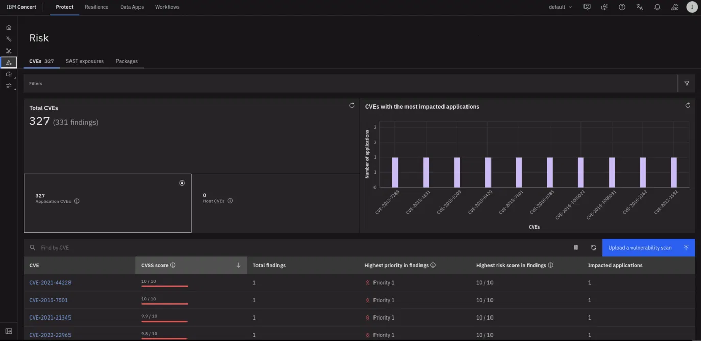

2. On the **Overview** tab, Concert gives you:
   - A description of the vulnerability
   - An **attack vector**, meaning how this would be exploited
   - The **impact** if it were exploited
   - Whether there is an **active exploit** in the wild
   - Whether **remediation is available**

3. Click the **Blast radius** tab. This is a visual correlation showing exactly how the vulnerability reaches you: the CVE exists in a **package**, that package was found in a **repository**, and that repository is what Concert defined as your **application**.

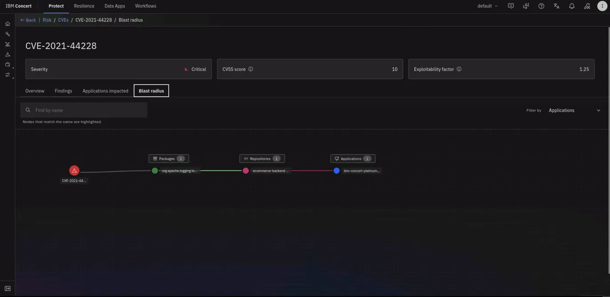

The blast radius is Concert's dependency-impact graph for a single vulnerability. Rather than showing the CVE in isolation, it maps every link in the chain that connects the flaw to your environment: the CVE is carried by a specific package (here, the vulnerable Apache Log4j library), that package was pulled in as a dependency of the ecommerce-backend repository, and that repository is what Concert registered as your ecommerce app. Reading the graph tells you exactly which of your assets inherit the vulnerability and by what path, which is information a CVE record alone never gives you. Because the same package can be a dependency of more than one repository or application, the graph also shows how far a single flaw actually spreads, so you can see whether fixing it resolves one finding or clears it across several applications at once. This is why the blast radius is the step that connects a scan result to a remediation decision: it identifies the exact dependency to change and every downstream asset that change will fix.

Use the **Filter by** control in the top right to narrow the graph to a single application. This isolates one application's path through the chain and greys out the rest, which is useful when a widely-used package fans out to several applications and you want to focus on the impact to just one of them.

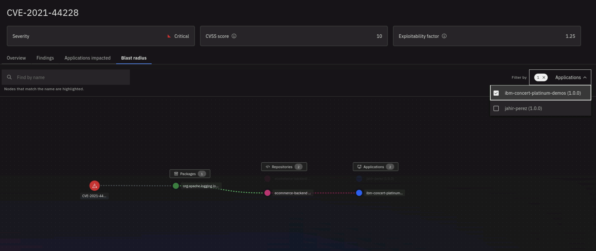

:::note
On cluster-based discovery the blast radius extends further still, adding images, environments, and public or private access points to the chain.
:::

4. Click the **Findings** tab and expand a finding using the arrow on the left. This is where the risk score becomes transparent: you can see the CVSS score, the exploitability factor, and the environmental factor that combined to produce the final number.

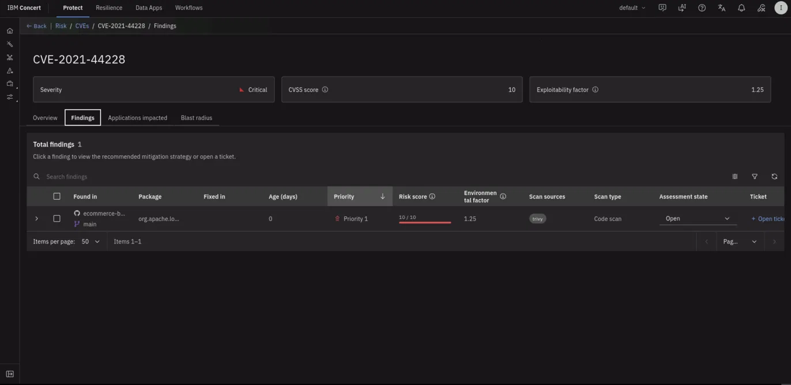

5. Below the finding details, Concert presents a **recommended mitigation strategy** generated by watsonx.ai. The guidance is specific to your stack: because Concert can see that the repository uses Maven, it returns the exact `pom.xml` dependency block you need to change rather than a generic instruction to upgrade.

6. Below the guidance, click **Open ticket**. A ticket is Concert's way of handing this vulnerability off to whoever will actually fix it — instead of the finding living only inside Concert, it becomes an issue in the tool your developers already work in. The **Open a ticket** dialog opens with two sections: **Ticketing system** (where the ticket goes) and **Ticket details** (what it says). Work through them top to bottom.

   **a. Choose the ticketing system.** Under **Type**, pick where the ticket should be created. Concert can file into **GitHub**, **Jira**, **ServiceNow**, **Salesforce**, or **GitLab**. For this lab, leave **GitHub** selected.

   **b. Select a connection.** A *connection* is a saved, authenticated link between Concert and your ticketing tool — it is what actually gives Concert permission to create an issue on your behalf, using the Git PAT from your credentials file. Open the **Connection** dropdown and choose the GitHub connection for the repository you scanned.

   :::note No connection in the dropdown?
   If the **Connection** dropdown is empty, no link to GitHub has been set up yet, and you cannot file a ticket until one exists. A connection is created once in the Concert Administration area by an Admin or Editor, using a GitHub token with read and write access to the repository. Note also that only users with an **Admin** or **Editor** role in Concert are allowed to create tickets.
   :::

   **c. Point at the repository.** Two fields tell Concert exactly where the GitHub issue should land:
   - **Organization** — the GitHub account or organization that **owns the repository the issue will be filed in**. For this lab that is `ibm-concert-platinum-demos`, the organization that owns the upstream `ecommerce-backend` repository.
   - **Repository** — the specific repo inside that organization: `ecommerce-backend`.

   *(Optional)* Click the **Refresh** button next to **Select labels** to pull the repository's existing GitHub labels, then apply any you want on the issue.

   At this point the top half of the dialog should look like this — GitHub selected, a connection chosen, and the organization and repository filled in:

   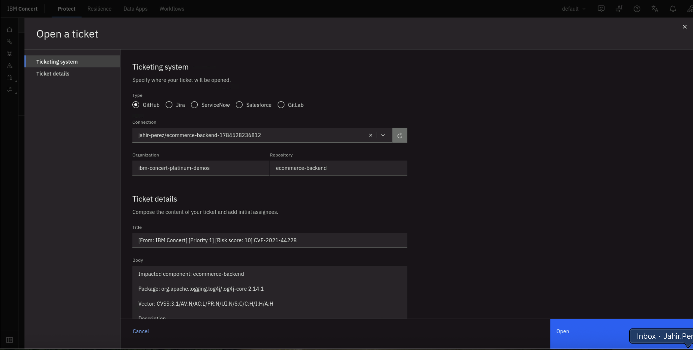

   :::warning Organization is not always your username
   The **Connection** name may show your own GitHub handle (for example `your-username/ecommerce-backend`), but that is just the label Concert gave the connection. The **Organization** field must name the account that actually owns the target repository. Entering your own username when the issue belongs in the upstream organization is the most common reason a ticket fails to publish. If the ticket does not file, check this field first, then confirm your Git PAT still has the `repo` scope.
   :::

7. Review the **Ticket details**. This is the part that saves real time: Concert has **already written the ticket for you** from the finding, so you normally do not touch anything here.

   - The **Title** carries the source, the priority, the risk score, and the CVE, for example: `[From: IBM Concert] [Priority 1] [Risk score: 10] CVE-2021-44228`.
   - The **Body** carries the impacted component, the affected package (`org.apache.logging.log4j/log4j-core 2.14.1`), the CVSS vector, and the description — the same watsonx remediation guidance you read in step 5, pushed straight into the ticket with nothing copied by hand.
   - *(Optional)* Add a GitHub username in the **Assignees** field to assign the issue on creation. Do not include the `@`.

8. Click **Open** to file the ticket. Concert sends the issue to GitHub through the connection, and the dialog closes.

9. Confirm it worked inside Concert. Back on the **Findings** tab, expand the finding again — the **Ticket** field now shows a linked issue number (here, a GitHub icon with **#4**) instead of the **Open ticket +** option. This link is your proof the ticket was created and your shortcut to open it.

   

10. Confirm it worked inside GitHub. Click the **external-link arrow** next to the issue number to open the issue on GitHub in a new tab. You will see the issue in the **Open** state, titled exactly as Concert set it, with the impacted component, package, CVSS vector, and full description carried across — a ready-to-work ticket a developer can pick up immediately.

    

:::tip Automating this step
Opening tickets one at a time is fine for a demo, but it is not how a customer runs this at scale. Under **Administration** → **Integrations** → **Automation rules**, you can create a rule such as:

> *When a CVE is detected, and it is Priority 1, and it affects the ecommerce app, open a GitHub ticket in the ecommerce app repository using the existing GitHub connection.*

Concert then files the ticket, with the watsonx remediation guidance included, the moment a qualifying vulnerability is found.
:::

---

## 5.12 Beyond GitHub

GitHub is only one of the sources Concert can discover from. The same discovery flow connects to:

- **Amazon Web Services (AWS)**
- **IBM Cloud**
- **Kubernetes**
- **Red Hat OpenShift**
- **Containers**
- **Google Cloud (GKE)**

For a **Red Hat OpenShift** cluster, you provide the API endpoint, a token, and a cluster name, then validate the connection. Concert connects using the `oc` binary, discovers the namespaces deployed on the cluster, pulls the list of images and their versions, and runs a Trivy scan against them.

:::note Namespaces are not applications
A Kubernetes namespace does not necessarily map cleanly to an application, and several namespaces may belong to a single application. If that is the case, apply the **same Kubernetes label** to each of them. Concert detects the shared label and groups them into one application.
:::

---

:::tip Success Indicators
- The GitHub indicator shows **Connected**
- The scan completes without errors
- The Risk view lists discovered CVEs with severity and priority rankings
- Prioritized exposures and vulnerable packages are populated
- Application criticality and data sensitivity are set, and priorities have been recomputed
- Expanding a finding shows the watsonx remediation guidance
- Clicking **Open** files the ticket, and the finding's **Ticket** field links the created GitHub issue
:::

Concert has now taken a repository it knew nothing about, read the code and every dependency it relies on, ranked what it found by how much risk each item actually poses in your environment, handed you AI-generated remediation guidance, and filed that guidance as a tracked ticket in GitHub ready for a developer to pick up. You have a prioritized list to act on rather than an undifferentiated pile of warnings.

---