## 6.1: Overview

In this section you will connect an OCP Cluster to IBM Concert and let Concert scan the container images running on it for vulnerabilities. Instead of scanning one project's source code, Concert reaches into a running environment, finds the applications deployed there, pulls down the container images those applications are built from, and scans every one of them.

This matters because it is closer to how a real customer operates. Code in a repository is what you *wrote*; images running on a cluster are what you actually *shipped*. Scanning the cluster tells you what is at risk in production, not just in the codebase.

This lab section guides you through:

- Connecting an OpenShift cluster to Concert using an endpoint, a token, and a cluster name
- Selecting which namespaces (applications) you want Concert to discover
- Letting Concert run a Trivy image scan against the discovered images
- Setting environmental factors so Concert can prioritize findings for your environment
- Reviewing a vulnerability end to end, across its blast radius and findings
- Reading watsonx-generated remediation guidance and opening a ticket from it

:::info What is OpenShift, and what is a cluster?
**Red Hat OpenShift** is a platform for running containerized applications. A **cluster** is the group of machines OpenShift manages, and the applications running on it are organized into **namespaces** — think of a namespace as a labeled box that holds one application's running pieces. When Concert "discovers" a cluster, it is asking OpenShift: *what namespaces exist here, and what container images are running inside them?*
:::

:::info How is this different from the GitHub scan?
The GitHub flow scanned **source code and its dependencies**. This flow scans **container images** — the pre-built, packaged artifacts that actually run in production. Concert connects to the cluster using the `oc` command-line binary under the hood, lists the namespaces, pulls the images and their versions, and runs a **Trivy** scan against each image. Trivy is the embedded open-source scanner Concert uses to inspect an image and report the known vulnerabilities inside it.
:::

---

## 6.2 Reset the Demo Environment (if needed)

If you are using the **reservable demo instance**, the environment resets automatically at the end of each 4-hour slot. Most of the time you do not need to do anything. If you ever need to reset the data manually — for example, if a previous run left the instance in a half-finished state — do the following:

1. Navigate to **Concert Workflows**.
2. Open the **Workflows** tab, then the **Reset** folder.
3. Inside the Reset folder, open and run the **`Setup_Remediation_Demo`** workflow.

:::warning Watch your time slot
The Trivy image scan in step 6.4 takes **10–15 minutes** to finish. If you are on the reservable instance, start early in your 4-hour slot so a reset does not wipe your work mid-demo.
:::

:::note Prerequisites
You need **one** of the following:

- A TechZone **Concert version 2.0.0** instance with **watsonx.ai enabled**, or
- A booked timeslot on the Concert **reservable demo instance**
:::

---

## 6.3 Create the Auto-Discovery Integration

You will start from an empty Concert home page and connect the cluster.

1. On the home page, click **Discover your data** in the top-right corner.

   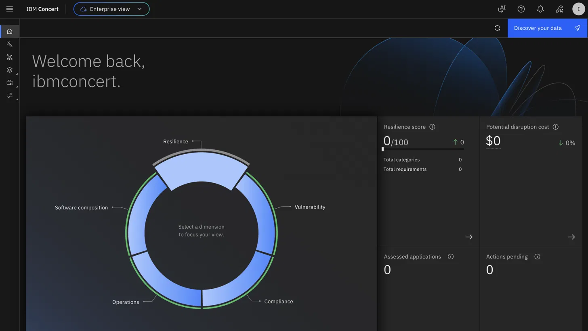

2. A menu of integration types appears. These are all the sources Concert can pull from — AWS, IBM Cloud, Kubernetes, Google Cloud, and more.

   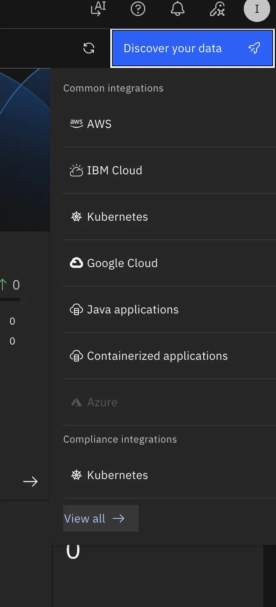

3. In the **Select an integration** dropdown, choose **Red Hat OpenShift Container Platform (OCP)**.

   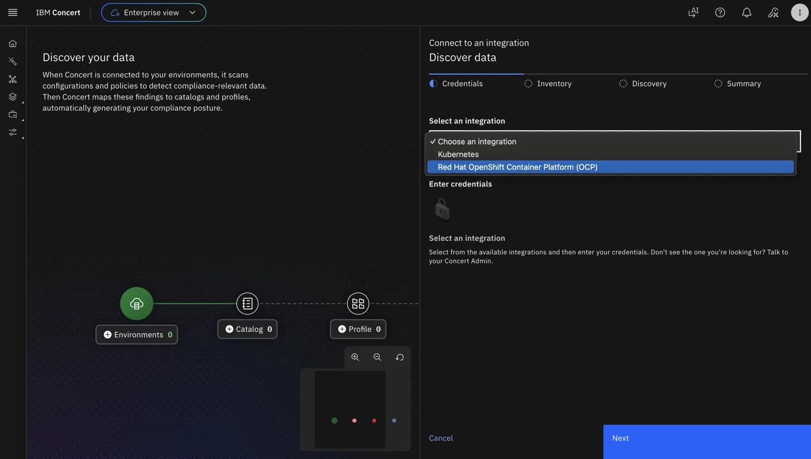

4. Leave **Create new connection** selected, and enter the three credentials below. Keep them somewhere easy to copy from.

   | Detail | Value |
   |---|---|
   | **Endpoint** | `https://api.ecommerce-app.cp.fyre.ibm.com:6443` |
   | **Token** | *(the long `eyJ...` service-account token from your credentials file)* |
   | **Cluster name** | `us-south-dev01` |

   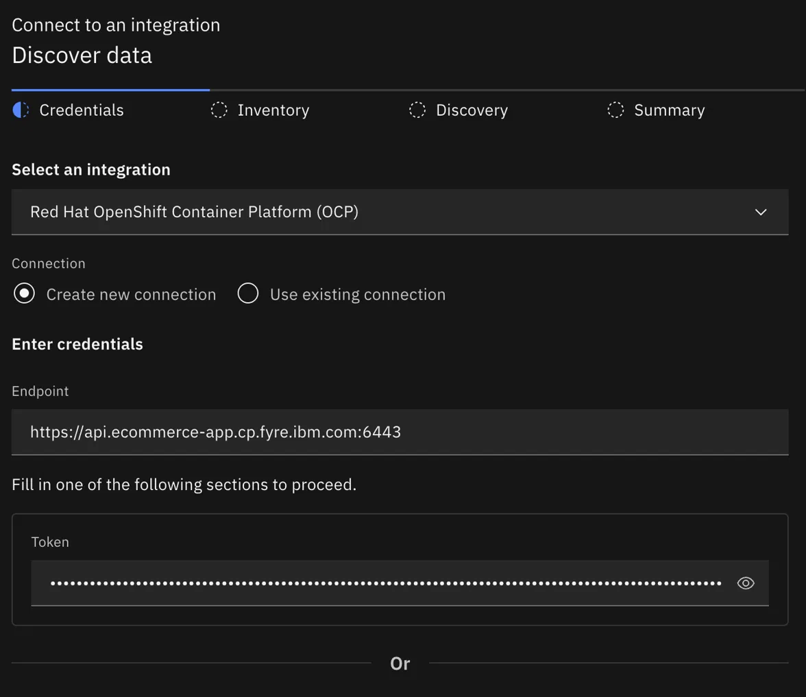

:::info What are these three values?
- The **endpoint** is the cluster's API address — the front door Concert knocks on to talk to OpenShift.
- The **token** is a service-account credential that proves Concert is allowed in and grants it read access to the cluster.
- The **cluster name** is just a label so you can recognize this cluster later inside Concert.
:::

5. Concert validates the connection. When the credentials are correct, the **Validation status** shows a green **Successful**. Click **Next**.

   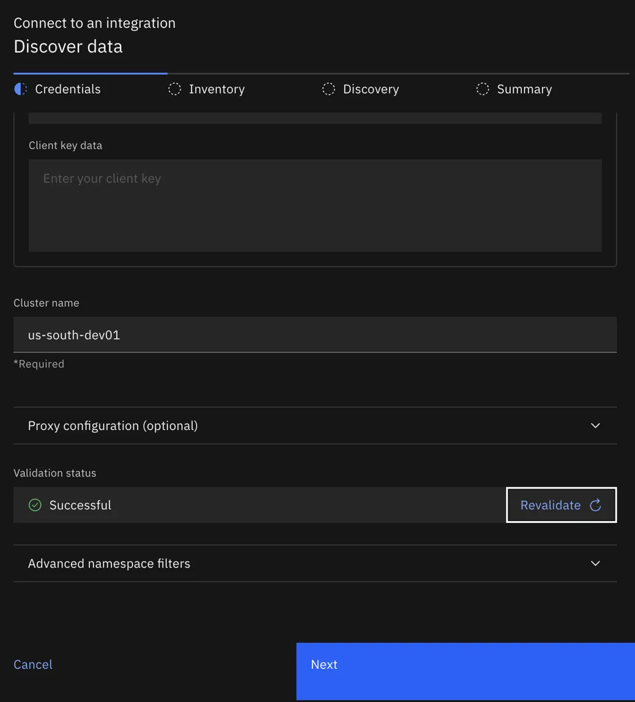

:::tip If validation fails
A failed validation almost always means the token is wrong, expired, or lacks read permission on the cluster. Re-copy the token carefully (these are long and easy to truncate) and use **Revalidate** rather than starting over.
:::

---

## 6.4 Select Namespaces and Run Discovery

Concert has connected to the cluster. Now you tell it which applications to bring in.

1. On the **Inventory** step, under the `us-south-dev01` cluster, click **Click to select the namespaces**.

   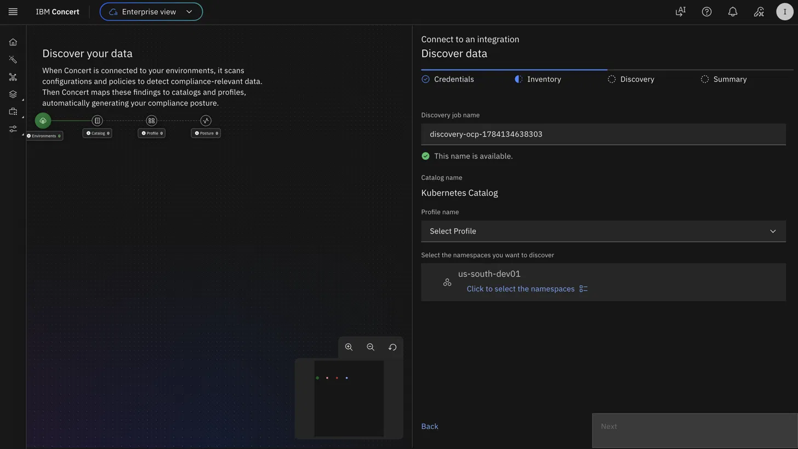

2. A dialog lists every namespace on the cluster. Many of these are OpenShift's own internal namespaces (marked **Excluded**) — you can ignore those. Select only the three application namespaces this demo uses:

   - **`ecommerce-backend`**
   - **`ecommerce-frontend`**
   - **`qotd`** *(quote-of-the-day)*

   At the top of the list, check **`ecommerce-backend`** and **`ecommerce-frontend`**:

   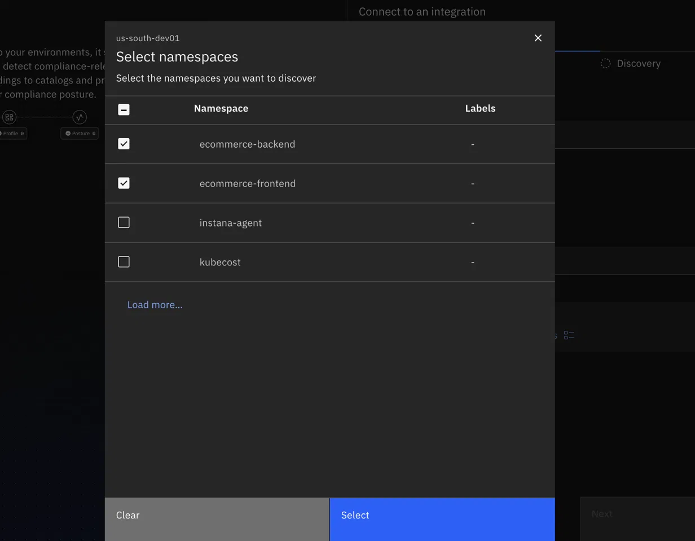

   The `qotd` namespace sits further down the list, so scroll down and check it as well:

   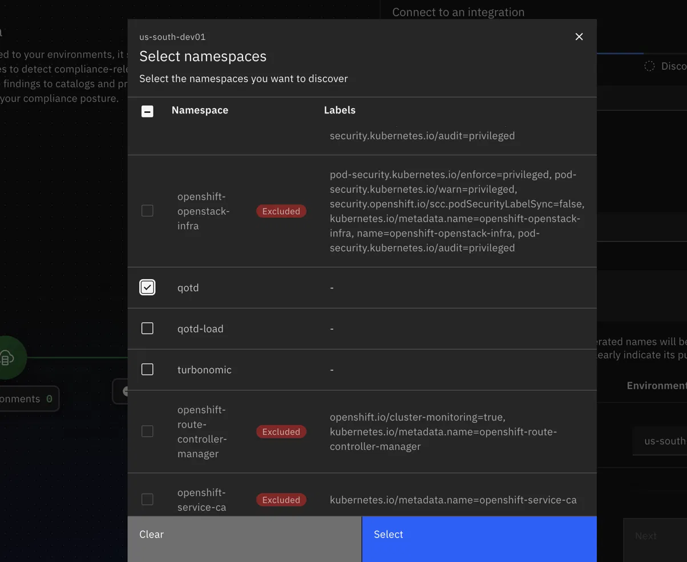

   Click **Select** to confirm all three.

:::note Namespaces are not always applications
A namespace does not always map cleanly to one application — sometimes several namespaces make up a single app. If that happens, apply the **same Kubernetes label** to each namespace; Concert detects the shared label and groups them into one application. For this lab each namespace is its own application, so no labeling is needed.
:::

3. Back on the Inventory step, confirm **3 namespaces selected** and choose the **Kubernetes Profile** from the Profile dropdown. Concert shows the three applications it will create, one per namespace. You can rename them here if you like; the defaults (`us-south-dev01_ecommerce-backend`, and so on) are fine.

   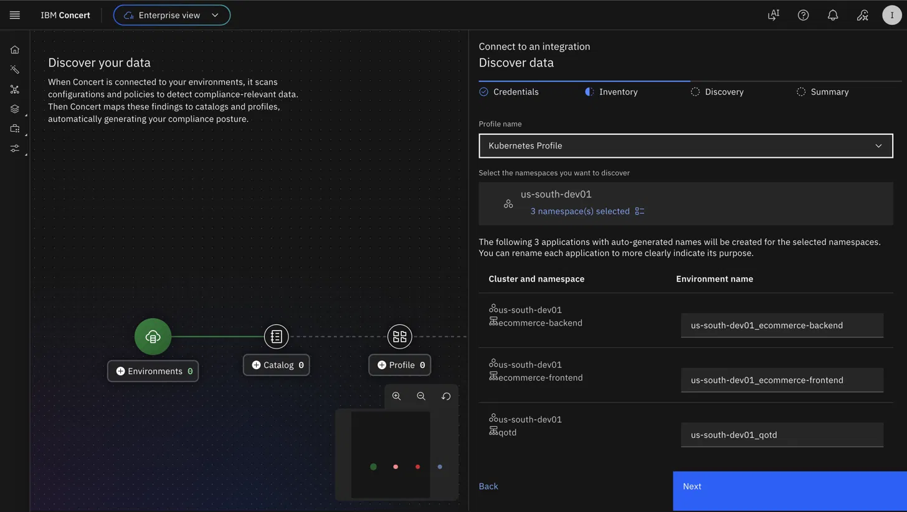

4. Click **Next**. Concert now begins discovery: it accesses the cluster, pulls the image inventory, and kicks off the Trivy scan. The screen shows *"Accessing and scanning the cloud…"* with an estimated time.

   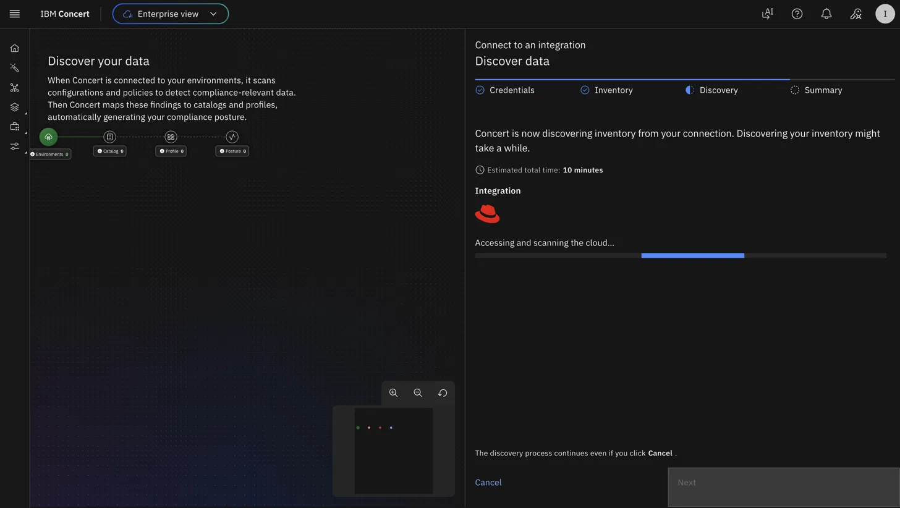

:::warning This step takes 10–15 minutes
Trivy is performing a real scan against every discovered image. The discovery process continues even if you click Cancel or navigate away, so you do not have to sit and watch it. This is the natural pause point in the demo.
:::

5. When discovery finishes, Concert shows a **Resilience summary**: an overall resilience score, the number of available actions, and the applications discovered.

   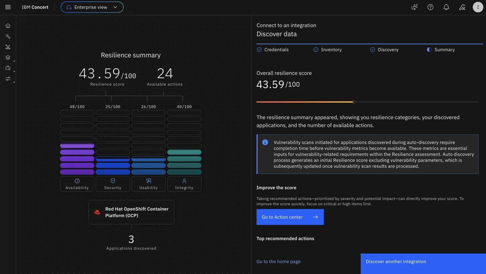

:::note Why is the score "incomplete" at first?
The initial resilience score is calculated **without** the vulnerability results, because the Trivy scan may still be finishing when the summary first appears. Once the scan results are processed, the score updates automatically to include them. Seeing a provisional score here is expected, not a bug.
:::

---

## 6.5 Set Environmental Factors on Each Application

Concert has now discovered your three applications, but it does not yet know how important each one is to you. Two applications can carry the exact same vulnerability and still represent completely different levels of risk — and Concert cannot tell the difference until you tell it.

1. In the left navigation rail, open the **Inventory** icon, then **Application inventory**. You will see your three discovered applications, each at release `1.0.0`.

   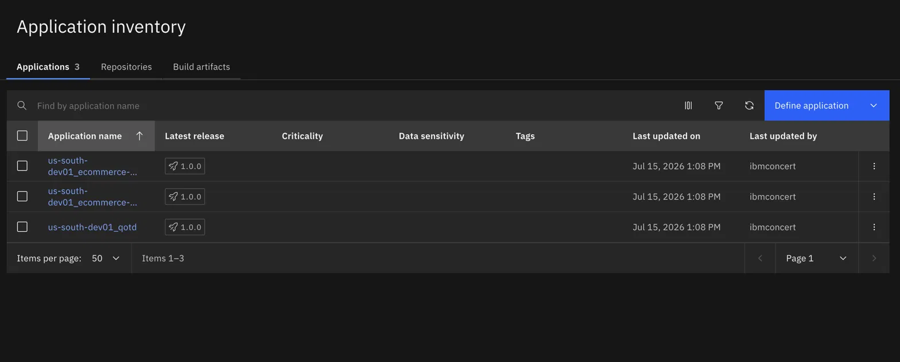

2. For each application, click the **3-dot menu** on the right of its row and select **Edit details**. Set the **Criticality** and **Data sensitivity** as follows:

   | Application | Criticality | Data sensitivity |
   |---|---|---|
   | `ecommerce-backend` | Very high | Very high |
   | `ecommerce-frontend` | Very high | High |
   | `qotd` (quote-of-the-day) | Medium | Medium |

   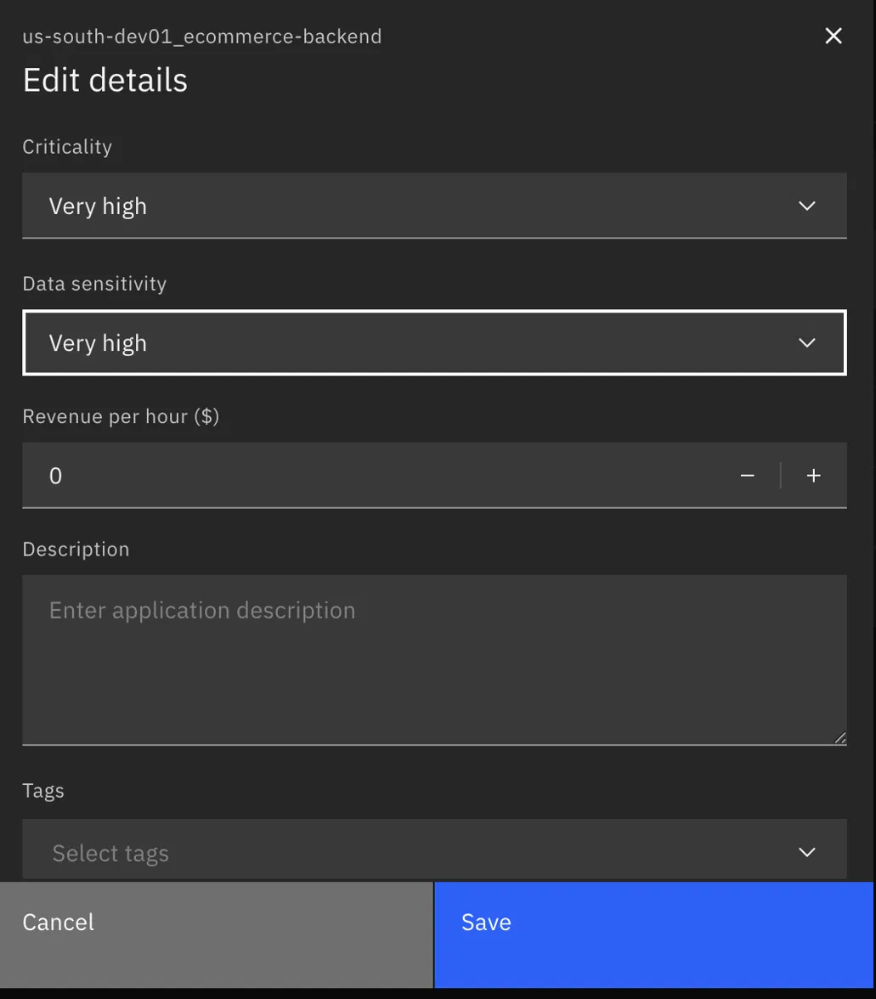

   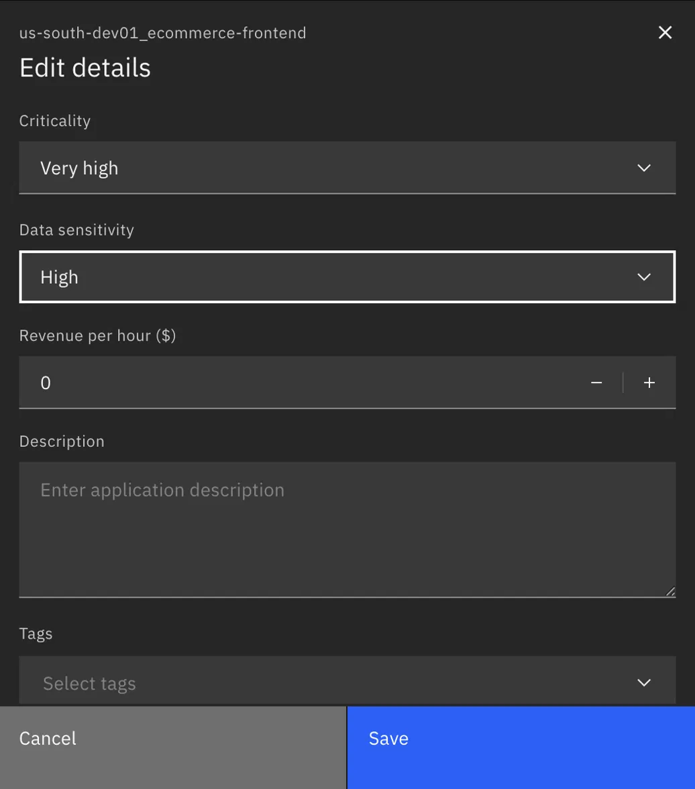

   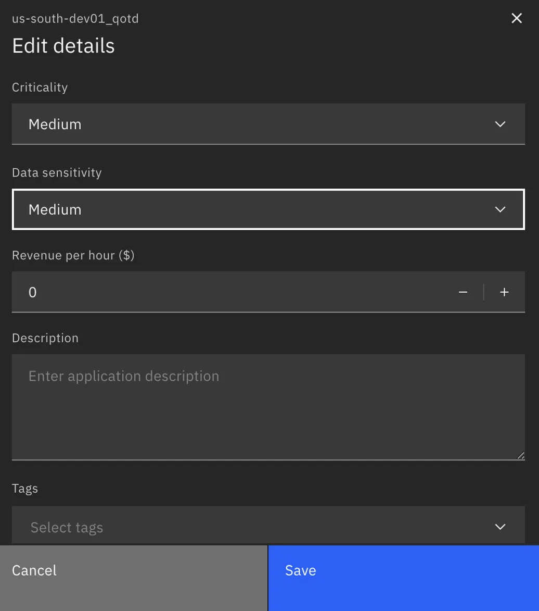

3. Click **Save** after each one. When all three are set, the inventory reflects the new criticality and data-sensitivity values.

   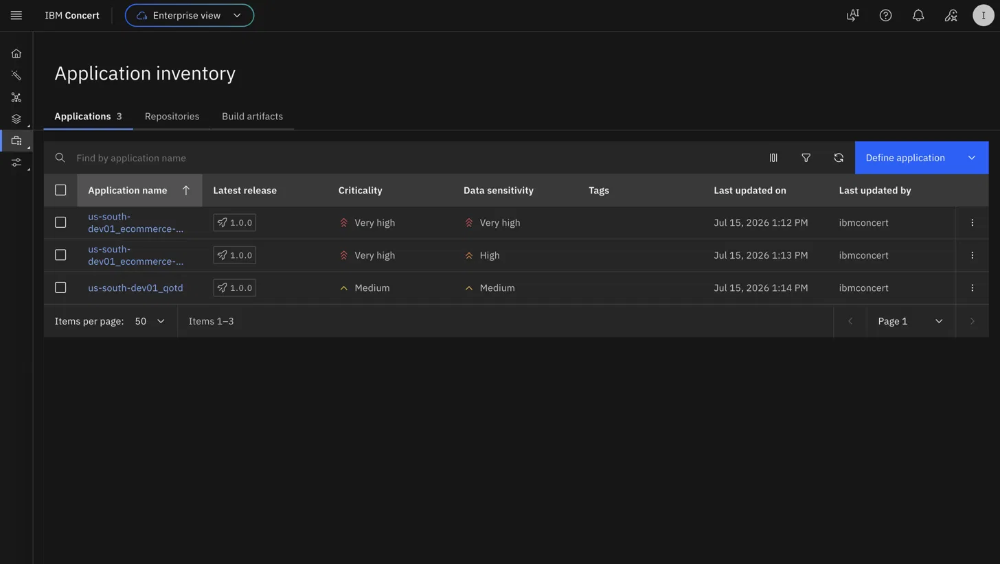

4. Select the checkbox next to **all three applications**, then click **Recompute priorities**. Confirm in the dialog by clicking **Recompute**.

   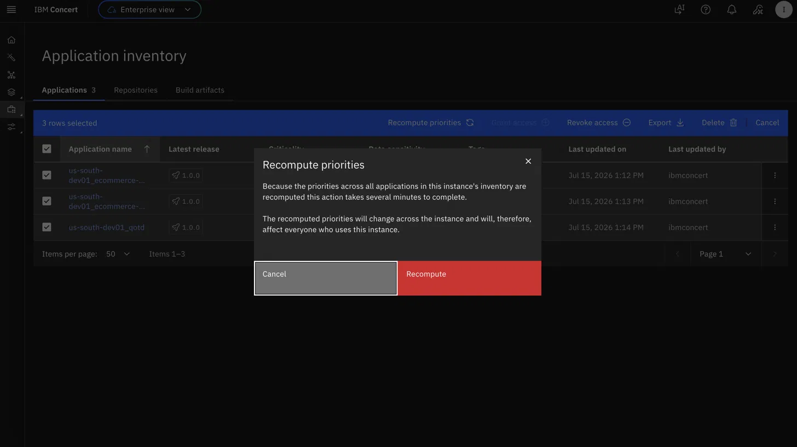

:::warning You must recompute
Setting criticality and data sensitivity does **not** re-rank your findings on its own. You have to explicitly **recompute priorities** afterward, or Concert keeps showing the priorities it calculated before your changes. This step is easy to forget — and if you skip it, the CVE priorities in the next section will look wrong.
:::

:::note What just happened?
The values you set feed directly into the **environmental factor**, one of the three inputs to the Concert risk score. Telling Concert that `ecommerce-backend` is highly critical means a vulnerability living there will outrank the same vulnerability living in a lower-stakes app like `qotd`. After recomputing, findings re-rank accordingly. You can watch the recompute jobs run under the **Event log** if you want to confirm they completed.
:::

---

## 6.6 Understanding the Concert Risk Score

Before reviewing the vulnerabilities, it is worth understanding the number Concert uses to rank them. If you completed the GitHub section this will be familiar; the scoring model is identical regardless of how the data was discovered.

### 6.6.1 The problem with CVSS alone

Most organizations prioritize vulnerabilities using the **CVSS score**, a severity rating out of 10. CVSS is useful, but it only measures how dangerous a flaw is *in the abstract*. It says nothing about whether the vulnerable code is reachable in your environment, whether anyone is actually exploiting it, or whether the application it lives in matters to your business.

Consider the scale: a very large share of all published CVEs score **7 or higher** on CVSS — that is the pile most teams try to work through. But the set of CVEs **actually being exploited** in real environments is dramatically smaller, and part of it scores *below* 7 and never gets prioritized at all. Prioritizing by CVSS alone means chasing the big pile while some real threats sit outside it.

### 6.6.2 How Concert calculates risk

Concert produces its own score from 1 to 10: