## 7.1: Overview

In the previous sections you used Concert to **discover** vulnerabilities and open remediation **tickets**, handing each fix off to a developer to complete by hand. This section closes the last gap. Instead of a developer writing the patch, **IBM Concert Secure Coder** generates the fix itself, applies it to your repository on a new branch, and opens a pull request with the changes already made.

Where a ticket says *"upgrade log4j-core to a fixed version,"* Secure Coder edits your dependency file, commits the change, and raises a pull request against your repository, turning a finding into a reviewable code change with no manual editing.

Secure Coder in the browser is a guided, conversational remediation experience. You point it at a remediation action, it clones the repository, generates a remediation plan, applies the dependency upgrades, validates the result, and opens a pull request, all from inside Concert.

This lab section guides you through:

- Launching Concert Secure Coder from the Concert toolbar
- Connecting IBM Bob with the API key from your credentials file
- Selecting a remediation action generated from your scan findings
- Reviewing the remediation plan and its compatibility analysis
- Executing the remediation and reviewing the before/after results
- Generating a pull request and confirming it in GitHub

:::note What is Concert Secure Coder?
Concert Secure Coder helps developers identify and remediate security vulnerabilities during development. It is available both as an IDE extension (VS Code, IBM Bob) and as a **browser experience** inside Concert. This lab uses the **browser experience**, which provides a centralized, conversational remediation workflow and can generate pull requests directly from Concert.
:::

## 7.2: Before You Begin

Before starting this section, make sure the following are in place.

- You have completed the **GitHub Auto-Discovery** scan from Section 5 so that vulnerability findings and remediation actions exist in Concert. Secure Coder remediates existing findings; without them there is nothing to act on.
- You have your **IBM Bob API key** ready in your credentials file (set up in Section 3, Lab Preparation).
- You have your **classic GitHub Personal Access Token (PAT)** with **full `repo`** scope ready in your credentials file. This is important: unlike the earlier scan-only sections, Secure Coder needs **write** access to push a remediation branch and open a pull request, not just read access.
- You have access to the source code repository associated with the remediation action.

:::warning
Secure Coder in the browser currently supports remediation of **package dependency (SCA) vulnerabilities only**. This section targets the vulnerable dependencies discovered in `ecommerce-backend`, not SAST code exposures.
:::

## 7.3: Confirm Your Scan Findings

Open Concert, switch to the **Protect** view, and confirm your scan has populated risk data. On the Protect home page you should see your **Prioritized CVEs**, **Prioritized exposures**, and **Packages with high vulnerability** populated from the Section 5 scan.

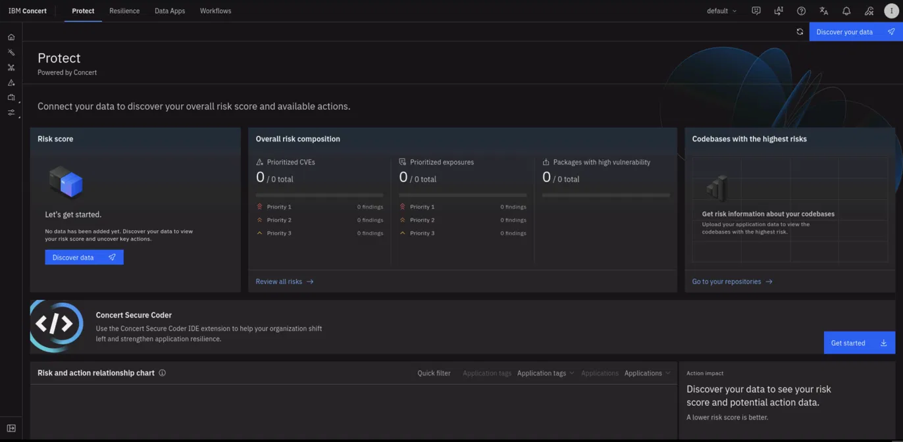

In the left navigation rail, open the **Risk** area and select the **Packages** tab. This is where the package dependency vulnerabilities live, and these are the findings Secure Coder remediates. You should see the discovered packages listed with their installed version, number of vulnerabilities, and risk score.

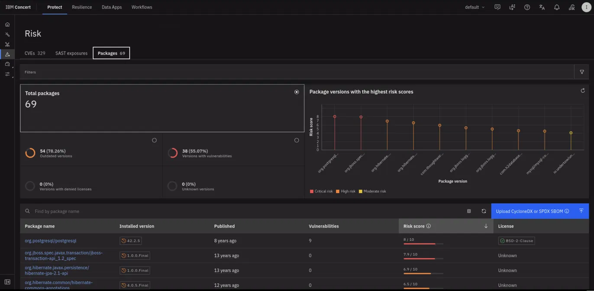

## 7.4: Launch Concert Secure Coder

Concert Secure Coder is launched from the Concert toolbar. In the top navigation bar, hover over the icons next to the profile menu and locate the **Secure Coder** chat icon.

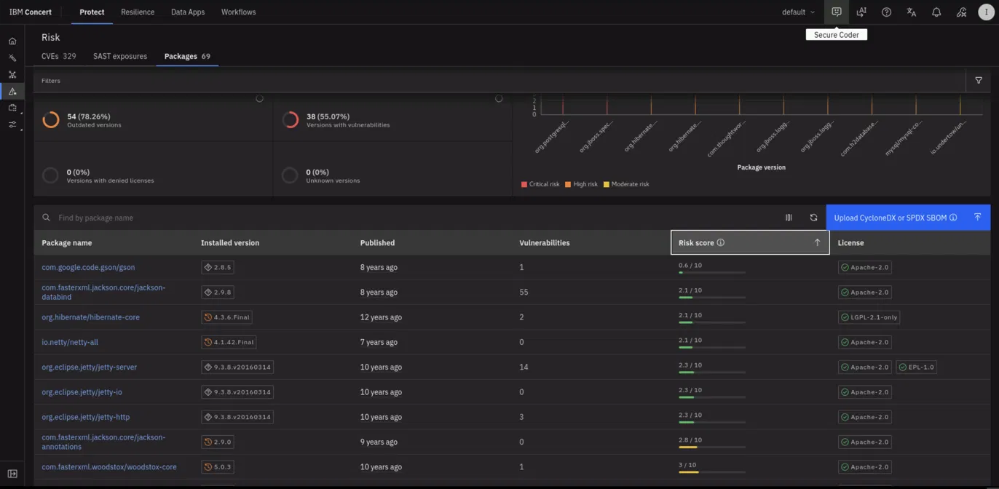

Click the **Secure Coder** icon. The Secure Coder browser experience opens and prompts you for your **IBM Bob API key**. This key is required to enable the remediation chat functions.

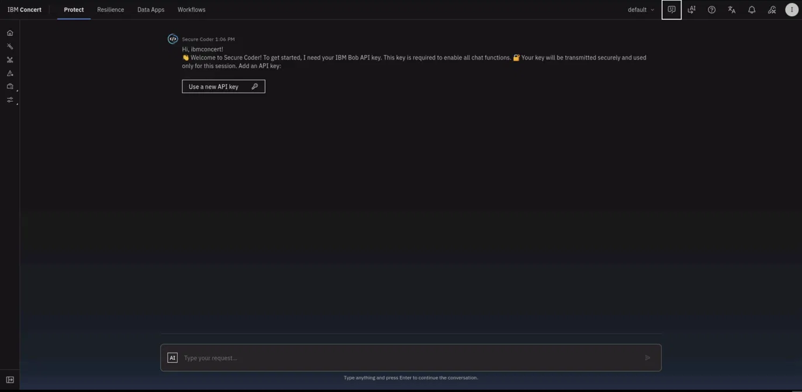

:::note
A new remediation session is started each time you access Secure Coder in the browser.
:::

## 7.5: Connect Your IBM Bob API Key

Secure Coder uses IBM Bob to generate the remediation code. You already created your **IBM Bob API key** during **Lab Preparation** and saved it in your credentials file, so you do not need to generate a new one here.

1. Open your `credentials.txt` file.
2. Copy the value of the **IBM Bob API Key** field.
3. Return to the Secure Coder tab, click **Use a new API key**, paste the key, and connect.

:::note
If the **IBM Bob API Key** field in your credentials file is empty, go back to Section 3, Lab Preparation, and complete the step that creates it. The key must use the **General** scope, which is scoped to your instance and usable across services (the **Inference** scope is limited to inference requests only and will not work here).
:::

## 7.6: Review the Remediation Action

Once your Bob API key is connected, Secure Coder analyzes your findings and presents a **remediation action** generated from the scan. For the `ecommerce-backend` repository, the action summarizes the impact of remediating the vulnerable packages.

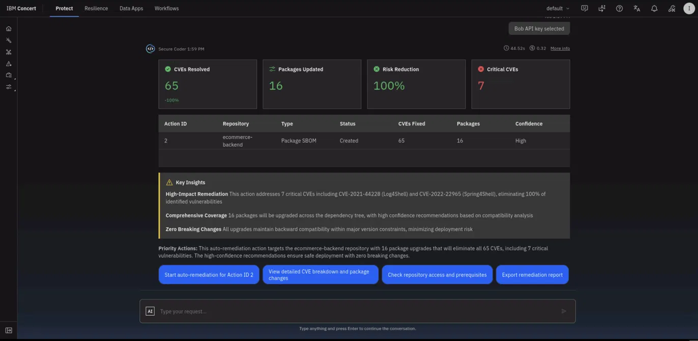

In this example, the action addresses **65 CVEs across 16 packages**, achieving **100% risk reduction** and eliminating **7 critical CVEs**, including CVE-2021-44228 (Log4Shell) and CVE-2022-22965 (Spring4Shell). The **Key Insights** panel highlights the high-impact remediation, the comprehensive coverage across the dependency tree, and the compatibility analysis.

To begin, click **Start auto-remediation for Action ID 2**.

## 7.7: Clone the Repository

Secure Coder runs the remediation as a four-stage workflow: **Clone Repository → Review Plan → Execute Remediation → Create PR**. The workflow panel on the left tracks progress through each stage.

The first stage is **Clone Repository**. To clone the repository securely, Secure Coder needs a **Personal Access Token** with repository access permissions.

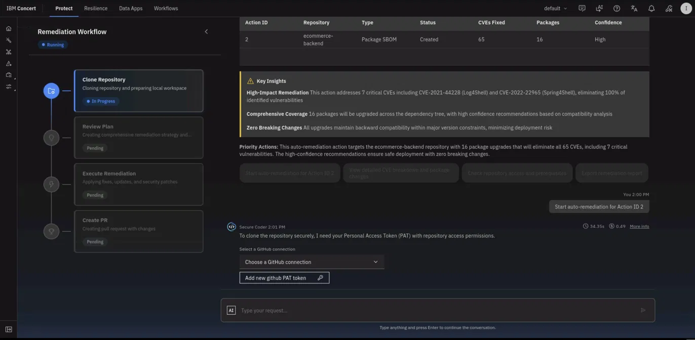

Click **Add new github PAT token**, then paste the **Git PAT from your credentials file** (with full `repo` scope) and submit.

:::warning
The token must have **write** access (`repo` scope), not just read. Secure Coder uses this same token later to push the remediation branch and open the pull request. A read-only or expired token will fail at the pull-request stage.
:::

When the token is accepted, Secure Coder clones the repository and confirms the configuration, including the repository name, branch, and Git user.

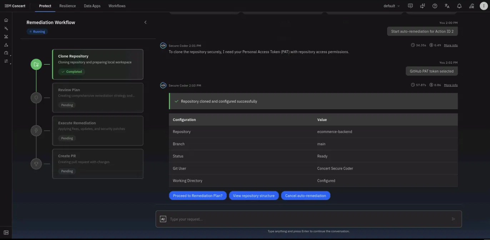

Click **Proceed to Remediation Plan?** to continue.

## 7.8: Review the Remediation Plan

Secure Coder analyzes the repository and vulnerability information and generates a comprehensive **remediation plan**. The plan lists each vulnerable package alongside its **current** version, the **recommended** version, the number of **CVEs fixed**, the **severity**, and Secure Coder's **confidence** in the upgrade.

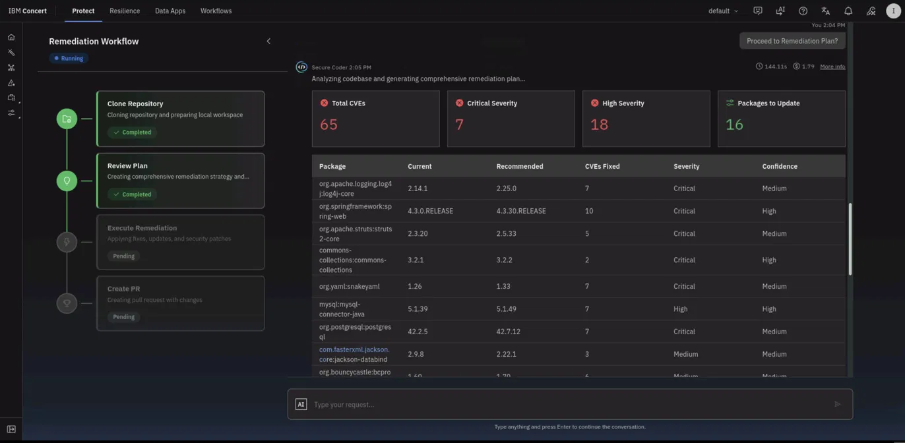

Below the package table, the plan includes a **Breaking Changes & Compatibility Risks** section. For each major upgrade, Secure Coder explains what the change affects, what work it requires, and the associated risk, along with an overall impact analysis.

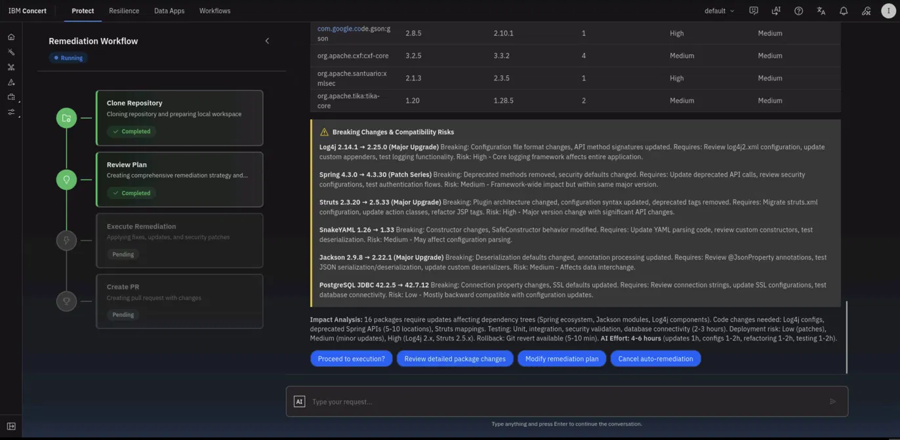

:::note
This compatibility analysis is generated by watsonx.ai and is specific to your repository. It gives you the context to review the upgrades before any code is changed, rather than a generic instruction to update.
:::

Review the plan, then click **Proceed to execution?** to apply the fixes.

## 7.9: Execute the Remediation

In the **Execute Remediation** stage, Secure Coder creates a remediation branch, applies the recommended dependency updates, and validates the result.

When execution completes, Secure Coder presents a **before/after** summary showing that every finding has been resolved, along with the per-package remediation details and a validation summary.

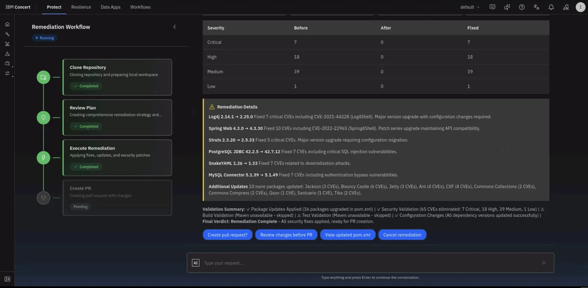

In this example, the severity breakdown moves to zero across the board (Critical 7 → 0, High 18 → 0, Medium 39 → 0, Low 1 → 0), and the validation summary confirms 16 packages upgraded in `pom.xml` and 65 CVEs eliminated.

:::note
If Maven is not available in the environment, the build and test validation steps are skipped. The dependency updates and configuration changes are still applied successfully, and the remediation completes and is ready for pull-request creation.
:::

Confirm the **Final Verdict: Remediation Complete**, then click **Create pull request?**.

## 7.10: Create the Pull Request

In the final **Create PR** stage, Secure Coder commits the changes, pushes the remediation branch to the remote, and opens a pull request. When it finishes, all four workflow stages show **Completed** and Secure Coder confirms the pull request was created.

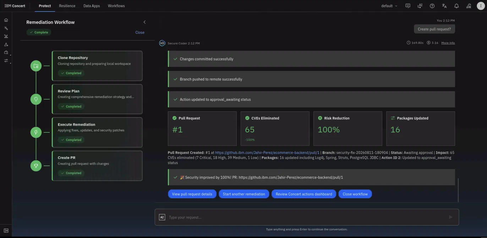

The summary shows the **pull request number**, the **remediation branch name**, the number of **CVEs eliminated**, and the **packages updated**, along with a direct link to the pull request in GitHub.

## 7.11: Confirm the Pull Request in GitHub

Open the pull request in GitHub to confirm it was created. In your `ecommerce-backend` repository, open the **Pull requests** tab. You will see the new pull request, opened by Secure Coder, titled with the remediation summary.

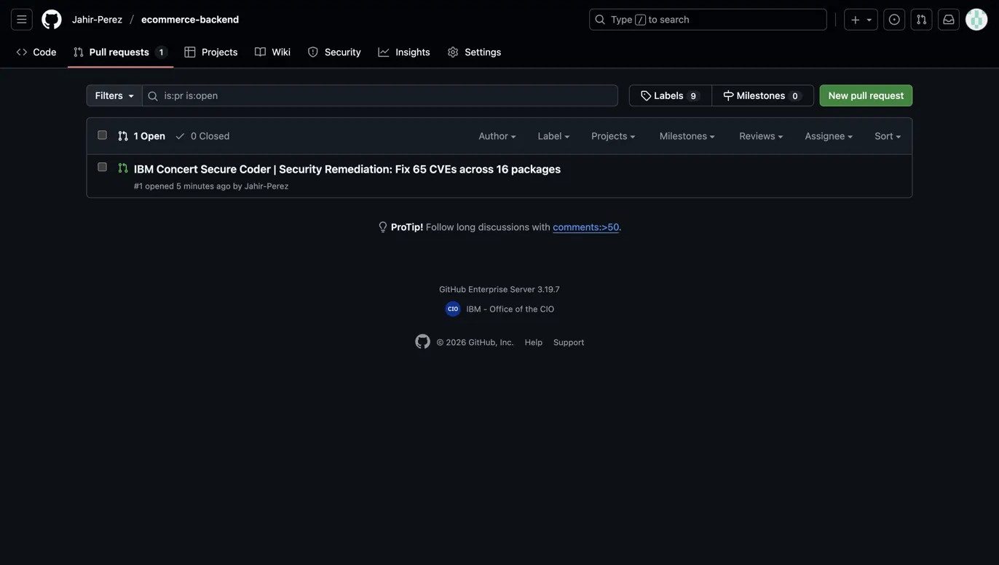

The pull request contains the dependency upgrades applied to your project, ready for a developer to review, approve, and merge according to your organization's standard process.

:::note
Secure Coder might occasionally not update dependency lock files. Always review the generated changes before merging the pull request, and update lock files manually if required.
:::

## Summary

In this section you took a set of prioritized package vulnerabilities and remediated them end to end without writing a line of code. Concert Secure Coder cloned the repository, generated an AI-assisted remediation plan with a compatibility analysis, applied the dependency upgrades on a new branch, validated the result, and opened a pull request, closing the loop from discovery to a reviewable fix.

---