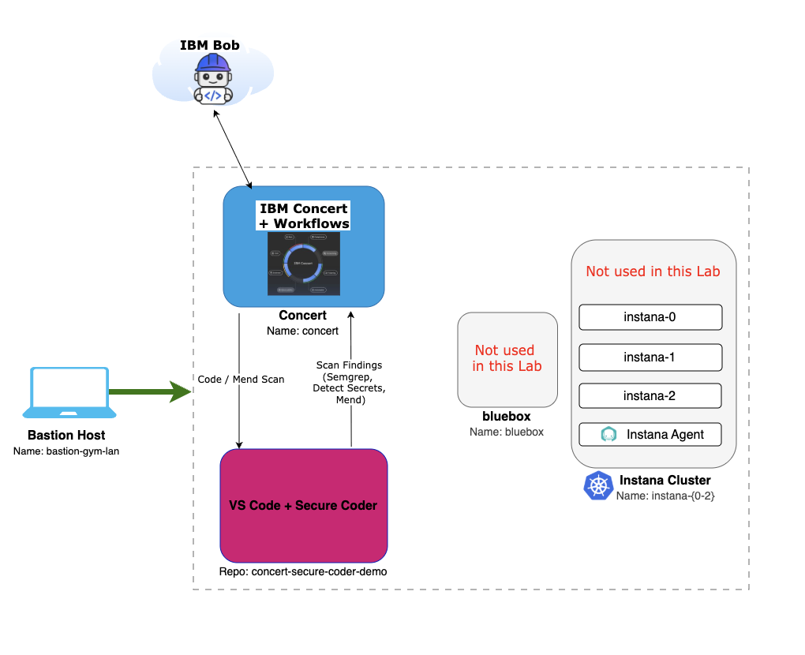

# Lab Environment

In this lab, you will work inside a single **Bastion virtual machine** that hosts everything you need: a browser to reach IBM Concert, Visual Studio Code as your IDE, and a sample vulnerable repository to scan. IBM Concert and the Secure Coder service are pre-installed and running in the same environment, so you do not install or configure any server-side components — you focus entirely on the developer experience inside the IDE.

* **Bastion Host** (`bastion-gym-lan`) — the VM you connect to through your browser using **Guacamole** (a clientless remote-desktop gateway). This is your workstation for the entire lab: Firefox, Visual Studio Code, a terminal, and the sample project all live here.
* **Concert Host** (`concert`) — pre-installed IBM Concert (plus Workflows), reachable from the Bastion at `https://concert.ibmdte.local:12443`. Concert hosts the Secure Coder service that the IDE extension talks to for scans and remediation.

The lab reservation also includes a `bluebox` host and an Instana cluster (`instana-{0-2}`), but **these are not used in this lab** — you can ignore them.

:::info
This lab runs in the **TechZone Jam-in-a-Box** environment. All activity happens on the Bastion VM through Guacamole — there is nothing to install on your own laptop, and you do not need a local copy of Visual Studio Code.
:::

## Architecture

The following diagram describes the components involved in this lab and how a scan flows through them:

From the **Bastion Host**, you drive Visual Studio Code with the Secure Coder extension. When you run a **Code Scan** or **Mend Scan**, the request goes to **IBM Concert**, the underlying engines (Semgrep, Detect Secrets, Mend) analyze the `concert-secure-coder-demo` repository, and the **scan findings** flow back into the IDE. IBM Concert also connects to **IBM Bob**, a supported Secure Coder IDE.

### Architecture Components

#### 1. Bastion Host (`bastion-gym-lan`) — your workstation
- **Purpose**: The single environment where you perform all lab activity
- **Access**: Browser-based remote desktop through Guacamole
- **Tools**: Firefox, Visual Studio Code, terminal, and the `concert-secure-coder-demo` repository
- **Extension**: Concert Secure Coder VS Code extension (you install this during the lab)

#### 2. Concert Host (`concert`) — IBM Concert with the Secure Coder service
- **Purpose**: Hosts IBM Concert (plus Workflows) and the Secure Coder service that performs and coordinates scans
- **URL**: `https://concert.ibmdte.local:12443`
- **Pre-configured**: Concert and the Secure Coder service are installed and running
- **Role in this lab**: The IDE extension authenticates to Concert and sends scan requests; findings from Semgrep, Detect Secrets, and Mend flow back to the IDE
- **IBM Bob**: Concert also connects to IBM Bob, a supported Secure Coder IDE (this lab uses Visual Studio Code)

### How the pieces talk to each other

The Concert Secure Coder experience has two halves that work together:

- The **Secure Coder service**, installed with IBM Concert, processes scan requests and integrates with the underlying security and AI scanning engines.
- The **IDE extension**, installed in Visual Studio Code, is where you scan code, review findings, apply remediations, and view Concert exposure data.

The extension communicates with the Secure Coder service to run scans and retrieve results. When you trigger a scan in VS Code, the request goes to the Secure Coder service on Concert; the findings come back and render in the extension panel next to your code.

## Scanning engines used in this lab

Concert Secure Coder combines several scanning capabilities behind the IDE panel. This lab exercises the following:

| Capability | What it finds | Scope |
|------------|---------------|-------|
| **Secrets detection** | Exposed credentials, tokens, and keys | Active file |
| **SAST** (Static Application Security Testing) | Source-code weaknesses classified against the CWE catalog | Repository / workspace |
| **SCA** (Software Composition Analysis) | Known vulnerabilities in open source dependencies | Repository / workspace |
| **AI-assisted remediation** | Proposed code fixes for supported SAST findings | Per finding |

:::note
Scanning capabilities can be enabled or disabled per organization. In this lab environment, the capabilities used in the exercises are already enabled. In a real deployment, a capability that is turned off still appears in the interface but cannot be run until an administrator configures it.
:::

## Software versions

The following versions are used in this lab environment:

* **IBM Concert**: v2.2.0
* **Concert Secure Coder extension**: `concert-securecode-0.15.0`
* **Visual Studio Code**: 1.98.0 or later

:::note
IBM documentation refers to the extension file as `ibm-concert-secure-coder.vsix`. In this lab environment, the file you install is named `concert-securecode-0.15.0.vsix`. The two refer to the same extension; the version-stamped name is what you will actually download and install in the next section.
:::

## Prerequisites

### Supported IDE

Visual Studio Code (version 1.98.0 or later) is pre-installed on the Bastion Host. IBM Bob is also a supported IDE for Concert Secure Coder, but this lab uses Visual Studio Code.

### Access to IBM Concert

You reach IBM Concert from Firefox on the Bastion at `https://concert.ibmdte.local:12443`. Concert uses an internal, self-signed certificate, so your browser will show a certificate warning the first time you connect — you will accept it during Lab Preparation.

### Knowledge prerequisites

Before starting this lab, it helps to be familiar with:
- Basic use of Visual Studio Code (opening a folder, using the activity bar and the Extensions view)
- The general idea of a source-code vulnerability (for example, SQL injection or a hardcoded secret)
- Basic Git or repository concepts (helpful but not required)

No security-scanning experience is assumed — the lab walks you through each scan and each finding.

## Lab Environment Access

You access this lab through a **TechZone reservation**. When your reservation is ready, you will receive the Guacamole connection details that open the Bastion desktop in your browser. From there, everything you need is already on the machine.

:::tip
Because the whole lab runs inside the Bastion through Guacamole, keep that browser tab open for the duration of the lab. Closing it disconnects your remote desktop session (your work on the VM is preserved, but you will need to reconnect).
:::

## Next Steps

Now that you understand the environment and how the IDE extension and the Secure Coder service work together, proceed to the **Lab Preparation** section, where you will:
- Connect to the Bastion Host through Guacamole
- Open IBM Concert and locate the Secure Coder download
- Download the Concert Secure Coder extension (`.vsix`)
- Open Visual Studio Code and the sample vulnerable repository
- Get ready to install and authenticate the extension in the next section
