# 4. Install and Configure Concert Secure Coder

## 4.1: Overview

This lab section guides you through:

- Downloading and installing the Concert Secure Coder VS Code extension
- Authenticating the extension with your IBM Concert instance
- Verifying the extension is ready to scan

## 4.2: Locate the Concert Secure Coder Card

From the Bastion Remote Desktop, open Firefox and click the **Concert** bookmark.

1. Log in to Concert with `ibmconcert` / `Passw0rd`.
2. In the top navigation bar, click the **Protect** tab.
3. Scroll down until you see the **Concert Secure Coder** card.

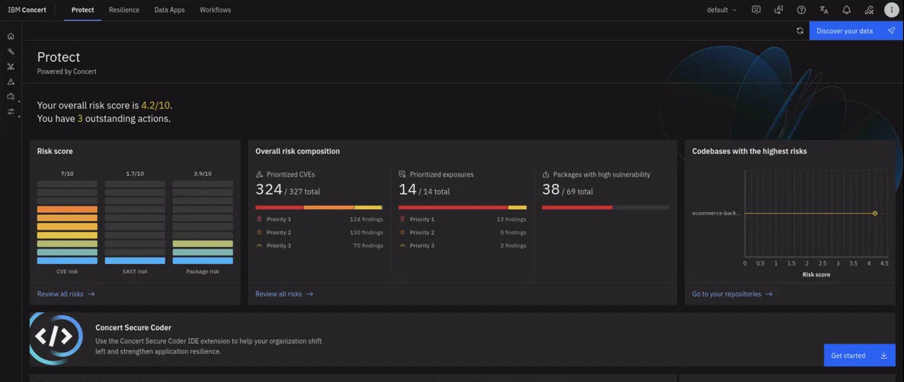

## 4.3: Open the Get Started Panel

Click **Get started** on the Concert Secure Coder card.

A three-step configuration panel opens with the custom Secure Coder URL and a generated API key.

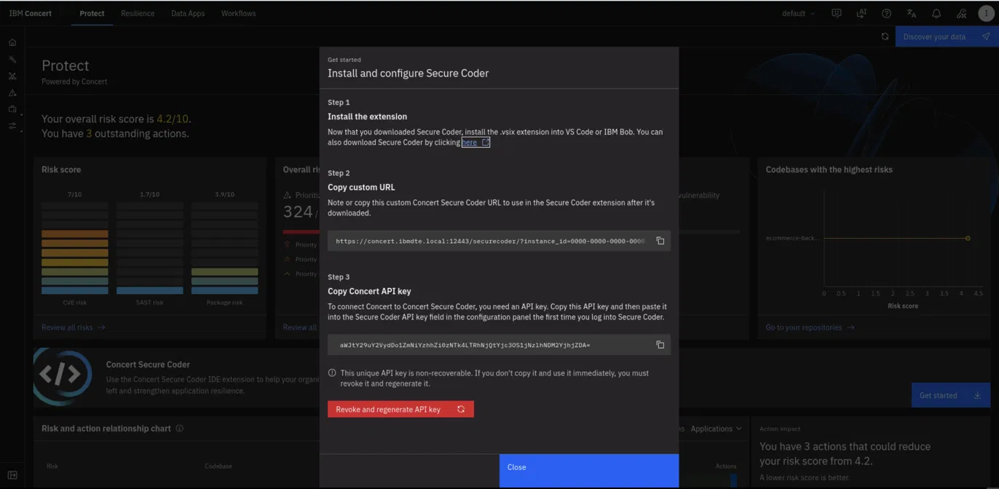

> **Note:** The API key shown in the panel is non-recoverable. Copy it into your `credentials.txt` file immediately. If you close the panel without copying, click **Revoke and regenerate API key** to create a new one.

## 4.4: Download the Extension VSIX

The **here** link on the Get Started panel and the **Download now** banner on the Concert home page both point to internal URLs that may not resolve. Download the extension directly from the GitHub Enterprise Releases page instead.

1. In Firefox, navigate to:

https://github.ibm.com/secure-pipelines-service/secure-coder-internal/releases


2. Locate the latest release and scroll to the bottom.
3. Click **Assets** to expand the download list.

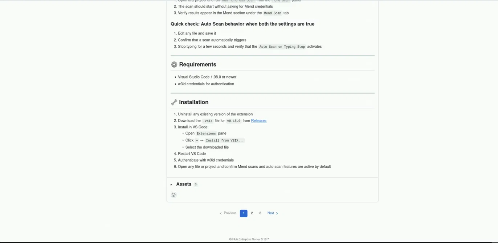

4. Click `concert-securecode-0.15.0.vsix` to download the extension.

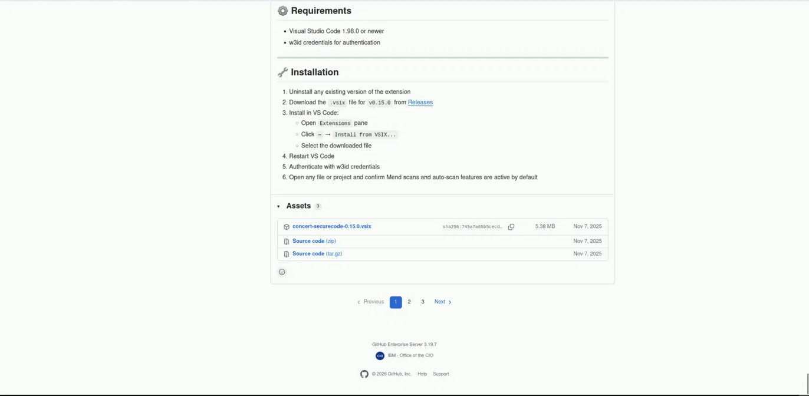

The file downloads to `~/Downloads/`.

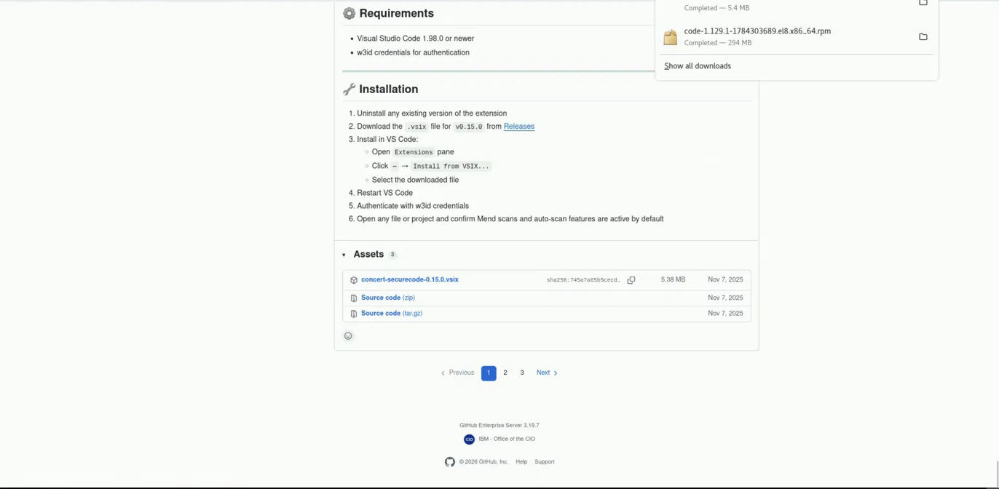

## 4.5: Install Visual Studio Code

The Bastion image does not include Visual Studio Code. Install it before installing the extension.

1. In Firefox, navigate to [https://code.visualstudio.com/download](https://code.visualstudio.com/download).
2. Under the Linux section, download the `.rpm` (x64) build for Red Hat.
3. Open a terminal on the Bastion and run:

```bash
   sudo rpm -i ~/Downloads/code-*.rpm
```

4. Verify the installation:

```bash
   which code
```

   Expected output: `/usr/bin/code`

> **Note:** A `NOKEY` warning from `rpm` about an unverified GPG signature is expected and safe to ignore.

## 4.6: Install the Concert Secure Coder Extension

From the Bastion terminal, install the VSIX:

```bash
code --install-extension ~/Downloads/concert-securecode-0.15.0.vsix
```

You should see:

Installing extensions...
Extension 'concert-securecode-0.15.0.vsix' was successfully installed.


> **Note:** A `DeprecationWarning` about `url.parse()` may appear. This is a Node.js warning from VS Code and can be ignored.

## 4.7: Verify the Extension

Launch VS Code:

```bash
code
```

1. Press `Ctrl+Shift+X` to open the Extensions view.
2. Confirm **Concert SecureCode** by IBM appears under **Installed**.

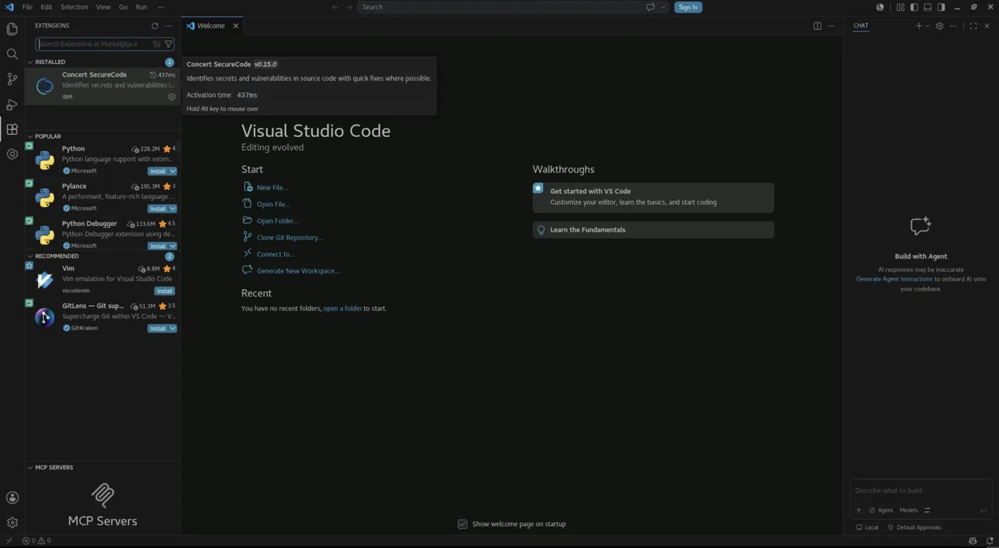

3. Click the extension to open its details page. Confirm the identifier is `ibm.concert-securecode` and the version is `0.15.0`.

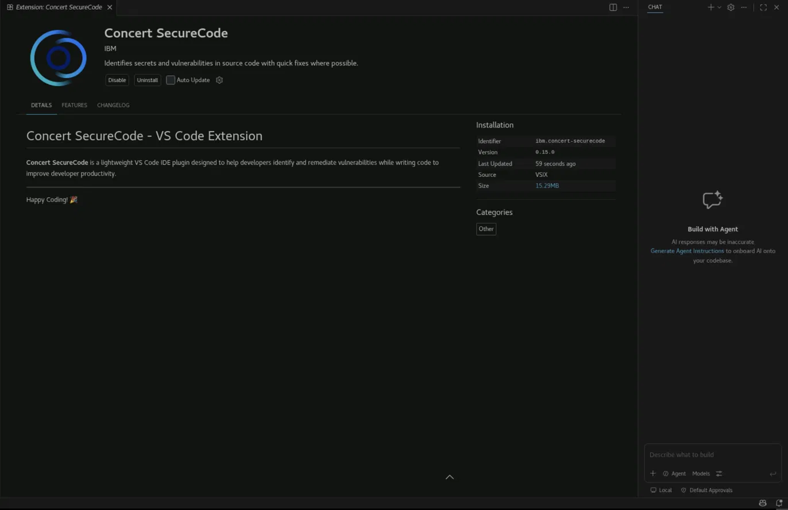

## 4.8: Open the Concert Secure Coder Panel

Click the **Concert SecureCode** icon in the far-left activity bar to open the extension panel.

The panel displays two tabs: **Code Scan** and **Mend Scan**.

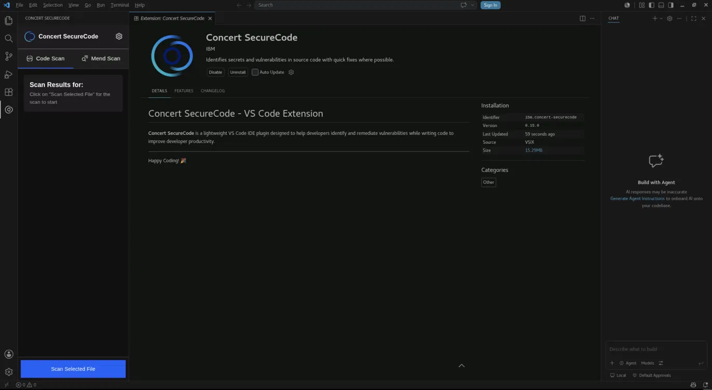

The **Mend Scan** tab provides workspace-level SAST and OSS scans:

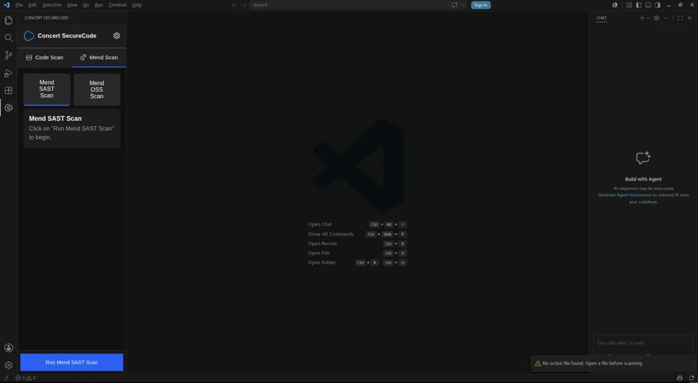

## 4.9: Authenticate the Extension

Concert Secure Coder authenticates via w3id single sign-on.

1. When the extension prompts for authentication, confirm the redirect to your browser.
2. Log in with your w3id credentials.
3. Return to VS Code after successful authentication.

You should see a confirmation toast:

> Concert SecureCode authentication successful. Token stored securely.

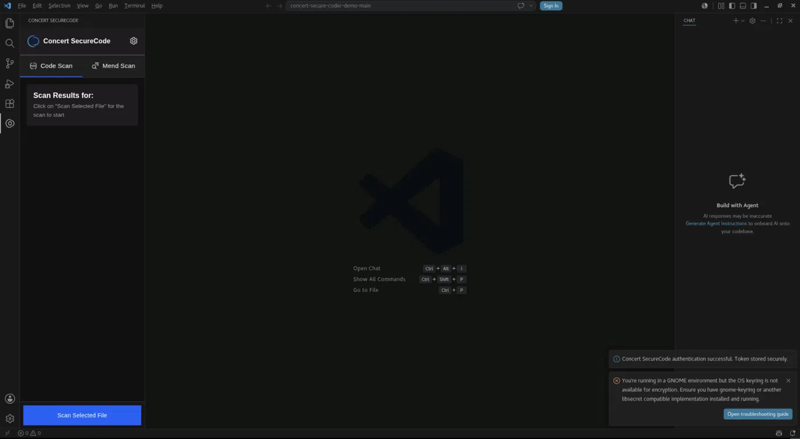

> **Note:** The w3id token expires every 24 hours. You must reauthenticate periodically during extended lab sessions.

> **Note:** If a GNOME keyring warning appears (`You're running in a GNOME environment but the OS keyring is not available for encryption`), the extension still functions. The token is stored, just not with OS-level encryption.

## 4.10: Prepare the Scan Target Repository

You need a workspace with code to scan. Use the Concert Secure Coder demo repository, which contains intentional vulnerabilities for testing.

1. In Firefox, navigate to:

https://github.ibm.com/secure-pipelines-service/concert-secure-coder-demo/archive/refs/heads/main.zip


2. The repository downloads as `concert-secure-coder-demo-main.zip`.

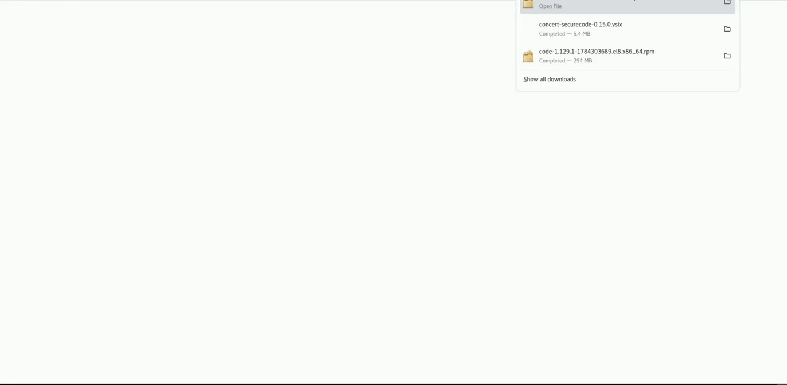

3. Extract the archive from the terminal:

```bash
   cd ~
   unzip ~/Downloads/concert-secure-coder-demo-main.zip
```

4. Open the extracted folder in VS Code:

```bash
   code ~/concert-secure-coder-demo-main
```

## 4.11: Trust the Workspace

When VS Code opens the folder, a yellow **Restricted Mode** banner appears at the top. Extensions are disabled in Restricted Mode.

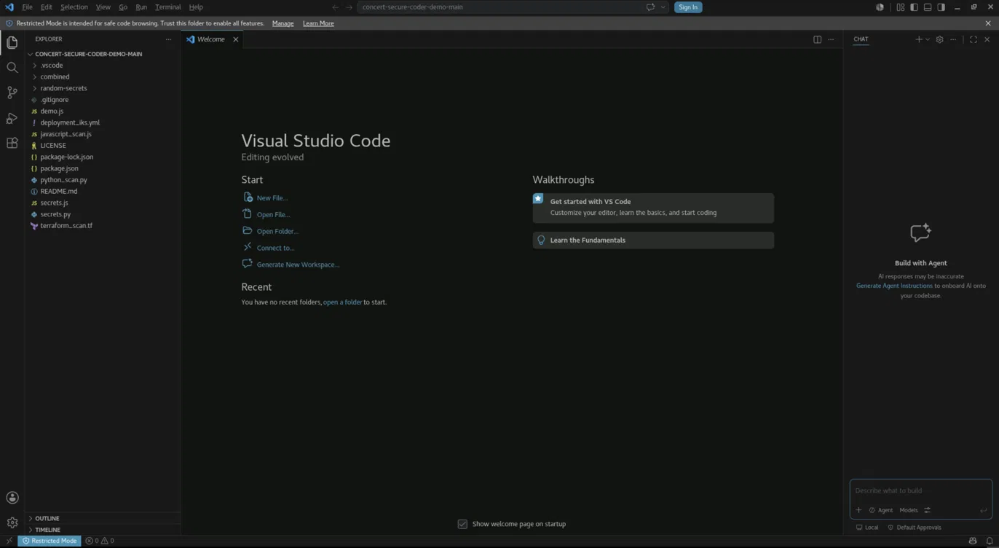

1. Click **Manage** in the banner.
2. Select **Yes, I trust the authors**.

The Concert SecureCode extension activates and the panel becomes available in the activity bar.

You are now ready to run scans in section 5.