# 5. Vulnerability Patch Workflow

## 5.1 Overview

In the previous section you installed the Concert Secure Coder extension in Visual Studio Code on the Bastion, authenticated it against your IBM Concert instance, and opened the demo repository as a trusted workspace. The extension is connected and ready to scan.

In this section you run the vulnerability patch workflow end to end. You scan a vulnerable JavaScript file, review the findings each scanner returns, remediate one vulnerability using an AI-generated fix and another by hand, and rescan to prove both are gone. You then run the two Mend scans to see how repository-wide SAST and dependency analysis widen the picture.

This is the core value of Secure Coder. Rather than waiting for a vulnerability to surface in a downstream pipeline scan, a security review, or a production incident, the developer sees the finding in the editor where the code was written and remediates it before the change is ever committed.

### What you will do

- Run a **Code Scan** on a vulnerable file and review the Semgrep and Detect Secrets findings
- Expand a finding to review its description, affected file, and line number
- Apply an AI-generated remediation using **Fix with AI**
- Review the applied fix, correct a side effect it introduces, and remediate the remaining finding manually
- Rescan to confirm a clean result
- Run a **Mend SAST Scan** and review a CWE-classified finding in depth
- Run a **Mend OSS Scan** to surface vulnerable open source dependencies
- Review the Secure Coder settings that govern scan behavior

### Scan types used in this lab

The Concert SecureCode panel exposes two top-level tabs. Each maps to a different scanning engine.

| Tab | Scan | Scope | What it detects |
| --- | --- | --- | --- |
| Code Scan | Semgrep | Active file | Insecure patterns and missing security controls in source code |
| Code Scan | Detect Secrets | Active file | Exposed credentials, tokens, and keys |
| Mend Scan | Mend SAST Scan | Repository | CWE-classified security vulnerabilities in source code |
| Mend Scan | Mend OSS Scan | Repository | Known vulnerabilities in open source dependencies |

:::note
The extension panel is branded **Concert SecureCode**. The IBM product documentation refers to the same component as Concert Secure Coder, and describes a different tab layout (Home, File scans, Workspace scans, Concert exposures). This lab follows the interface as it appears in the Jam-in-a-Box environment.
:::

### About AI-assisted remediation

**Fix with AI** generates a proposed code change for a supported finding, inserts it into your working copy, and annotates it with a confidence score. It is reached from the Visual Studio Code **Quick Fix** menu in the editor, not from a button inside the Concert SecureCode panel — a detail the product documentation does not mention.

AI fixes are offered on Semgrep findings from a Code Scan. Mend SAST findings return a written **Recommendation** instead, which you apply yourself.

The **Confidence Threshold** setting controls the minimum confidence a generated fix must reach before it can be applied. The default is 90.

---

## 5.2 Open the Vulnerable File

The demo repository contains a small Express application seeded with deliberate security defects. You scan that file first.

1. In Visual Studio Code, press **Ctrl+P**.
2. Type `javascript_scan.js` and press **Enter**.

The file opens in the editor. Note the three seeded problems:

- Line 6 — an Express application with no CSRF middleware
- Line 10 — a hard-coded private key assigned to `PRIVATE_KEY`
- Line 15 — a hard-coded JWT signing secret passed to `jwt.sign()`

:::tip
The Concert SecureCode panel scans the file that is currently active in the editor. If no file is open, the panel reports `No active file found. Open a file before scanning.`
:::

---

## 5.3 Run a Code Scan

1. Click the **Concert** icon in the activity bar to open the Concert SecureCode panel.

   The activity bar is the narrow vertical strip of icons along the far left edge of the Visual Studio Code window. The Concert icon is the circular one near the bottom of that strip. Clicking it opens the Concert SecureCode panel beside it.

2. Select the **Code Scan** tab at the top of the panel.
3. Click the blue **Scan Selected File** button at the bottom of the panel.

The scan completes in a few seconds and the results appear in the panel, grouped by scanner.

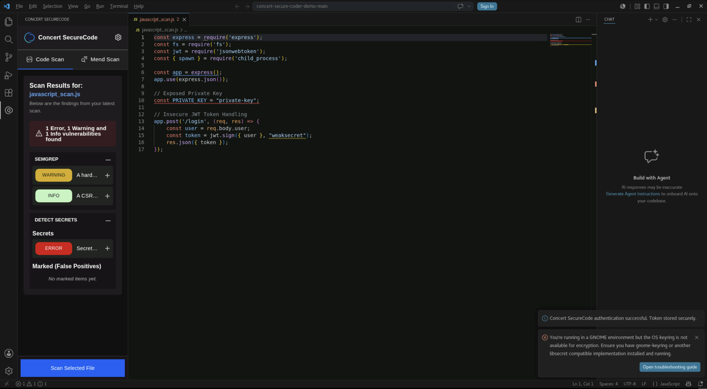

You should see **1 Error, 1 Warning and 1 Info vulnerabilities found**, split across two sections:

- **SEMGREP** — a `WARNING` for the hard-coded credential and an `INFO` for the missing CSRF middleware
- **DETECT SECRETS** — an `ERROR` for the exposed secret keyword

:::tip
Widen the panel before reviewing findings. Drag the divider between the Concert SecureCode panel and the editor to the right until the finding descriptions stop truncating.
:::

---

## 5.4 Review a Finding

1. Click the **+** at the right edge of the SEMGREP `WARNING` row.

The row expands to show the full finding.

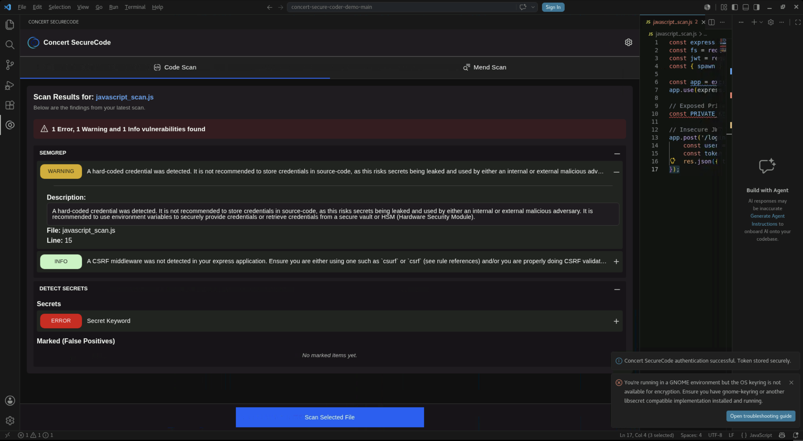

A Code Scan finding reports:

- **Description** — what the scanner detected and why it matters
- **File** — the file the finding belongs to
- **Line** — the line number of the affected code

Click the **−** to collapse the finding again.

---

## 5.5 Apply an AI-Generated Fix

The remaining Semgrep finding — the missing CSRF middleware on line 6 — is a good candidate for AI remediation. The fix requires adding a new dependency and wiring it into the Express app, which is more than a single-token change.

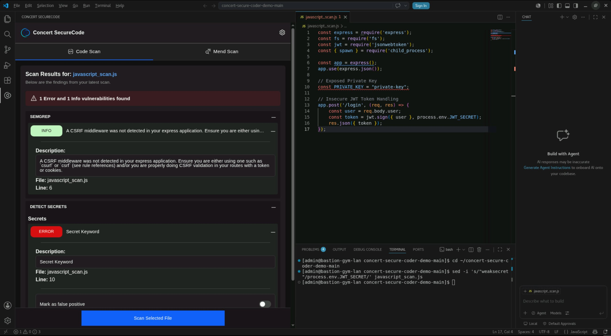

1. In the editor, click on **line 6** — the `const app = express();` declaration.
2. Press **Ctrl+.** to open the **Quick Fix** menu.

The Quick Fix menu lists two Secure Coder actions alongside the standard Visual Studio Code refactorings.

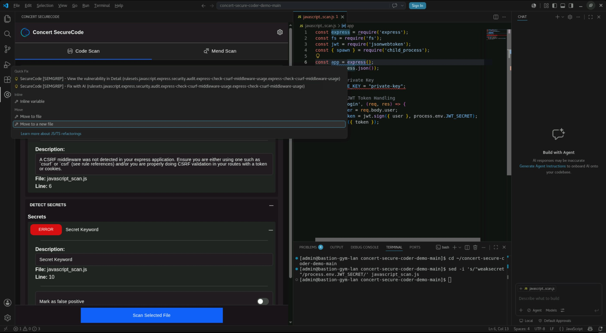

- **SecureCode [SEMGREP] - View the vulnerability in Detail** — opens the finding detail
- **SecureCode [SEMGREP] - Fix with AI** — generates and inserts a remediation

3. Select **SecureCode [SEMGREP] - Fix with AI**.

The generated fix is inserted into the file and highlighted.

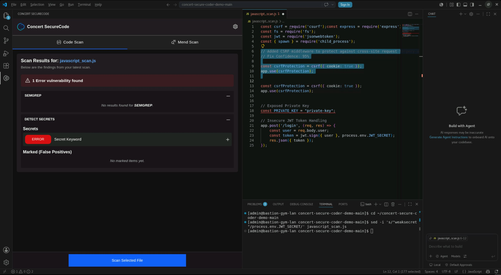

The insertion includes an explanatory comment and a confidence score:

```javascript
// Added CSRF middleware to protect against cross-site request forgery attacks
// Fix Confidence: 95%

const csrfProtection = csrf({ cookie: true });
app.use(csrfProtection);
```

It also adds the `csurf` require to line 1.

:::note
This fix reported 95% confidence, above the default **Confidence Threshold** of 90, so it was offered. Fixes scoring below the threshold are not applied. If a finding you expect to be fixable offers nothing, lower the threshold in the Secure Coder settings and rescan.
:::

---

## 5.6 Review and Correct the Applied Fix

An AI-generated fix modifies your working copy only. Nothing is committed on your behalf, and you are responsible for reviewing what it wrote.

In this case the generated code declares `csrfProtection` a second time. Scroll through the file and you will see the same two lines appear twice:

```javascript
const csrfProtection = csrf({ cookie: true });
app.use(csrfProtection);
```

JavaScript does not allow the same `const` name to be declared twice in the same scope, so the file is now broken. You need to delete the second copy and keep the first.

1. In the editor, find the **second** occurrence of the pair. It sits a few lines below the first, with only blank lines between them.
2. Click at the very start of the second `const csrfProtection` line.
3. Hold **Shift** and press the **Down arrow** twice. This highlights both duplicate lines.
4. Press **Delete** to remove them.

The file should now contain the CSRF block exactly once:

```javascript
// Added CSRF middleware to protect against cross-site request forgery attacks
// Fix Confidence: 95%

const csrfProtection = csrf({ cookie: true });
app.use(csrfProtection);
```

5. Save the file with **Ctrl+S**.
6. Click **Scan Selected File**.

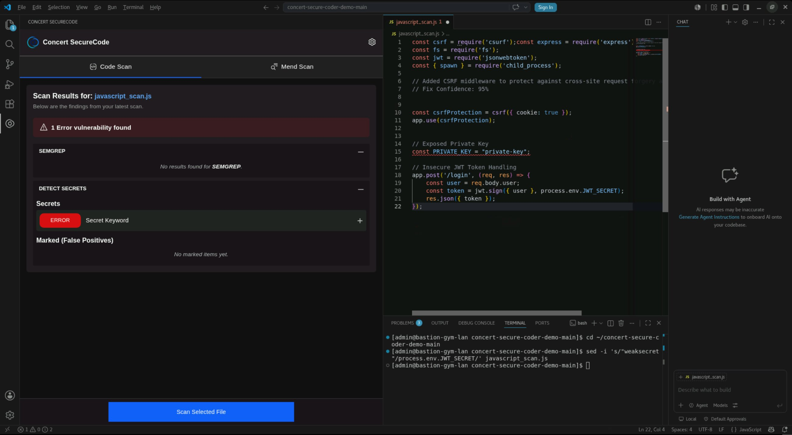

SEMGREP now reports **No results found**. One finding remains: the exposed secret on the `PRIVATE_KEY` line.

:::caution
This is the central lesson of AI-assisted remediation. The fix was correct in intent and wrong in placement. Always read a generated change before accepting it, and always rescan afterward. Treat **Fix with AI** as a developer-in-the-loop assist, not auto-remediation.
:::

---

## 5.7 Remediate the Remaining Finding

Detect Secrets findings do not offer an AI fix. You remediate them yourself, and the correct remediation is almost always the same: take the secret out of the source file and read it from an environment variable instead. An environment variable is a value supplied to the application when it starts, so the secret never appears in the code or in source control.

The finding tells you exactly where to look. In the Detect Secrets section of the panel it lists `File: javascript_scan.js` and a line number.

1. In the editor, find the line under the `// Exposed Private Key` comment. It currently reads:

```javascript
const PRIVATE_KEY = "private-key";
```

2. Select the text `"private-key"`, including both quotation marks. Click just before the opening quote, hold the mouse button down, drag to just after the closing quote, and release.

3. Type the following to replace it:

```
process.env.PRIVATE_KEY
```

The line should now read:

```javascript
// Exposed Private Key
const PRIVATE_KEY = process.env.PRIVATE_KEY;
```

Leave the semicolon at the end in place.

4. Save the file with **Ctrl+S**.

:::tip
An unsaved file shows a filled dot on its editor tab instead of an **X**. If the dot is still there, the scan will run against the version on disk, not what you see on screen.
:::

---

## 5.8 Verify the Clean Scan

1. Click **Scan Selected File**.

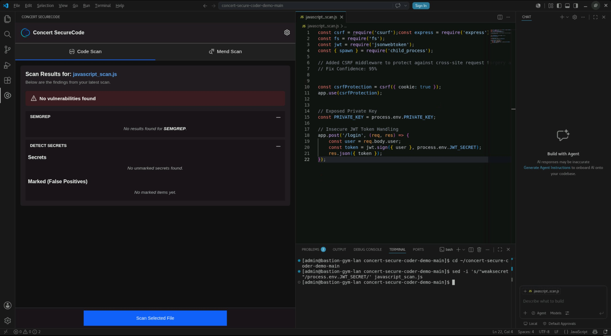

The panel reports **No vulnerabilities found**. SEMGREP returns no results, and Detect Secrets reports `No unmarked secrets found`.

You have now completed a full remediation loop: detect, review, fix, verify.

---

## 5.9 Run a Mend SAST Scan

The Code Scan analyzes the active file. The Mend scans analyze the whole repository and classify what they find against the CWE catalog.

1. Select the **Mend Scan** tab.

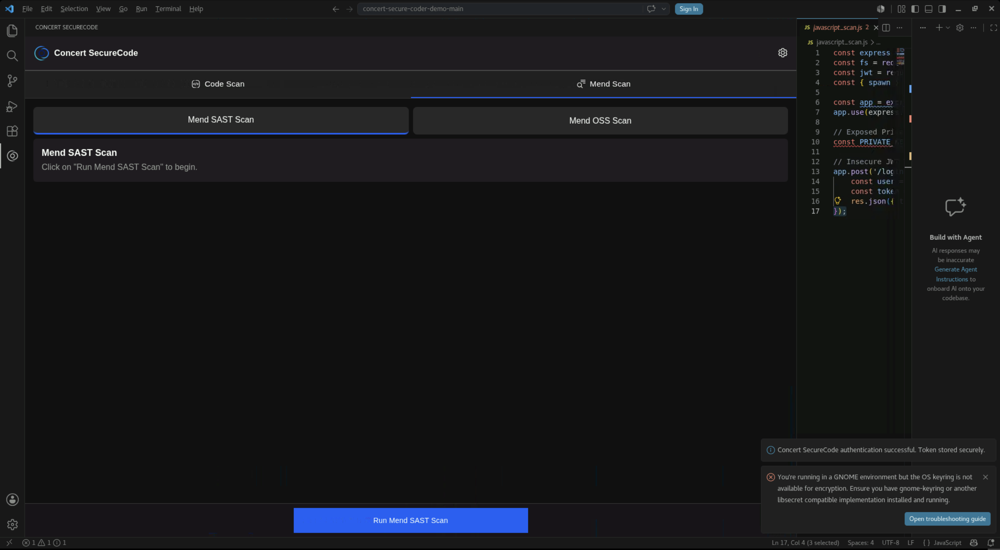

The Mend Scan tab has two sub-tabs: **Mend SAST Scan** and **Mend OSS Scan**.

2. Ensure **Mend SAST Scan** is selected.
3. Click **Run Mend SAST Scan**.

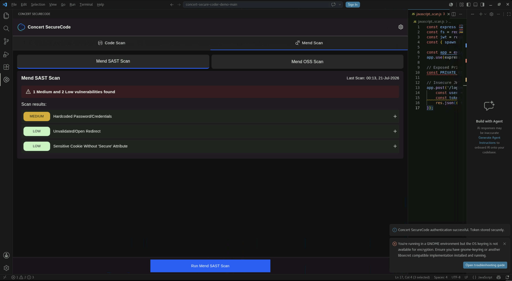

The scan reports **1 Medium and 2 Low vulnerabilities found**:

- `MEDIUM` — Hardcoded Password/Credentials
- `LOW` — Unvalidated/Open Redirect
- `LOW` — Sensitive Cookie Without 'Secure' Attribute

---

## 5.10 Review a Mend SAST Finding

1. Click the **+** at the right edge of the `MEDIUM` **Hardcoded Password/Credentials** row.

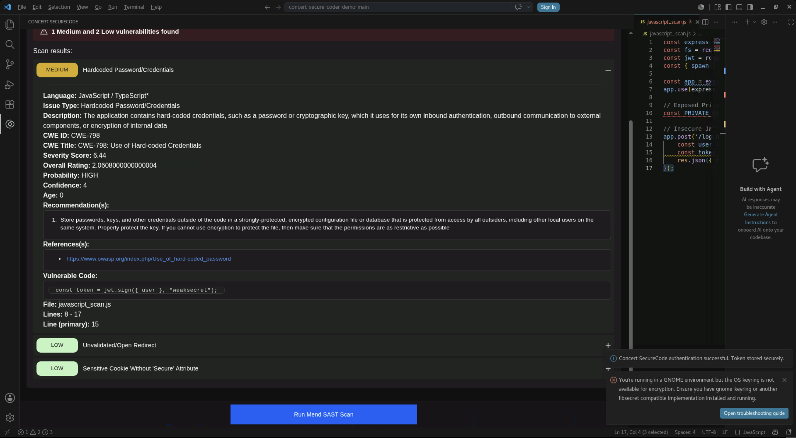

A Mend SAST finding carries substantially more context than a Code Scan finding:

| Field | Example |
| --- | --- |
| Language | JavaScript / TypeScript |
| Issue Type | Hardcoded Password/Credentials |
| CWE ID | CWE-798 |
| CWE Title | CWE-798: Use of Hard-coded Credentials |
| Severity Score | 6.44 |
| Probability | HIGH |
| Recommendation(s) | Store credentials outside the code in a strongly-protected, encrypted configuration file or database |
| Reference(s) | Link to the OWASP entry for the weakness |
| Vulnerable Code | The offending line, quoted |
| File / Lines | The file and the line range, with a primary line |

:::note
Mend SAST findings provide a written **Recommendation** rather than a **Fix with AI** action. You apply the recommendation yourself.
:::

---

## 5.11 Remediate and Verify the Mend SAST Finding

The expanded finding names the file and line, and quotes the offending code under **Vulnerable Code**. It is the JWT signing secret — a password hard-coded directly into the call that creates login tokens.

Apply the recommendation the same way you did in step 5.7: move the secret into an environment variable.

1. In the editor, find the line under the `// Insecure JWT Token Handling` comment. It currently reads:

```javascript
const token = jwt.sign({ user }, "weaksecret");
```

2. Select the text `"weaksecret"`, including both quotation marks.

3. Type the following to replace it:

```
process.env.JWT_SECRET
```

The line should now read:

```javascript
const token = jwt.sign({ user }, process.env.JWT_SECRET);
```

4. Save the file with **Ctrl+S**.
5. Click **Run Mend SAST Scan**.

:::tip
If you prefer the command line, you can make the same change from the Visual Studio Code terminal. Open **Terminal > New Terminal** and run:

```bash
cd ~/concert-secure-coder-demo-main
sed -i 's/"weaksecret"/process.env.JWT_SECRET/' javascript_scan.js
```

The editor picks up the change from disk automatically.
:::

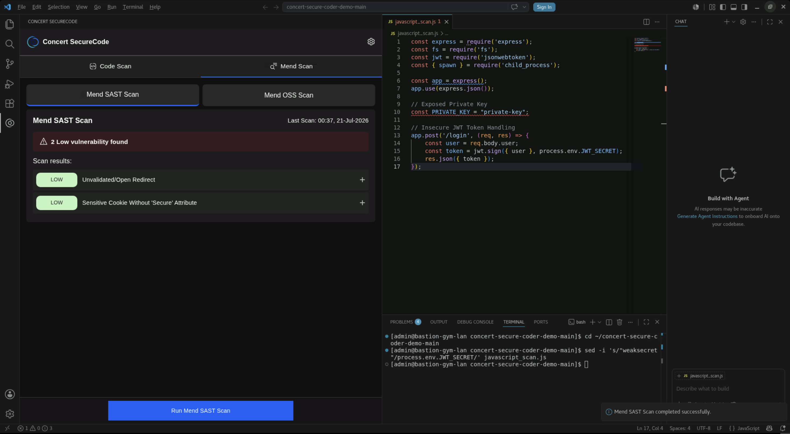

The result drops to **2 Low vulnerability found**. The `MEDIUM` Hardcoded Password/Credentials finding is gone; the two `LOW` findings, which you did not address, remain.

:::tip
Leaving the two `LOW` findings in place is deliberate. It shows that a rescan reflects exactly what changed, rather than clearing the board.
:::

---

## 5.12 Run a Mend OSS Scan

Source code is only part of an application's attack surface. Most of what ships in a Node.js project comes from its dependency tree.

1. Select the **Mend OSS Scan** sub-tab.
2. Click **Run Mend OSS Scan**.

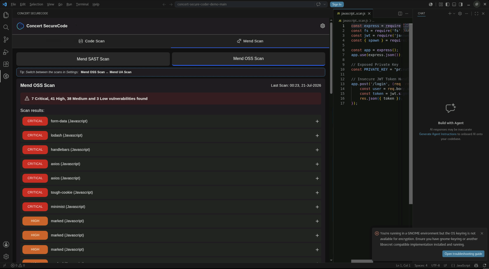

The scan reports **7 Critical, 41 High, 38 Medium and 3 Low vulnerabilities found** across the repository's dependencies, including `form-data`, `lodash`, `handlebars`, `axios`, `tough-cookie`, `minimist`, and `marked`.

Compare that to the three findings the source code scans returned. The dependency tree is where the volume is, and it is invisible without software composition analysis.

:::note
Mend OSS results are listed by package and severity. In this environment the individual findings do not expand to show detail.
:::

---

## 5.13 Review the Secure Coder Settings

1. Click the **gear** icon at the top right of the Concert SecureCode panel.

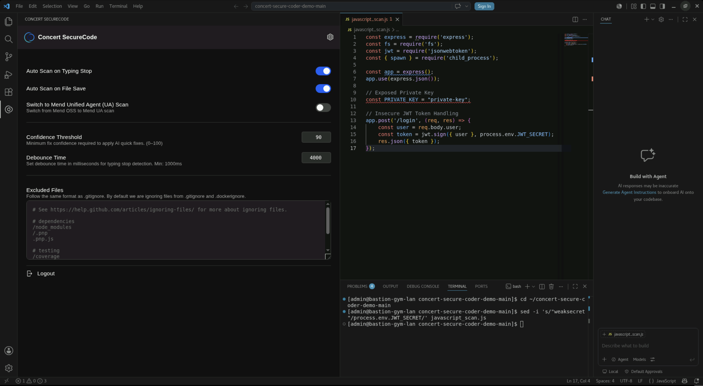

| Setting | Purpose |
| --- | --- |
| Auto Scan on Typing Stop | Runs a Code Scan after you stop typing |
| Auto Scan on File Save | Runs a Code Scan every time you save |
| Switch to Mend Unified Agent (UA) Scan | Switches the dependency scanner from Mend OSS to Mend UA |
| Confidence Threshold | Minimum confidence a generated fix must reach before it can be applied (0–100, default 90) |
| Debounce Time | How long typing must stop before an automatic scan runs (minimum 1000 ms) |
| Excluded Files | Paths to skip, in `.gitignore` format. `.gitignore` and `.dockerignore` are honored by default |
| Logout | Ends the authenticated session |

2. Click the **gear** icon again to close the settings.

---

## 5.14 Section Summary

In this section you ran the complete Secure Coder remediation workflow inside the IDE:

- Scanned a file with Semgrep and Detect Secrets, and reviewed the findings each returned
- Generated a remediation with **Fix with AI**, reviewed it, corrected a defect it introduced, and verified the result
- Remediated an exposed secret manually and confirmed a clean scan
- Ran a repository-wide Mend SAST scan, reviewed a CWE-classified finding, applied its recommendation, and verified the fix
- Ran a Mend OSS scan and saw how far the dependency attack surface exceeds the source code attack surface
- Reviewed the settings that govern scan behavior and fix confidence

Every one of these actions happened before a commit. That is the point of shifting security into the editor: the cheapest moment to fix a vulnerability is the moment it is written.

### Environment notes

The following apply to the Jam-in-a-Box environment used for this lab:

- **Fix with AI** is reached from the Visual Studio Code Quick Fix menu (**Ctrl+.**), not from a button in the Concert SecureCode panel
- Mend SAST findings offer a written recommendation rather than an AI fix
- Mend OSS findings list by package and severity but do not expand to show per-finding detail
- The panel provides no control for synchronizing scan results back to IBM Concert
- Visual Studio Code may report that the GNOME OS keyring is unavailable for encryption. The session still authenticates. To suppress the warning, launch with `code --password-store="gnome-libsecret"`, or run **Preferences: Configure Runtime Arguments** and add `"password-store": "gnome-libsecret"` to `argv.json`