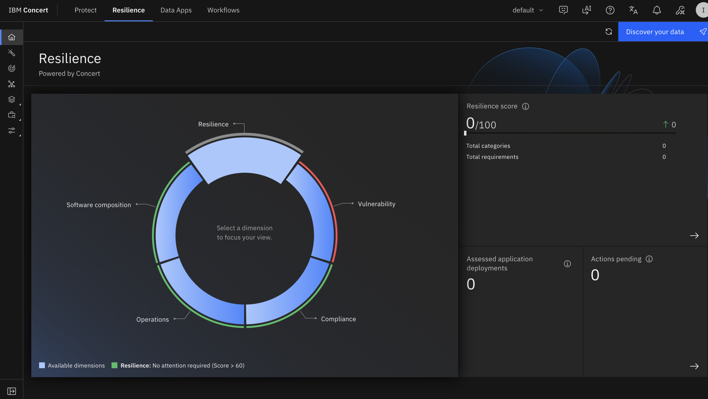

# Lab Preparation

Before setting up Concert, take a few minutes to confirm you can reach both
virtual machines and the Concert UI. Getting connectivity confirmed up front
saves time later, because the WebSphere workflows depend on Concert being able
to reach the Liberty server over SSH.


## Verify access to the Concert UI

Open the Concert UI in your browser:

```
https://concert-v3-auto71.fyre.ibm.com:12443/concert
```

Log in with:

- **Username:** `ibmconcert`
- **Password:** `Passw0rd`

You should land on the Concert home page with the **Protect**, **Resilience**,
**Data Apps**, and **Workflows** tabs across the top.



:::note
The browser may warn that the site is "Not Secure" because the lab instance
uses a self-signed certificate. This is expected for the lab environment.
Proceed to the site.
:::

## Step 3: Verify SSH access to both servers

Open a terminal and confirm you can SSH into both VMs as `root`.

Connect to the Concert server:

```bash
ssh root@concert-v3-auto71.fyre.ibm.com
```

Then confirm you can connect to the WebSphere Liberty target:

```bash
ssh root@os-patch-rhel1.fyre.ibm.com
```

Both should log you in without error.

## Step 4: Confirm the WebSphere Liberty server is running

While connected to the Liberty target (`os-patch-rhel1`), confirm the server is
installed and running. Check the version first:

```bash
/opt/IBM/wlp/bin/server version
```

You should see output similar to:

```
WebSphere Application Server 24.0.0.6 (1.0.90.cl240620240603-2001) on OpenJDK 64-Bit Server VM, version 17.0.20+8-LTS (en_US)
```

Note the version, **24.0.0.6**. This is the version Concert will find as
vulnerable and later upgrade. Confirm the server process is active:

```bash
systemctl status liberty@defaultServer
```

The unit should be **active (running)**.


## Step 5: Confirm Ansible is installed on the target

On IBM Concert 3.0.x, the non-FaaS remediation applies the fixpack by running
**Ansible on the target server itself**. That means the Liberty server needs
`ansible-playbook` available, or the patch step will fail later when it tries
to install the fix.

Check whether Ansible is present on the Liberty target:

```bash
which ansible-playbook
```

If this returns a path such as `/usr/bin/ansible-playbook`, you are set.

If it returns nothing (the command is not found), install it now:

```bash
dnf install -y ansible-core
```

Then confirm it works:

```bash
ansible-playbook --version
```

:::tip
It is worth confirming Ansible **before** you start the remediation step. The
fixpack download, authentication, and scheduling can all succeed, and the patch
will still fail at the very end if `ansible-playbook` is not installed on the
target. Installing it up front avoids that.
:::

## Step 6: Clean up data from previous runs (optional)

If someone has run this lab on the same Concert instance before, you may see an
existing WebSphere server in the software inventory or leftover remediation
actions. If you want a clean starting point, remove the previously registered
server from **Software inventory** before you begin. If the instance is fresh,
skip this step.

## You're ready

With the VPN connected, both servers reachable, the Liberty server confirmed at
24.0.0.6, and Ansible present on the target, you are ready to set up the Concert
workflows. That is the focus of the next section.