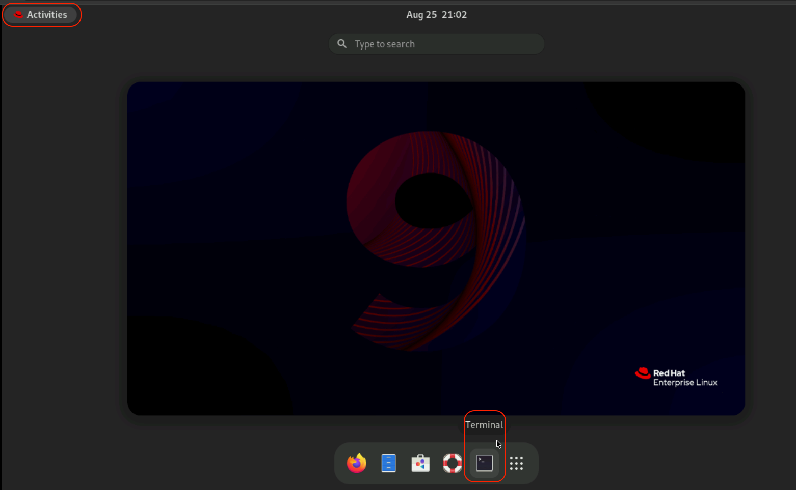
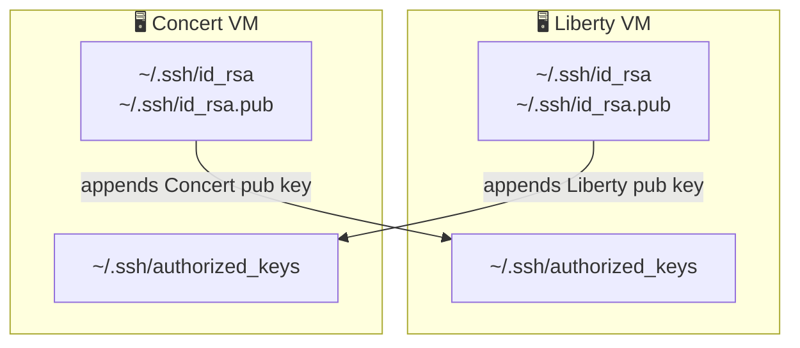

## 3.1 Overview

Before proceeding with the main lab activities, ensure that you have completed **all Lab Preparation steps** in this section.


:::warning
You may receive prompts for software updates during the lab.  
Please **ignore these prompts** and **do not install any updates** to avoid disrupting the lab environment.
::: 

## 3.2 Disabling the Terminal Window Timeout

This command removes the default timeout settings of the Terminal window and then closes the window. We will do this to keep the
Terminal window open during the Lab. 
From the **Concert VNC Desktop**, click on the top-left **Activities** button and then on the bottom panel, click **Terminal**.



Run the command below on the Terminal window:

```bash
sudo sed -i 's/^typeset -xr TMOUT=900/export TMOUT=0/' /etc/profile.d/tmout.sh;exit
```
Repeat these steps in the **Liberty VNC Desktop**.

## 3.3 Capturing the Lab Credentials

In this section, you will collect all necessary credentials and configuration details required to complete the lab exercises. 
All credentials will be consolidated into a single executable file, which simplifies the steps later in the lab.


### Prepare the Credentials File

1. Same as before, from the **Concert VNC Desktop**, click on the top-left **Activities** button and then on the bottom panel, click **Terminal**

2. From the Terminal window, run the following commands to open the text editor:

```bash
cd /home/itzuser
gedit credentials.sh &
```

3. Paste the following template and keep this credentials window open for easy access during the lab.


```bash

Lab guide:        https://tinyurl.com/concert-labs
Lab files:        https://ibm.box.com/v/lab-websphere

Concert URL:      https://localhost:12443
concert_username: ibmconcert
concert_password: Passw0rd
Concert API Key: 

Liberty Server directory: /opt/IBM/wlp/usr/servers/defaultServer

IBM Fix Central URL:      https://www.ibm.com/support/fixcentral
IBM Fix Central id:       jorgegotest@gmail.com
IBM Fix Central password: <example ztWgg2LfryAHgEdjXzD9>

ssh_port=2223
vm_user=itzuser

concert_fqdn=<paste-concert-hostname-here>

liberty_fqdn=<paste-liberty-hostname-here>

```

#### Get the Hostnames

From the **Concert VNC Desktop** Terminal window, run the command below, 
copy its value and paste it after `export concert_fqdn=` in the credentials file.
Repeat these steps in the **Liberty VNC Desktop** to obtain the Liberty VM hostname.

```bash
sudo jq -r '.resources.vsi1_fqdn' /root/post_deploy/post_deploy_variables.json
```

:::important
Save the the **credentials.sh** file and keep the window open. 
:::


## 3.4 Enable Port Forwarding in the Concert VM

The Concert Workflows supporting the Liberty patching use SSH tunnel connectivity which 
requires Port forwarding to be enabled. 
Run the commands below on the Concert VM **Terminal** window to enable Port forwarding:

```bash
sudo tee /etc/ssh/sshd_config.d/00-0-forwarding.conf >/dev/null <<'EOF'
DisableForwarding no
AllowTcpForwarding yes
EOF
sudo sshd -t && sudo systemctl restart sshd
sudo sshd -T | grep -iE 'disableforwarding|allowtcpforwarding'
``` 

## 3.5 Copy SSH Public Keys Across the VMs

In order to allow cross SSH connection between the Concert and Liberty VMs, we will
copy each other SSH public keys into the opposite authorized_keys file as shown in the 
following diagram:



Run the command below on the Concert VM Terminal window: 
```bash
# Regenerate the Concert VM ssh public key if it doesn't exist
[ -f ~/.ssh/id_rsa.pub ] || ssh-keygen -y -f ~/.ssh/id_rsa > ~/.ssh/id_rsa.pub
chmod 644 ~/.ssh/id_rsa.pub
cat ~/.ssh/id_rsa.pub
```

From the Liberty VM Terminal window open the authorized_keys file and
paste the Concert VM SSH public key. Make sure to copy the full key starting with `ssh-rsa..`.
Feel free to use the `gedit` editor instead if you are unfamiliar with the `vi` editor.

```bash
vi ~/.ssh/authorized_keys
```

Conversely, run the first command in the Liberty VM Terminal window to get the Liberty VM 
public SSH key and add it to the `authorized_keys` file in the Concert VM.


## 3.6 Verify SSH access to the Liberty servers


The command below confirms you can SSH to the Liberty server target as user `itzuser`. Run this
commands on the Concert Terminal window. Replace with the actual Liberty VM hostname from the credentials file.
(Respond `yes` to the question: *Are you sure you want to continue connecting* (yes/no/[fingerprint])? yes)

```bash
ssh -p 2223 itzuser@<liberty_fqdn>
```

**After you are connected, type exit to leave the ssh session**

Similarly, to confirm the Liberty VM can SSH to the Concert VM, Run this
commands on the Liberty Terminal window:

```bash
ssh -p 2223 itzuser@<concert_fqdn>
```
**After you are connected, type exit to leave the ssh session**


## 3.7 Confirm the Liberty server is running

From the Liberty VM Terminal window, run the following command to start the Liberty server
(if its not already running) and check the server version:

```bash
sudo /opt/IBM/wlp/bin/server start defaultServer
sudo /opt/IBM/wlp/bin/server version
```

You should see an output similar to:

```
*Server defaultServer is already running*   or if it was not running   *Starting server defaultServer*
WebSphere Application Server 24.0.0.6 (1.0.90.cl240620240603-2001) on OpenJDK 64-Bit Server VM, version 17.0.20+8-LTS (en_US)
```

Note the version, **24.0.0.6**. This is the version Concert will find as
vulnerable and later upgrade.


## 3.8 Login into IBM Concert for the First Time

From the **Concert VNC Desktop**, click on the top-left **Activities** button and then on the bottom panel, click on the **Firefox** icon.
Copy/Paste the Concert URL from the **credentials.sh** file to the browser.

:::warning
If you encounter a security warning such as **“Warning: Potential Security Risk Ahead”** when 
using the browser, please disregard it. Select **Advanced** → **Accept the Risk and Continue**.
::: 

Login to the Concert UI using the credentials from your credentials file:

- **concert_username**
- **concert_password**


On the Concert welcome page, select the **Resilience** option on the right and select **Skip** in the next page:


:::danger
Make sure to choose **Skip** in the next page to bypass the setup wizard.


:::


## 3.9 Obtaining the IBM Concert API Key


* In the Concert UI, on the top right corner, click on the **API Key** icon
* Click **Generate API key**
* After the API key is generated, copy the **Request header** value 
and paste it into the credentials file after **Concert API Key:**
* Remove `Authorization:` from the value you pasted. We only need the value starting with C_API_KEY ...
* Make sure to **Save** the credentials file and keep the window open. 
* Click on the **X** to close the **API key** window


## 3.10 You're ready to start the Lab

With the Liberty server confirmed at
v24.0.0.6, Ansible installed and access to Concert, you are ready to set up the Concert
workflows. That is the focus of the next Lab section.