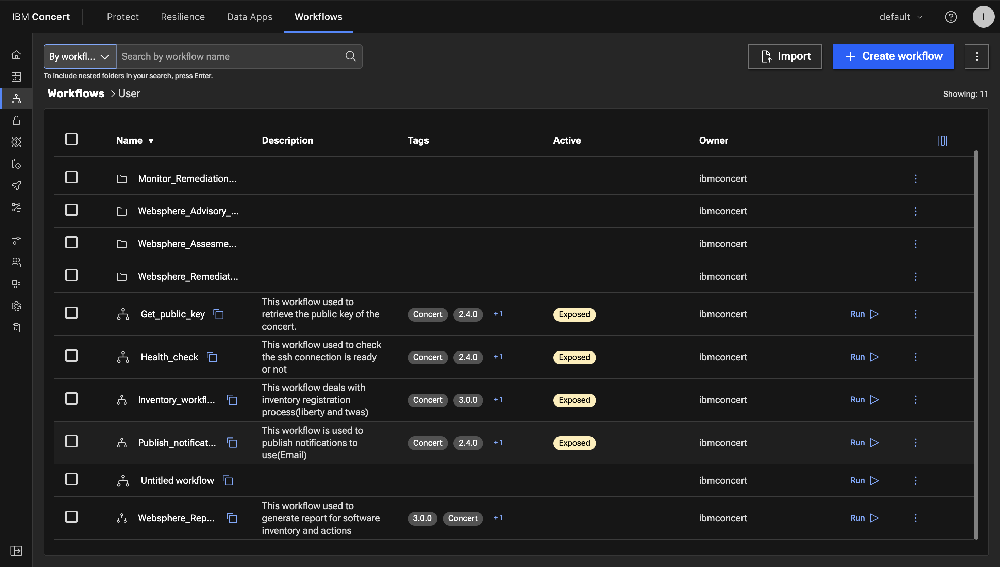
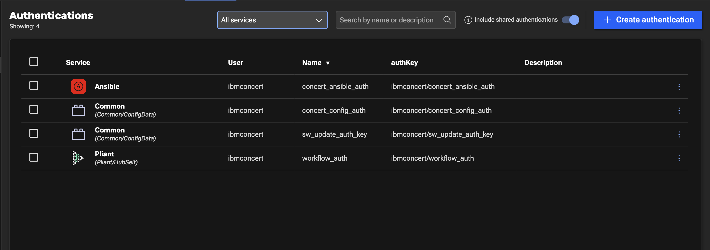
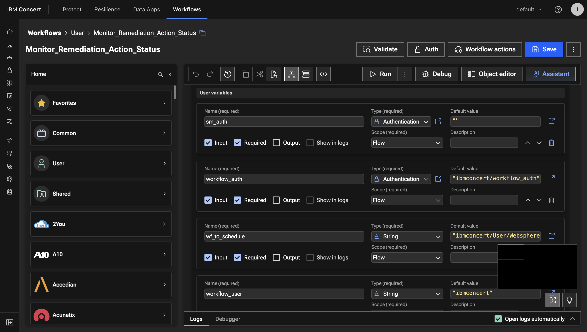
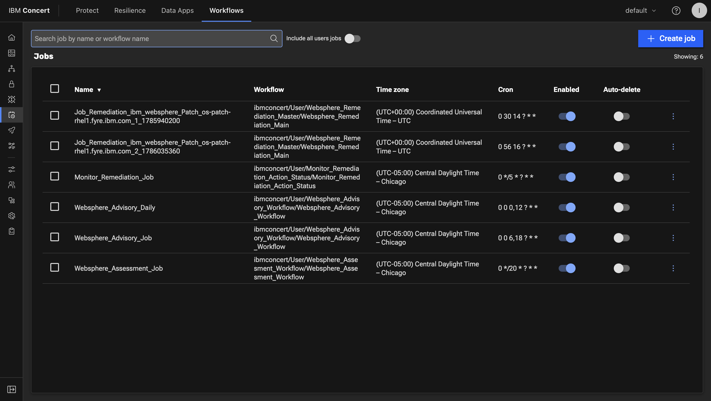
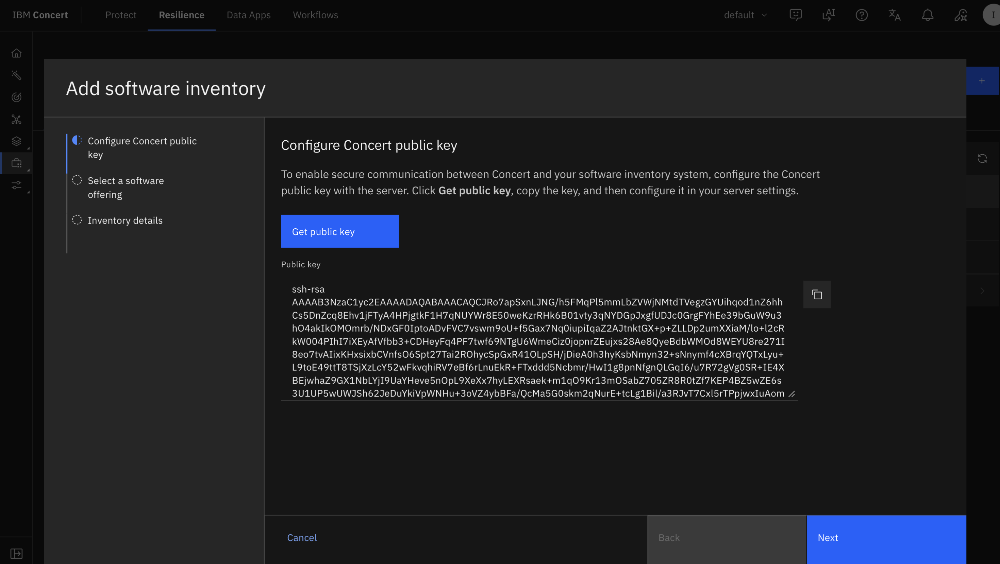
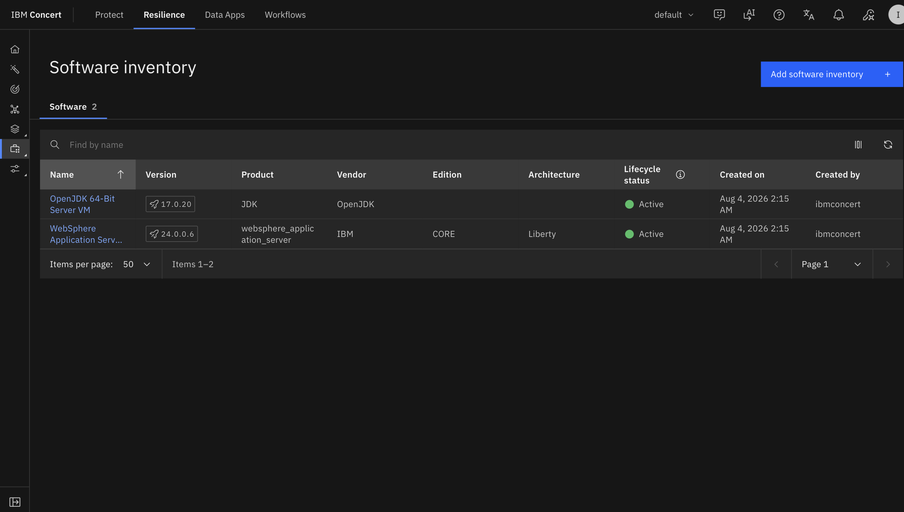
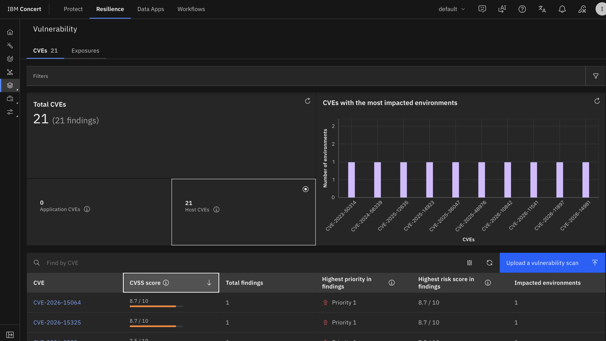

# Scanning for Vulnerabilities

This is the core setup section. Here you will configure everything Concert needs
to manage WebSphere vulnerabilities, register the Liberty server, and let
Concert discover and assess it. By the end you will have a list of CVEs
affecting the server and a remediation action ready to approve.

The work breaks into these stages:

1. Import the WebSphere workflows
2. Create the authentications
3. Configure the workflow inputs
4. Expose the workflows
5. Schedule the jobs
6. Prime the advisory data
7. Set up SSH trust between Concert and the Liberty server
8. Register the WebSphere server
9. Review the detected vulnerabilities

---

## Step 1: Import the WebSphere workflows

The WebSphere vulnerability workflows provide the automation Concert uses to
register Liberty servers, retrieve advisories, assess vulnerabilities, and remediate.

Download the zipped workflows file:
1. From the **credentials.sh** file, copy the `Lab files:` URL
2. Open a new browser tab in the Firefox browser and paste the URL
3. Hover on the `flows_liberty.zip` file, check the checkbox on the right and click the Download icon

Import the workflows:
1. In the Concert UI, select the **Workflows** top tab to get to the Concert Workflows page
2. Click on the **Workflows** tile and then click on the **Import** button
3. Select the file you just downloaded and click on **Open** to install the workflows

Note that there are various workflows installed. The table below describes the purpose of each one:

| Workflow library name | Imported name | Purpose |
|---|---|---|
| Concert_Host_Public_Key_Retrieval | Get_public_key | Retrieves the Concert public SSH key for registration. |
| WebSphere_to_Concert_SSH_Connection_Verification | Health_check | Verifies SSH connectivity to the target before registration. |
| Onboard_WebSphere_Server | Inventory_workflow | Registers WebSphere servers and configures them for vulnerability management. |
| Websphere_Advisory_Workflow | Websphere_Advisory_Workflow | Refreshes Concert's WebSphere security advisory data. |
| Websphere_Assessment_Workflow | Websphere_Assessment_Workflow | Compares discovered inventory against advisories and creates remediation actions. |
| Monitor Remediation Action Status | Monitor_Remediation_Action_Status | Monitors approval status and schedules approved remediation. |
| Websphere_Remediation_Master | Websphere_Remediation_Master | Orchestrates remediation: downloads, prepares, and applies the fix. |
| WebSphere_Notification_Publisher | Publish_notifications | Sends notifications for registration, assessment, and remediation events. |
| Websphere Report | Websphere_Report | Generates inventory and remediation reports. |


:::note

Note that complex workflows such as **Websphere_Remediation_Master**, have
dependent remediation workflows called
`Websphere_Remediation_Main`, `Websphere_Remediation_Fix_Download`, and
`Websphere_Remediation_Fix_Install_Uninstall`
:::



---

## Step 2: Create the authentications

Authentications are how the workflows securely connect to Concert, to the
WebSphere server, and to IBM Fix Central. You will create **four**
authentications for this lab.

To create each one:

1. From the main Concert Workflows page, select the **Authentications** tile
2. Click **Create authentication**
3. Fill in the values shown below
4. Save

:::tip
For every authentication, select the **Overridable** checkbox next to each
configurable field. This lets you update the authentication's values later
without deleting and recreating it.
:::

### 2a. Configuration authentication `concert_config_auth`

This stores the Concert connection details and the SSH key pair Concert uses.

- **Name:** `concert_config_auth`
- **Service:** `Config Data`
- **Data:** *see below*

To generate a JSON value for the Data field, open a **Terminal** window on the 
**Concert VNC Desktop** and run all these commands together:

```bash
set -euo pipefail
PRIVATE_KEY=$(base64 -w 0 ~/.ssh/id_rsa)
PUBLIC_KEY=$(ssh-keygen -y -f ~/.ssh/id_rsa)

cat <<EOF


{
  "host": "<concert_public_ip>",
  "concert_port": "12443",
  "ssh_port": "2223",
  "instanceId": "0000-0000-0000-0000",
  "Authorization": "<Concert API Key>",
  "private_key": "${PRIVATE_KEY}",
  "public_key": "${PUBLIC_KEY}"
}
EOF
```
Copy the JSON output and paste it into the Data field.

Finally:
* Replace the `<concert_public_ip>` with the value from **credentials.sh** file
* Similarly, replace `<Concert API Key>` with the `C_API_KEY aWJtY29...` key value from **credentials.sh** file (make sure not to include `Authorization:` in the value)


### 2b. Software update authentication `sw_update_auth_key`

This lets the remediation workflows download fixpacks from IBM Fix Central. It
is only used during remediation.

- **Name:** `sw_update_auth_key`
- **Service:** `Config Data`
- **Data:** provide your IBM Fix Central credentials as JSON:

```json
{
  "username": "<fixcentral_username>",
  "password": "<fixcentral_password>"
}
```

:::caution
The Fix Central username and password must be correct, and the account must be
entitled to download WebSphere fixes. If the credentials are wrong, the
remediation download will fail later. Because you marked the fields
**Overridable**, you can correct them in place if needed without recreating the
authentication.
:::

### 2c. Execution authentication (non-FaaS) `concert_ansible_auth`

This lets Concert connect to the WebSphere server over SSH using Ansible during
registration and remediation.

- **Name:** `concert_ansible_auth`
- **Service:** `Ansible`
- **Private key:** Concert needs the private key in **PKCS#8 PEM** format. On
  the Concert host, convert it:

```bash
sudo ssh-keygen -p -m PEM -f ~/.ssh/id_rsa -N "" -P ""

sudo openssl pkcs8 -topk8 -inform PEM -outform PEM \
  -in ~/.ssh/id_rsa \
  -out ~/.ssh/id_rsa.pk8 \
  -nocrypt

sudo cat ~/.ssh/id_rsa.pk8
```

  Paste the contents of the generated `~/.ssh/id_rsa.pk8` into the **Private
  key** field. Include both BEGIN and END lines. 
  DO NOT add a new line after the final `-----END PRIVATE KEY-----`

- **Inventory:** leave empty.

### 2d. Workflow authentication `workflow_auth`

This lets the WebSphere workflows invoke other Concert workflows during
registration and remediation.

- **Name:** `workflow_auth`
- **Service:** `IBM Hub - Self (Workflows)`

(No additional fields are required for this service type.)

### Confirm your authentications

When done, **Workflows → Authentications** should list all four:

| Name | Service |
|---|---|
| `concert_config_auth` | Config Data |
| `sw_update_auth_key` | Config Data |
| `concert_ansible_auth` | Ansible |
| `workflow_auth` | IBM Hub - Self (Workflows) |

Note that all four are registered under your Concert user name, so their full
reference is `ibmconcert/<name>` (for example, `ibmconcert/concert_config_auth`).
You will use this `ibmconcert/` prefix when referencing them in workflow inputs.



:::info
This lab does **not** use ServiceNow or external approval, so you do **not**
create an `sm_auth` authentication. Remediation actions are approved directly in
Concert. Email notifications (`smtp_auth`) are also optional and not required
for this lab.
:::

---

## Step 3: Configure the workflow inputs

Most workflow inputs are already filled in correctly when you import the
workflows. You only need to set a few.

When an input asks for an authentication, use the format
`<concert_username>/<authentication_name>` for this lab that means the
`ibmconcert/` prefix, for example `ibmconcert/workflow_auth`.

### Inventory_workflow

1. Open **Inventory_workflow** in the editor.
2. In the **Start** block's user variables, set `environment_type` to `vm`.
   (The default is `ocp`, which is for OpenShift deployments and is wrong for
   VM-based servers like this lab.)
3. Save.

### Monitor_Remediation_Action_Status

This workflow needs a few inputs set so it can schedule approved remediation
actions.

1. Open **Monitor_Remediation_Action_Status** in the editor.
2. In the **Start** block, set these values:

   | Input | Value |
   |---|---|
   | `wf_to_schedule` | `ibmconcert/User/Websphere_Remediation_Master/Websphere_Remediation_Main` |
   | `workflow_auth` | `ibmconcert/workflow_auth` |
   | `workflow_user` | `ibmconcert` |

3. Leave `sm_auth` empty (this lab does not use external change request approval flow).
4. Save.

:::caution
The `wf_to_schedule` path must point to the **Websphere_Remediation_Main**
workflow inside the master, and it must include the **`User/`** folder segment:
`ibmconcert/User/Websphere_Remediation_Master/Websphere_Remediation_Main`. If
the path is missing the `User/` segment, scheduling fails with a
`404 - Audited flow does not exist` error because Concert cannot find the
workflow at the path you gave it. If you also see a
`500 - Request method 'POST' is not supported` error, it means one of the
required inputs above (`workflow_auth` or `workflow_user`) is still empty 
fill them in and save.
:::

### Other configurable inputs

The remaining WebSphere-specific inputs are already set to sensible defaults on
import and do not usually need changing:

| Workflow | Input | Default |
|---|---|---|
| Websphere_Remediation_Main | `fix_download_path` | `/tmp/tempFixes` |
| Websphere_Remediation_Main | `deleteFixes` | `true` |
| Websphere_Remediation_Main | `backupNeeded` | `true` |
| Websphere_Remediation_Main | `wsaBackupDir` | `/opt/backups` |
| Websphere_Report | `report_type` | `software_inventory` |



---

## Step 4: Expose the workflows

Concert invokes some workflows externally through API endpoints. Expose only the
workflows in the table below.

For each one:

1. Open the **Workflows** page.
2. Find the workflow.
3. Click **Actions (⋮) → Automate → Expose externally**.
4. Set the API path and execution type from the table.
5. For asynchronous workflows, enable the **Asynchronous execution** option.
6. Click **Expose**.

| Workflow | API path | Type |
|---|---|---|
| Get_public_key | `/ssh/public-key` | Synchronous |
| Health_check | `/servers/test-connection` | Synchronous |
| Inventory_workflow | `/servers/register` | Asynchronous |
| Websphere_Assessment_Workflow | `/websphere_assessment` | Synchronous |
| Publish_notifications | `/publish_notifications` | Asynchronous |

Expose only these. The other WebSphere workflows are invoked internally and do
not need endpoints.

---

## Step 5: Schedule the jobs

Scheduled jobs keep the advisory data fresh, reassess the server on an interval,
and monitor remediation approvals.

For each job:

1. Go to **Workflows → Jobs**.
2. Click **Create job**.
3. Select the workflow.
4. Set the worker group to **default**.
5. Toggle **Enable job** on.
6. Set **Ends** to **Never**.
7. Set the repeat interval from the table.
8. Save.

| Workflow | Recommended interval |
|---|---|
| Websphere_Advisory_Workflow | Twice daily |
| Websphere_Assessment_Workflow | Every 20 minutes |
| Monitor_Remediation_Action_Status | Every 5 minutes |

:::note
The advisory job must run **before** the assessment job, because the assessment
uses the advisory data to evaluate the server. The schedule above naturally
keeps the advisory data ahead of the assessments.
:::



---

## Step 6: Prime the advisory data

Before you register the first server, run the advisory workflow once by hand and
let it finish. This populates Concert with the latest IBM WebSphere security
advisories so the assessment has data to compare against.

1. Go to **Workflows → User → Websphere_Advisory_Workflow**.
2. Click **Run**.
3. Wait for it to complete. The initial run typically takes about **20
   minutes** to retrieve the advisory data.

:::caution
Register WebSphere servers only **after** this initial advisory run completes.
If you assess before the advisory data is loaded, Concert will not find any
CVEs.
:::

---

## Step 7: Set up SSH trust between Concert and the Liberty server

Concert needs passwordless SSH access to the Liberty target. During
registration you will retrieve Concert's public key and add it to the target.

1. In Concert, go to **Software inventory**.
2. Click **Add software**.
3. Click **Get public key**. Concert displays its public SSH key.
4. Copy that public key.
5. SSH into the Liberty target and add the key to root's authorized keys:

```bash
ssh root@os-patch-rhel1.fyre.ibm.com
# paste Concert's public key onto a new line in:
#   /root/.ssh/authorized_keys
```

After adding the key, Concert can reach the Liberty server over SSH without a
password.



---

## Step 8: Register the WebSphere server

Now register the Liberty server so Concert can inventory, assess, and remediate
it.

1. In Concert, go to **Software inventory → Add software**.
2. Click **Get public key** (if you have not already added it to the target,
   do so now see Step 7), then click **Next**.
3. Under **Select a software offering**, choose **IBM WebSphere**, then
   **Next**.
4. Provide the connection details:
   - **Server:** `os-patch-rhel1.fyre.ibm.com`
   - **User:** the SSH user (`root`)
5. Click **Validate connection**. Concert confirms it can reach the server over
   SSH.
6. Provide the WebSphere details:
   - **Type:** `Liberty`
   - **Path:** `/opt/IBM/wlp/usr/servers/defaultServer` (the directory that
     contains `server.xml`)
7. Click **Register**.

:::caution
Registration **restarts** the WebSphere Liberty server so it can apply the
required configuration changes. Expect a brief interruption while it restarts.
:::

:::note
Register by **hostname** (`os-patch-rhel1.fyre.ibm.com`), not by IP address.
Registration by bare IP is not supported.
:::

Concert now discovers the installed WebSphere software and adds the server to
the software inventory. You can watch progress under **Event logs**.



---

## Step 9: Review the detected vulnerabilities

After the advisory and assessment jobs have run, Concert evaluates the
registered server and surfaces the CVEs that affect it.

1. In Concert, go to **Resilience → Vulnerability**.
2. Review the detected vulnerabilities for the registered server.
3. Select a vulnerability to see its details: severity, CVSS score,
   description, affected versions, and the recommended remediation.
4. Use the **Blast radius** view to see every registered server and component
   affected by a given vulnerability.

For this lab, the assessment surfaces **21 CVEs** (21 findings) affecting the
Liberty 24.0.0.6 server, ranging from high to low severity. The recommended
fixpack in the next section resolves the subset of these that has an available
supported fix.



Concert also creates a **remediation action** in the Action Center for the
supported fix. You will review, approve, and apply that action in the next
section.

:::info
If the assessment hasn't produced findings yet, give the scheduled jobs time to
run, or run **Websphere_Advisory_Workflow** and then
**Websphere_Assessment_Workflow** manually and wait a few minutes. The advisory
must run before the assessment.
:::