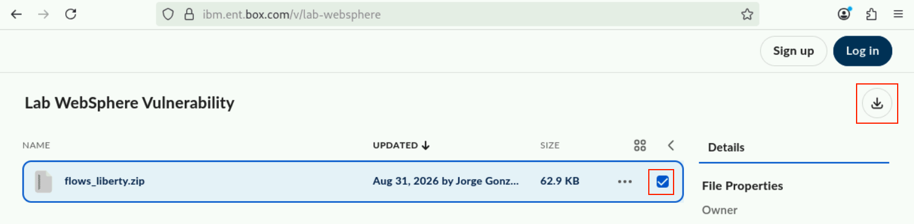
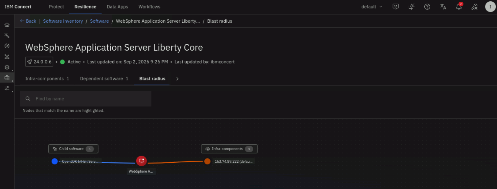
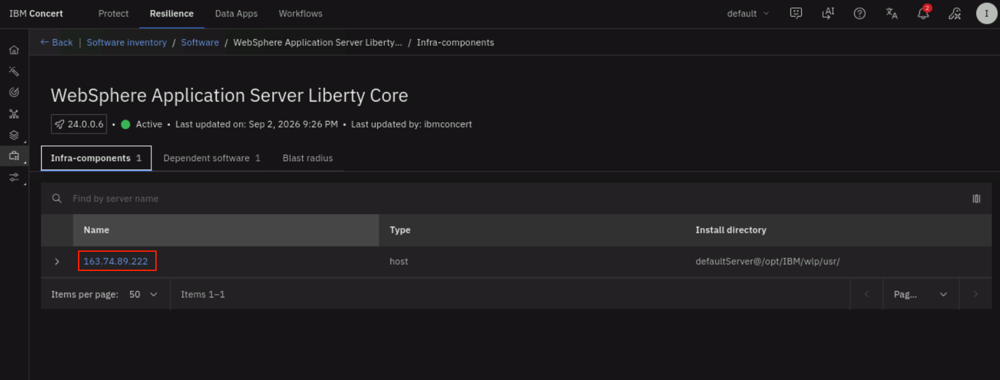
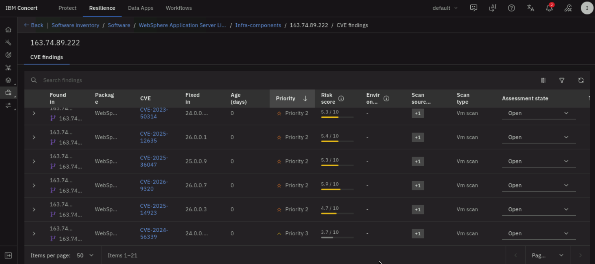
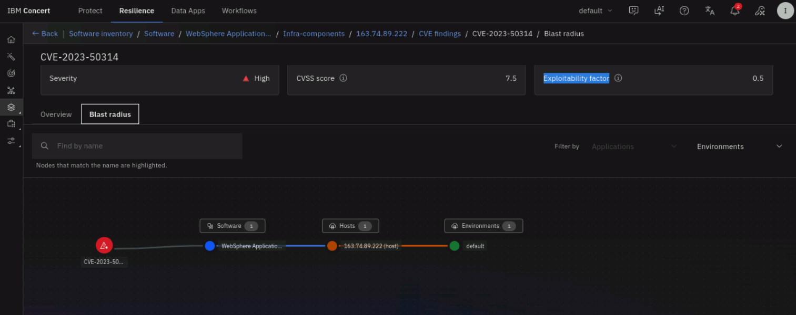

# Scanning for Vulnerabilities

This is the core setup section. Here you will configure everything Concert needs
to manage WebSphere vulnerabilities, register the Liberty server, and let
Concert discover and assess it. By the end you will have a list of CVEs
affecting the server and a remediation action ready to approve.

The work breaks into these stages:

1. Import the WebSphere workflows
2. Create the authentications
3. Configure the workflow inputs
4. Expose the workflows
5. Schedule the jobs
6. Prime the advisory data
7. Set up SSH trust between Concert and the Liberty server
8. Register the WebSphere server
9. Review the detected vulnerabilities

---

## 4.1 Import the WebSphere workflows

The WebSphere vulnerability workflows provide the automation Concert uses to
register Liberty servers, retrieve advisories, assess vulnerabilities, and remediate.

Download the zipped workflows file:
1. From the **credentials.sh** file, copy the `Lab files:` URL
2. Open a new browser tab in the Firefox browser and paste the URL
3. Hover on the `flows_liberty.zip` file, check the checkbox on the right and click the Download icon



Import the workflows:
1. In the Concert UI, select the **Workflows** top tab to get to the Concert Workflows page
2. Click on the **Workflows** tile and then click on the **Import** button
3. Select **Downloads** on the left side, pick the file you just downloaded and click on **Open** to install the workflows

:::note
You may want to enable the Firefox menu bar and zoom-out to work better with the UI
::: 


Note that there are various workflows installed. The table below describes the purpose of each one:

| Workflow library name | Imported name | Purpose |
|---|---|---|
| Concert_Host_Public_Key_Retrieval | Get_public_key | Retrieves the Concert public SSH key for registration. |
| WebSphere_to_Concert_SSH_Connection_Verification | Health_check | Verifies SSH connectivity to the target before registration. |
| Onboard_WebSphere_Server | Inventory_workflow | Registers WebSphere servers and configures them for vulnerability management. |
| Websphere_Advisory_Workflow | Websphere_Advisory_Workflow | Refreshes Concert's WebSphere security advisory data. |
| Websphere_Assessment_Workflow | Websphere_Assessment_Workflow | Compares discovered inventory against advisories and creates remediation actions. |
| Monitor Remediation Action Status | Monitor_Remediation_Action_Status | Monitors approval status and schedules approved remediation. |
| Websphere_Remediation_Master | Websphere_Remediation_Master | Orchestrates remediation: downloads, prepares, and applies the fix. |
| WebSphere_Notification_Publisher | Publish_notifications | Sends notifications for registration, assessment, and remediation events. |
| Websphere Report | Websphere_Report | Generates inventory and remediation reports. |


:::note

Note that complex workflows such as **Websphere_Remediation_Master**, have
dependent remediation workflows called
`Websphere_Remediation_Main`, `Websphere_Remediation_Fix_Download`, and
`Websphere_Remediation_Fix_Install_Uninstall`
:::


---

## 4.2 Create the authentications

Authentications are how the workflows securely connect to Concert, to the
WebSphere server, and to IBM Fix Central. You will create **four**
authentications for this lab.

To create each one:

1. From the main Concert Workflows page, select the **Authentications** tile
2. Click **Create authentication**
3. Fill in the values shown below. Make sure you don't change any provided values like authentication Name.
The Names listed are being referenced from the workflows.
4. Save

:::warning
For every authentication, select the **Overridable** checkbox next to each
configurable field. This lets you update the authentication's values later
without deleting and recreating it.
:::

### 4.2.1 Configuration authentication `concert_config_auth`

This stores the Concert connection details and the SSH key pair Concert uses.

- **Name:** `concert_config_auth`
- **Service:** `Config Data`
- **Data:** *see below*

To generate a JSON value for the Data field, open a NEW **Terminal** window on the 
**Concert VNC Desktop** and run all these commands together:

```bash
set -euo pipefail
PRIVATE_KEY=$(base64 -w 0 ~/.ssh/id_rsa)
PUBLIC_KEY=$(cat ~/.ssh/id_rsa.pub)

cat <<EOF


{
  "host": "<concert VM fqdn>",
  "concert_port": "12443",
  "ssh_port": "2223",
  "instanceId": "0000-0000-0000-0000",
  "Authorization": "<Concert API Key>",
  "private_key": "${PRIVATE_KEY}",
  "public_key": "${PUBLIC_KEY}"
}
EOF
```
Copy the JSON output and paste it into the Data field.

Finally:
* Replace the `<concert VM fqdn>` with the concert VM hostname value from **credentials.sh** file
* Similarly, replace `<Concert API Key>` with the `C_API_KEY aWJtY29...` key value from **credentials.sh** file (make sure not to include `Authorization:` in the value)


### 4.2.2 Software update authentication `sw_update_auth_key`

This lets the remediation workflows download fixpacks from IBM Fix Central. It
is only used during remediation.

- **Name:** `sw_update_auth_key`
- **Service:** `Config Data`
- **Data:** paste the **IBM Fix Central** credentials JSON snippet shown below:

```json
{
  "username": "jorgegotest@gmail.com",
  "password": "<example  ztWgg2LfryAHgEdjXzD9>"
}
```


### 4.2.3 Execution authentication `concert_ansible_auth`

This lets Concert connect to the WebSphere server over SSH using Ansible during
registration and remediation.

- **Name:** `concert_ansible_auth`
- **Service:** `Ansible`
- **Private key:** Concert needs the private key in **PKCS#8 PEM** format. On
  the Concert VM, run the command below on a Terminal window:

```bash
sudo ssh-keygen -p -m PEM -f ~/.ssh/id_rsa -N "" -P ""

sudo openssl pkcs8 -topk8 -inform PEM -outform PEM \
  -in ~/.ssh/id_rsa \
  -out ~/.ssh/id_rsa.pk8 \
  -nocrypt

sudo cat ~/.ssh/id_rsa.pk8
```

  Paste the contents of the generated key into the **Private
  key** field including both BEGIN and END lines.

- **Inventory:** leave empty
- **Overridable** make sure you check both checkboxes!


### 4.2.4 Workflow authentication `workflow_auth`

This lets the WebSphere workflows invoke other Concert workflows during
registration and remediation.

- **Name:** `workflow_auth`
- **Service:** `IBM Hub - Self (Workflows)`

(No additional fields are required for this service type.)

### Confirm your authentications

When done, **Workflows → Authentications** should list all four:

| Name | Service |
|---|---|
| `concert_config_auth` | Config Data |
| `sw_update_auth_key` | Config Data |
| `concert_ansible_auth` | Ansible |
| `workflow_auth` | IBM Hub - Self (Workflows) |

Note that all four are registered under your Concert user name, so their full
reference is `ibmconcert/<name>` (for example, `ibmconcert/concert_config_auth`).
You will use this `ibmconcert/` prefix when referencing them in workflow inputs.


:::info
This lab does **not** use ServiceNow or external approval, so you do **not**
create an `sm_auth` authentication. Remediation actions are approved directly in
Concert. Email notifications (`smtp_auth`) are also optional and not required
for this lab.
:::

---

## 4.3 Exposing the workflows

Concert invokes some workflows externally through API endpoints. Expose the
workflows listed in the table below so they can be run by Concert. 

For each one:

1. Open the **Workflows** page.
2. Find the workflow.
3. Click **Actions (⋮) → Automate → Expose externally**.
4. Set the **Exposure path** and **Asynchronous execution** as defined in the table.
6. Click **Expose**.

| Workflow | Exposure path | Asynchronous execution |
|---|---|---|
| Get_public_key | `/ssh/public-key` | leave uncheck |
| Health_check | `/servers/test-connection` | leave uncheck |
| Inventory_workflow | `/servers/register` | check |
| Websphere_Assessment_Workflow | `/websphere_assessment` | leave uncheck |
| Publish_notifications | `/publish_notifications` | check |

Expose only these. The other WebSphere workflows are invoked internally and do
not need endpoints.

---

## 4.4 Prime the advisory data

Before you register the first server, run the advisory workflow once by hand and
let it finish. This populates Concert with the latest IBM WebSphere security
advisories so the assessment has data to compare against.

1. Go to **Workflows → User → Websphere_Advisory_Workflow**.
2. Click **Run** and wait until it finish in a few seconds.

This will trigger an asynchronous `Websphere advisory job` that will connect to
IBM Fix Central and pulls WebSphere advisory information. To see the status of this job, 
click on the top **Resilience** tab and select **Administration** -> **Event Log** from the left menu.
The initial run typically takes about 20 minutes to retrieve the advisory data.


---

## 4.5 Reviewing the workflow inputs

The workflow set you have imported are already filled in the authentication names you have 
previously defined. DO NOT change any predefined authentications. 

Note that the authentication format is 
`<concert_username>/<authentication_name>`. For this lab,  that means the
`ibmconcert/` prefix, for example `ibmconcert/workflow_auth`.

### Inventory_workflow

1. Open **Inventory_workflow** in the editor.
2. In the **Start** block's user variables, review the authentications. 
3. Note `environment_type` is set to `vm`. Another valid option is `ocp`, which is for OpenShift deployments.

### Monitor_Remediation_Action_Status

This workflow needs a few inputs set so it can schedule approved remediation
actions.

1. Open **Monitor_Remediation_Action_Status** in the editor.
2. Note the following authentications already set:

   | Input | Value |
   |---|---|
   | `wf_to_schedule` | `ibmconcert/User/Websphere_Remediation_Master/Websphere_Remediation_Main` |
   | `workflow_auth` | `ibmconcert/workflow_auth` |
   | `workflow_user` | `ibmconcert` |


:::note
The `wf_to_schedule` path must point to the **Websphere_Remediation_Main**
workflow inside the master, and it must include the **`User/`** folder segment:
`ibmconcert/User/Websphere_Remediation_Master/Websphere_Remediation_Main`. If
the path is missing the `User/` segment, scheduling fails with a
`404 - Audited flow does not exist` error because Concert cannot find the
workflow at the given path.
:::

### Other configurable inputs

The remaining WebSphere-specific inputs are already set to sensible defaults on
import and do not usually need changing:

| Workflow | Input | Default |
|---|---|---|
| Websphere_Remediation_Main | `fix_download_path` | `/tmp/tempFixes` |
| Websphere_Remediation_Main | `deleteFixes` | `false` |
| Websphere_Remediation_Main | `backupNeeded` | `true` |
| Websphere_Remediation_Main | `wsaBackupDir` | `/opt/backups` |
| Websphere_Report | `report_type` | `software_inventory` |


---

## 4.6 Schedule the jobs

Scheduled jobs keep the advisory data fresh, reassess the server on an interval,
and monitor remediation approvals.

For each job:

1. Go to **Workflows → Jobs**
2. Click **Create job**
3. Select the workflow
4. Set the worker group to **default**
5. Toggle **Enable job** on
6. In the **Repeats** field, select **Advanced settings** 
7. Set **Ends** to **Never**
8. Set the **Cron job expression** value from the table
9. Click on **Create**

| Name & Workflow | Recommended interval | Cron job expression
|---|---|---|
| Websphere_Advisory_Workflow | Every 12 hours | `0 0 */12 ?`
| Websphere_Assessment_Workflow | Every 20 minutes | `0 */20 * ?`
| Monitor_Remediation_Action_Status | Every 5 minutes | `0 */5 * ?`

:::note
The advisory job must run **before** the assessment job, because the assessment
uses the advisory data to evaluate the server. The schedule above naturally
keeps the advisory data ahead of the assessments.
:::


---

## 4.7 Register the WebSphere server

:::caution
Register WebSphere servers only **after** the **Websphere advisory job** that you triggered previously completes.
If you register a server before the advisory data is loaded, Concert will not find any
CVEs. To see the status of this job, 
click on the top **Resilience** tab and select **Administration** -> **Event Log** from the left menu, 
and look for **Websphere advisory job**.
:::

Follow these steps to register the WebSphere Liberty server:

1. In the Concert UI, select the **Resilience** tab on top and select **Inventory** -> **Software inventory** on the left menu
2. Click **Add software inventory**
3. We have **already added** Concert's public key into the Liberty VM ~/.ssh/authorized_keys
during the Lab Preparation section. Disregard the steps under **Configure Concert public key**


4. Click **Next**
5. Under **Select a software offering**, choose **IBM WebSphere**, then **Next**
6. Provide the connection details:
   - **Server:** copy the **liberty_fqdn** value from credentials.sh
   - **User:** `itzuser`
7. Click **Validate connection**. Concert confirms it can reach the server over SSH
8. Provide the WebSphere details:
   - **Type:** `Liberty`
   - **Path:** `/opt/IBM/wlp/usr/servers/defaultServer` 
9. Click **Register**

:::caution
Registration **restarts** the WebSphere Liberty server so it can apply the
required configuration changes. In a Production environment, this should be done during 
a maintenance time window.
:::


Concert now discovers the installed WebSphere software and adds the server to
the software inventory. After 3-5 minutes, click on the refresh button to see the discovered 
software. Note that Concert discovered both the JDK and the application server:

* OpenJDK 64-Bit Server VM
* WebSphere Application Server Liberty Core


---

## 4.8 Review the detected vulnerabilities

Now lets review the CVEs that Concert found:

1. From the same Software inventory page, click on the discovered **WebSphere Application Server Liberty Core**
2. From the **WebSphere Application Server Liberty Core** page, click on the **Blast radius** tab to see a topology map of the server configuration



3. Click on the **Infra-components** tab and select the IP address of the Liberty server.



4. Review the detected vulnerabilities for the registered server. Note that 21 CVEs were found.



5. Select a vulnerability (from the **CVE** column) to see its details: Severity, CVSS score, Exploitability factor,
   Description, etc.
6. Click on the **Blast radius** tab to see the impact path of this CVE.




Concert creates a **remediation action** in the **Action Center** for the
supported fix. You will review, approve, and apply that action in the next
section of the Lab.

:::info
If the assessment hasn't produced any CVEs yet, give the scheduled jobs time to
run, or run **Websphere_Advisory_Workflow** and then
**Websphere_Assessment_Workflow** manually and wait a few minutes. The advisory
must run before the assessment.
:::