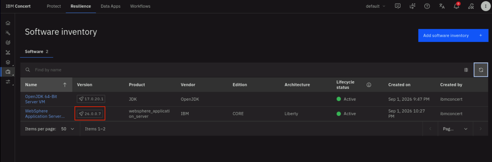

# Patching Vulnerabilities

With vulnerabilities detected and a remediation action created, you can now
apply the fix. In this section you review the recommended remediation, approve
and schedule it, let Concert download and install the fixpack, and confirm the
server is patched.

## 5.1 Review the remediation action

1. In Concert, select the **Resilience** tab on top and select **Action center** on the left menu
2. Note that Concert created one remediation action of type **Web server** and status **Approval pending** as shown below


3. On the right side of the **Action**, click on **Review and approve** to open the remediation action
3. Now, on the **Review and schedule the upgrade** page, on the **Overview** tab, review the **Action** details:

   | Field | Value for this lab |
   |---|---|
   | Type | Web server |
   | Install directory | `/opt/IBM/wlp/` |
   | Current version | 24.0.0.6 |
   | Recommended version | 26.0.0.8 (Liberty fixpack) |
   | Confidence | High |
   | Reduce risk by | 100% |
   | CVEs included | 21 |

Concert recommends the fixpack that resolves the most CVEs. Here that is the
**26.0.0.8 Liberty fixpack**.


:::note
Due to the dynamic nature of patching availability, you may see a different Liberty fixpack number recommended
:::

## 5.2 Review the available fixes

Click on the **Available fixes** tab. Note that there are **Fixpacks** and **iFixes** recommended. 
* A **Fix Pack** upgrades WebSphere to a newer maintenance level and typically
resolves multiple vulnerabilities at once. 
* An **Interim Fix (iFix)** targets
specific vulnerabilities without moving to the next fixpack level. 

For this lab, we will select a fixpack that is a version below (**26.0.0.7-WS-LIBERTY-CORE-FP**)from the one Concert recommends. This simulates an enterprise scenario 
where multiple WebSphere servers across the company are all patched at the same fixpack level. This fixpack remediates 11 CVEs.

On the **Available fixes** page:
* Check the **26.0.0.7-WS-LIBERTY-CORE-FP** fixpack and notice on the right the list of 11 (3 + 8) CVEs remediated.
* Click on **Save**
* Click on **Approve**


* In the **Schedule and approve this upgrade** dialog, leave the default 
values and click **Schedule and approve**. You will see a confirmation that the upgrade action was approved successfully,
and the action status moves to **Approved**.


You may remember that in the previous chapter, we have scheduled the 
**Monitor_Remediation_Action_Status** workflow to run every 5 minutes. This Workflow
looks for Actions with **status=Approved** and when they are found, it schedules the **Websphere_Remediation_Master**
workflow to apply the fixpack and changes the Action status to **Scheduled**.


## 5.3 Concert applies the fixpack

When the scheduled window arrives, Concert automatically carries out the
remediation:

1. Downloads the recommended fixpack from **IBM Fix Central** (using the
   `sw_update_auth_key` credentials that you defined) to the download path
   (`/tmp/tempFixes`).
2. Backs up the current installation (backups for root installs go to
   `/opt/backups`).
3. Applies the fixpack using IBM Installation Manager and Ansible on the target
   server.
4. Restarts the WebSphere Liberty server to complete the installation.

The remediation runs asynchronously on the target host, so it continues even if you close the browser.

:::caution
Because the fixpack is downloaded and installed **on the target server**, the
Liberty server needs `ansible-playbook` installed
:::

## 5.4 Monitor the remediation

To watch the remediation progress:

1. Go to **Resilience → Action Center**.
2. Open the action and watch the status move through
   **Approved → Scheduled → In progress → Success or Failed**.

Concert records the outcome, the execution details, and a remediation log you
can open for verification or troubleshooting.


## 5.5 Verify the server is patched

Confirm the remediation actually landed by checking the server directly. Open a **Terminal**
window on the Liberty VM and run:

```bash
sudo /opt/IBM/wlp/bin/server version
```

You should now see:

```
WebSphere Application Server 26.0.0.7 (1.0.115.cl260720260702-0043) on OpenJDK 64-Bit Server VM, version 17.0.20.1+1-LTS (en)
```

The version has moved from **24.0.0.6** to **26.0.0.7**. The fixpack is applied
and 11 CVEs are remediated.

:::tip
The server version is the definitive proof that the patch succeeded. The
version number only changes if the fixpack is actually installed, so a reading of
`26.0.0.7` confirms the remediation has been applied.
:::

On the Liberty VM, on the same **Terminal** window, run the following command to confirm the downloaded fixpack (about 733 MB) 
plus its checksum and signature files:

```bash
ls -la /tmp/tempFixes/WebSphere_Application_Server_Liberty_Core/
```

## 5.6 Reassess the Host

After the patch, let Concert reassess the now-patched server so its records
catch up.

1. Run **Websphere_Assessment_Workflow** (or let the scheduled job run).
2. Concert reassesses the server against the advisory data.

### Review the Software Inventory Updates

Click on the **Resilience** tab on top and select **Inventory -> Software Inventory** on the left menu.
Click on the refresh button (on the right) and note that the new listed version is **26.0.0.7**.




You have now completed the full WebSphere vulnerability lifecycle: the server
was discovered, assessed, vulnerabilities were found, it was patched, and reassessed.