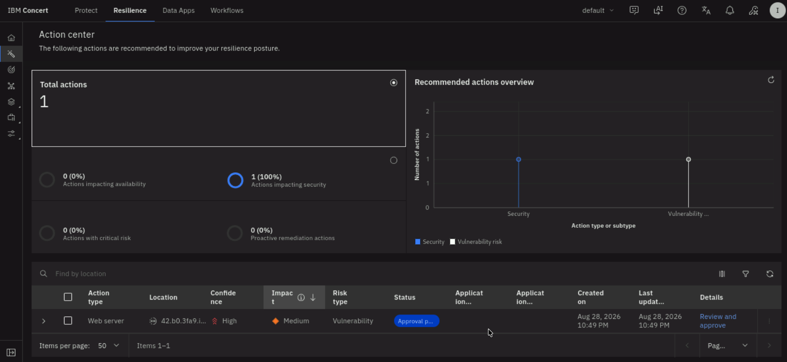
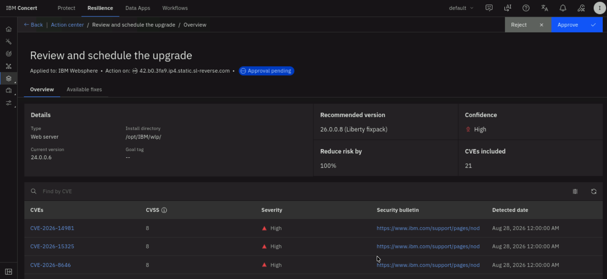
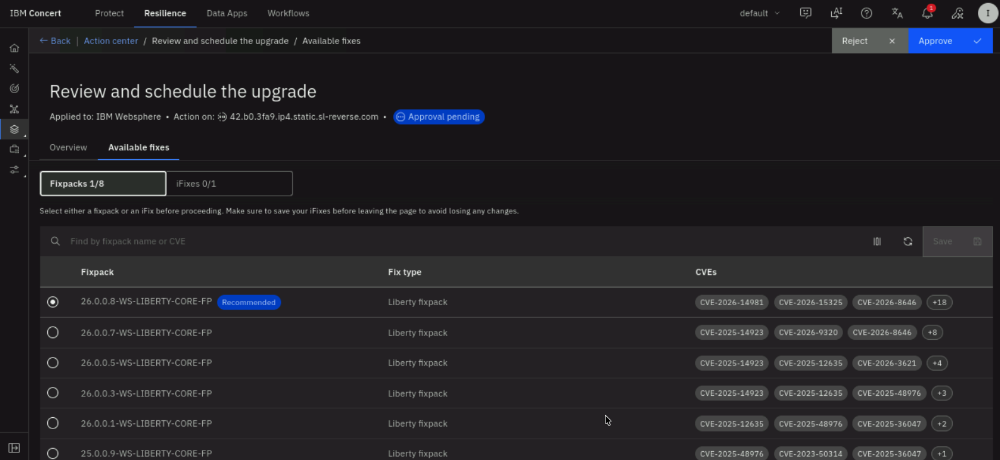
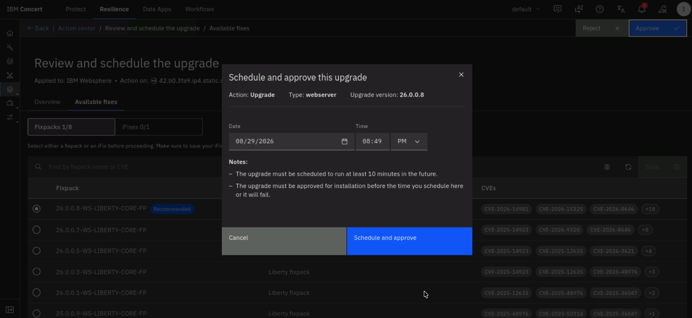

# Patching Vulnerabilities

With vulnerabilities detected and a remediation action created, you can now
apply the fix. In this section you review the recommended remediation, approve
and schedule it, let Concert download and install the fixpack, and confirm the
server is patched.

## 5.1 Review the remediation action

1. In Concert, select the **Resilience** tab on top and select **Action center** on the left menu
2. Note that Concert created one remediation action of type **Web server** and status **Approval pending** as shown below



3. On the right side of the **Action**, click on **Review and approve** to open the remediation action
3. Now, on the **Review and schedule the upgrade** page, on the **Overview** tab, review the **Action** details:

   | Field | Value for this lab |
   |---|---|
   | Type | Web server |
   | Install directory | `/opt/IBM/wlp/` |
   | Current version | 24.0.0.6 |
   | Recommended version | 26.0.0.8 (Liberty fixpack) |
   | Confidence | High |
   | Reduce risk by | 100% |
   | CVEs included | 21 |

Concert recommends the fixpack that resolves the most CVEs. Here that is the
**26.0.0.8 Liberty fixpack**, which addresses all 21 detected CVEs and reduces
risk by 100%.



:::note
Due to the dynamic nature of patching availability, you may see a different Liberty fixpack number recommended
:::

## 5.2 Review the available fixes

1. Open the **Available fixes** tab.
2. You will see the list of available Liberty fixpacks. The fixpack that fixes the highest number of vulnerabilities 
   (**26.0.0.8-WS-LIBERTY-CORE-FP**) is marked as **Recommended**.

Note that there are **Fixpacks** and **iFixes** recommended. A **Fix Pack** upgrades WebSphere to a newer maintenance level and typically
resolves multiple vulnerabilities at once. An **Interim Fix (iFix)** targets
specific vulnerabilities without moving to the next fixpack level. For this lab,
keep the recommended fixpack selected.



## 5.3 Approve and schedule the remediation

1. On the same **Review and schedule the upgrade** page, click **Approve**.
2. In the **Schedule and approve this upgrade** dialog, set the **Date** and
   **Time** for the maintenance window.

   :::caution
   The upgrade must be scheduled to run at least **10 minutes in the future**,
   and the action must be approved before that time. Pick a time a bit further
   out (for example, 15 minutes ahead) to be safe. Do not use a time in the
   past the scheduler skips windows that have already passed.
   :::

3. Click **Schedule and approve**.

You will see a confirmation that the upgrade action was approved successfully,
and the action status moves to **Approved**.



You may remember that in the previous chapter, we have scheduled the 
**Monitor_Remediation_Action_Status** workflow to run every 5 minutes. This Workflow
looks for Actions with **status=Approved** and when they are found, it schedules the **Websphere_Remediation_Master**
workflow to apply the fixpack and changes the Action **status=Scheduled**.


## 5.4 Concert applies the fixpack

When the scheduled window arrives, Concert automatically carries out the
remediation:

1. Downloads the recommended fixpack from **IBM Fix Central** (using the
   `sw_update_auth_key` credentials that you defined) to the fix download path
   (`/tmp/tempFixes`).
2. Backs up the current installation (backups for root installs go to
   `/opt/backups`).
3. Applies the fixpack using IBM Installation Manager and Ansible on the target
   server.
4. Restarts the WebSphere Liberty server to complete the installation.

The remediation runs asynchronously on the target host, so it continues even if you close the browser.

:::caution
Because the fixpack is downloaded and installed **on the target server**, the
Liberty server needs `ansible-playbook` installed (see the preparation
section). If the install step fails immediately with a return code of `2` and no
log output, Ansible is almost certainly missing on the target. Install it with
`dnf install -y ansible-core` on the Liberty server, then re-run the
remediation.
:::

## 5.5 Monitor the remediation

You can watch progress in two places.

### In the Concert UI

1. Go to **Resilience → Action Center**.
2. Open the action and watch the status move through
   **Approved → Scheduled → In progress → Success or Failed**.

Concert records the outcome, the execution details, and a remediation log you
can open for verification or troubleshooting.


## 5.6 Verify the server is patched

Confirm the remediation actually landed by checking the server directly. Open a **Terminal**
window on the Liberty VM and run:

```bash
sudo /opt/IBM/wlp/bin/server version
```

You should now see:

```
WebSphere Application Server 26.0.0.8 (1.0.116.cl260820260725-1102) on OpenJDK 64-Bit Server VM, version 17.0.20.1+1-LTS (en)
```

The version has moved from **24.0.0.6** to **26.0.0.8**. The fixpack is applied
and all 21 CVEs are remediated.

:::tip
The server version is the definitive proof that the patch succeeded. The
version number only changes if the fixpack is actually installed, so a reading of
`26.0.0.8` confirms the remediation worked regardless of what any intermediate
status showed.
:::

On the same **Terminal** window, you can also confirm the downloaded fixpack (about 733 MB) 
plus its checksum and signature files:

```bash
ls -la /tmp/tempFixes/WebSphere_Application_Server_Liberty_Core/
```

## 5.7 Reassess the Host

After the patch, let Concert reassess the now-patched server so its records
catch up.

1. Run **Websphere_Assessment_Workflow** (or let the scheduled job run).
2. Concert reassesses the server against the advisory data.

Because the server is now on 26.0.0.8, the previously detected CVEs no longer
apply, and Concert updates the vulnerability findings accordingly. Reassessment
runs on an interval, so the Action Center and Vulnerability views may take an
assessment cycle to fully reflect the patched state.

:::note
Concert generates remediation actions from the most recent assessment snapshot.
Right after patching you may briefly see a new action created from older data;
it clears once a fresh assessment runs against the patched server. The server
version (`26.0.0.8`) remains the source of truth.
:::

You have now completed the full WebSphere vulnerability lifecycle: the server
was discovered, assessed, vulnerabilities were found, it was patched, and reassessed.